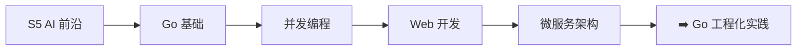

# S6 Go 语言 🟦

> **学习目标**：掌握 Go 语言核心特性、并发编程、Web 开发与微服务架构

## 内容章节

- [Go学习路径](./Go学习路径.md) — Go 语言学习路线与核心知识点
- [Go常识](./Go常识.md) — Go 语言基础概念与常见面试题

## 学习路线

```mermaid
graph LR
    S5["S5 AI 前沿"] --> Go["Go 基础"]
    Go --> Concurrency["并发编程"]
    Concurrency --> Web["Web 开发"]
    Web --> Microservice["微服务架构"]
    Microservice --> S6["➡️ Go 工程化实践"]
```
