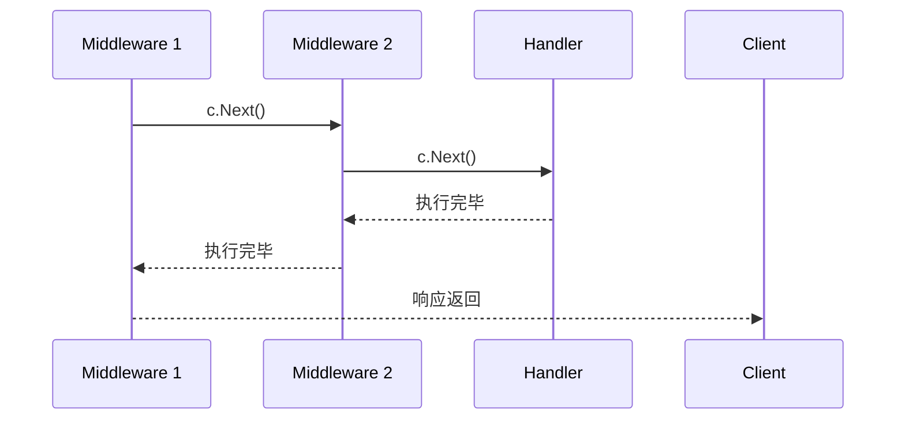

## 📅 阶段二：进阶与工程化（Web、DB、中间件）

### 2.1 Web 框架与标准库

#### Q8: `context` 的作用是什么？有哪些常见使用场景？

**难度**：⭐⭐⭐ | **频率**：🔥 高频

**考点**：上下文传递、超时控制、取消信号、值存储。

**💡 记忆关键词**：取消信号、超时控制、链路追踪、WithValue

**答案要点**：
- 用于在 goroutine 树之间传递取消信号、超时控制和请求级数据。
- 场景：
  1. HTTP 请求超时控制（`context.WithTimeout`）。
  2. 级联取消（父请求取消，子 RPC/DB 查询自动终止）。
  3. 传递 TraceID、用户信息等请求级元数据（`context.WithValue`，但不建议传业务参数）。

#### Q9: Gin 框架的中间件是如何实现的？

**难度**：⭐⭐ | **频率**：🔥 高频

**考点**：责任链模式、`c.Next()`、洋葱模型。

**💡 记忆关键词**：函数切片、c.Next()、洋葱模型、前后处理

**答案要点**：
- 中间件本质是一个函数切片，按注册顺序执行。
- `c.Next()` 调用后续中间件和 Handler，执行完毕后返回继续执行 `c.Next()` 之后的逻辑，形成洋葱模型。

---

### 2.2 数据库与缓存

#### Q10: GORM 中 `Preload` 和 `Joins` 的区别？

**难度**：⭐⭐ | **频率**：📌 常考

**考点**：N+1 问题、关联查询策略。

**💡 记忆关键词**：Preload 两次查询、Joins 一次 JOIN、N+1 问题

**答案要点**：
- `Preload`：先查主表，再用 `IN` 查询关联表（两次查询），避免 N+1，适合关联数据量大。
- `Joins`：使用 SQL `JOIN` 一次性查询，适合关联数据少或需要关联过滤的场景。

#### Q11: Redis 分布式锁如何实现？如何解决锁过期但业务未执行完的问题？

**难度**：⭐⭐⭐ | **频率**：🔥 高频

**考点**：`SETNX`、看门狗机制、Redlock。

**💡 记忆关键词**：SETNX、看门狗续期、Redlock、幂等性

**答案要点**：
- 基础实现：`SET key value NX PX expiration`。
- 续期问题：使用后台 goroutine（看门狗）定时检查锁是否存在并延长过期时间（如 Redisson 实现）。
- 高可用：Redlock 算法（多节点独立加锁，多数成功即认为成功），但存在争议；通常主从+哨兵/集群配合业务幂等性设计。

---

### 2.3 工程化与测试

#### Q12: `go mod` 如何解决依赖版本冲突？

**难度**：⭐ | **频率**：📌 常考

**考点**：语义化版本、最小版本选择、`go.sum`。

**💡 记忆关键词**：语义化版本、MVS 算法、go.mod/go.sum

**答案要点**：
- 使用语义化版本（vMajor.Minor.Patch）。
- 采用最小版本选择算法（MVS），保证构建确定性。
- `go.mod` 记录直接依赖，`go.sum` 记录所有依赖的哈希值，确保内容未被篡改。

---
