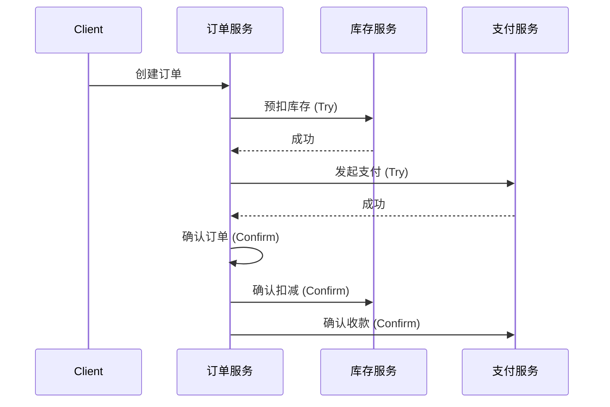

## 📅 阶段四：实战冲刺（微服务、项目、八股文）

### 4.1 微服务与 RPC

#### Q17: gRPC 和 RESTful API 的区别？Protobuf 的优势？

**难度**：⭐⭐ | **频率**：🔥 高频

**考点**：协议对比、序列化效率、IDL。

**💡 记忆关键词**：HTTP/2 vs HTTP/1.1、Protobuf vs JSON、IDL契约、内部vs外部

**答案要点**：
- **传输**：gRPC 基于 HTTP/2（多路复用、头部压缩、双向流），REST 通常基于 HTTP/1.1。
- **序列化**：gRPC 使用 Protobuf（二进制、紧凑、快），REST 常用 JSON（文本、冗余、慢）。
- **开发**：gRPC 通过 `.proto` 文件生成代码，强类型契约优先。
- **场景**：内部微服务通信用 gRPC，对外暴露 API 用 REST/GraphQL。


#### Q18: 微服务中如何实现分布式事务？

**难度**：⭐⭐⭐⭐ | **频率**：🔥 高频

**考点**：CAP/BASE 理论、Saga、TCC、最终一致性。

**💡 记忆关键词**：最终一致性、Saga补偿、TCC三段、本地消息表

**答案要点**：
- 强一致性难实现，通常追求最终一致性。
- **Saga**：长事务拆分为本地事务，失败时执行补偿操作（编排式/协同式）。
- **TCC**：Try-Confirm-Cancel，性能高但侵入性强。
- **本地消息表**：利用本地 DB 事务保证消息与业务原子性，异步投递。
- **可靠消息最终一致性**：如 RocketMQ 事务消息。




---

### 4.2 高并发与性能调优

#### Q19: 如何排查 Goroutine 泄漏？

**难度**：⭐⭐⭐ | **频率**：🔥 高频

**考点**：`pprof`、阻塞原因、最佳实践。

**💡 记忆关键词**：pprof分析、NumGoroutine、Channel阻塞、context超时

**答案要点**：
- **现象**：内存持续增长，`runtime.NumGoroutine()` 居高不下。
- **工具**：`net/http/pprof` 抓取 `goroutine` profile，使用 `go tool pprof` 或 Web UI 分析。
- **常见原因**：
  1. Channel 无接收者导致发送阻塞。
  2. Channel 无发送者导致接收阻塞。
  3. `sync.WaitGroup` 未正确 `Done()`。
  4. 定时器 `time.Ticker` 未停止。
- **预防**：使用 `context` 设置超时，确保 Channel 操作有退出路径。


#### Q20: 接口限流有哪些常见算法？Go 中如何实现？

**难度**：⭐⭐⭐ | **频率**：🔥 高频

**考点**：令牌桶、漏桶、滑动窗口、`golang.org/x/time/rate`。

**💡 记忆关键词**：令牌桶、漏桶、滑动窗口、x/time/rate、Redis+Lua

**答案要点**：
- **令牌桶**：允许一定突发流量，按固定速率生成令牌。
- **漏桶**：固定速率处理请求，平滑流量。
- **滑动窗口**：统计最近 N 秒请求数。
- **Go 实现**：官方库 `golang.org/x/time/rate` 提供令牌桶实现；生产环境常用 Redis + Lua 脚本做分布式限流。


#### Q21: 如何实现数据库读写分离？

**难度**：⭐⭐ | **频率**：📌 常考

**考点**：主从复制、读写分离中间件、数据源路由。

**💡 记忆关键词**：主从复制、读写分离、GORM 插件、`Proxy` 中间件

**答案要点**：
- **ORM 层实现**：GORM 支持通过 `Use()` 或插件实现读写分离，将写操作路由到主库，读操作路由到从库。
- **代理层实现**：通过 Proxy 中间件（如 `ProxySQL`、`MaxScale`）对应用透明。
- **注意事项**：主从延迟可能导致读不到刚写入的数据，写后读场景需强制走主库。

```go
import "gorm.io/plugin/dbresolver"

db.Use(dbresolver.Register(dbresolver.Config{
    Sources:  []gorm.Dialector{postgres.Open(dsnMaster)},
    Replicas: []gorm.Dialector{postgres.Open(dsnSlave1), postgres.Open(dsnSlave2)},
    Policy:   dbresolver.RandomPolicy{},
}))

// 写操作自动走主库
db.Create(&user)

// 读操作自动走从库
db.Where("name = ?", "Alice").Find(&users)

// 写后读强制走主库
tx := db.Session(&gorm.Session{Context: db.Set("read_write", "write")})
tx.Model(&user).Update("age", 30)
tx.First(&user)
```


#### Q22: 什么是优雅关停（Graceful Shutdown）？Go 中如何实现？

**难度**：⭐⭐ | **频率**：🔥 高频

**考点**：`os.Signal`、`server.Shutdown`、上下文超时、请求排空。

**💡 记忆关键词**：信号监听、Shutdown、context 超时、Drain 请求

**答案要点**：
- **优雅关停**：服务收到退出信号时，停止接受新请求，等待活跃请求处理完毕后再退出。
- **实现**：监听 `SIGINT`/`SIGTERM` 信号，调用 `http.Server.Shutdown(ctx)`。
- **超时控制**：设置最大等待时间（如 30s），超时仍未完成则强制退出。

```go
srv := &http.Server{Addr: ":8080"}

go func() {
    if err := srv.ListenAndServe(); err != nil && err != http.ErrServerClosed {
        log.Fatalf("listen: %s\n", err)
    }
}()

quit := make(chan os.Signal, 1)
signal.Notify(quit, syscall.SIGINT, syscall.SIGTERM)
<-quit

ctx, cancel := context.WithTimeout(context.Background(), 30*time.Second)
defer cancel()
if err := srv.Shutdown(ctx); err != nil {
    log.Fatal("Server forced to shutdown:", err)
}
```


#### Q23: Go 服务如何实现配置热更新？

**难度**：⭐⭐⭐ | **频率**：📌 常考

**考点**：文件监听、原子替换、`fsnotify`、配置版本化。

**💡 记忆关键词**：fsnotify、atomic.Value、热加载、版本号回滚

**答案要点**：
- **文件监听**：使用 `fsnotify` 库监听配置文件变化。
- **原子替换**：配置文件变化时重新解析，用 `atomic.Value` 或 `sync.RWMutex` 安全替换配置指针。
- **配置中心**：生产环境推荐 Apollo、Nacos、etcd 等配置中心，通过 Watch 机制实时推送变更。
- **版本回滚**：保留多版本配置快照，变更异常时自动回滚到上一版本。

```go
type Config struct {
    Addr string `json:"addr"`
    DB   string `json:"db"`
}

var cfg atomic.Value

func WatchConfig(path string) {
    watcher, _ := fsnotify.NewWatcher()
    defer watcher.Close()

    watcher.Add(path)
    for event := range watcher.Events {
        if event.Op&fsnotify.Write == fsnotify.Write {
            // 配置变更，重新加载
            newCfg := loadConfig(path)
            cfg.Store(newCfg)
        }
    }
}

func GetConfig() *Config {
    return cfg.Load().(*Config)
}
```


---

