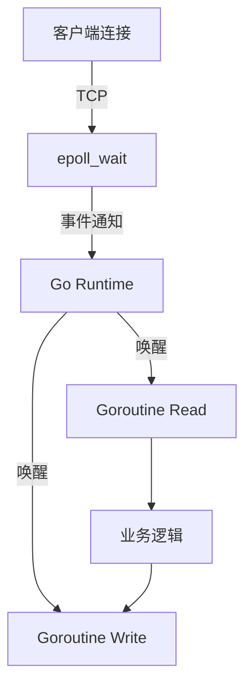
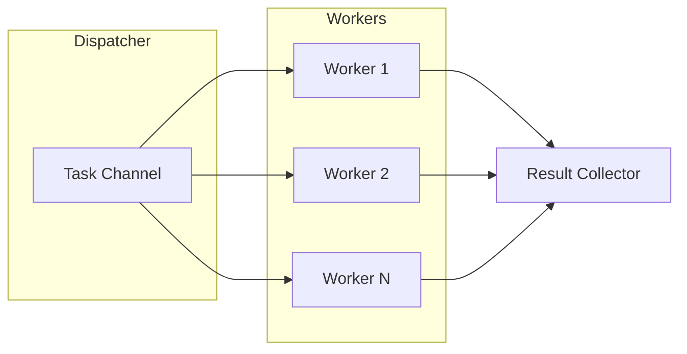

## 🚀 阶段五：云原生、架构进阶与实战场景

### 5.1 网络编程与底层 IO

#### Q21: Go 的 `net/http` 是如何实现高并发的？底层网络模型是什么？

**难度**：⭐⭐⭐⭐ | **频率**：🔥 高频

**考点**：epoll/kqueue、Goroutine 调度、连接复用。

**💡 记忆关键词**：epoll 封装、阻塞式 API、非阻塞 IO、Goroutine 挂起

**答案要点**：
- Go 的 `net` 包底层封装了操作系统的高效 I/O 多路复用机制（Linux 下为 `epoll`）。
- 每个连接由一个 `goroutine` 处理，阻塞式 API 在底层被转换为非阻塞 I/O + 运行时调度。当读写阻塞时，`goroutine` 被挂起，释放 `M` 执行其他任务，待 `epoll` 通知就绪后唤醒。
- `http.Server` 默认支持 Keep-Alive，通过连接池复用 TCP 连接，减少握手开销。

#### Q22: 什么是零拷贝（Zero-Copy）？Go 中如何实现？

**难度**：⭐⭐⭐ | **频率**：📌 常考

**考点**：`sendfile`、`io.Copy`、内存拷贝优化。

**💡 记忆关键词**：零拷贝、sendfile、内核态直达、io.Copy 优化

**答案要点**：
- 零拷贝指数据从磁盘到网卡不经过用户态内存拷贝，减少 CPU 上下文切换和内存带宽消耗。
- Go 标准库 `io.Copy` 在底层会尝试使用 `sendfile` (Linux) 或 `TransmitFile` (Windows) 实现零拷贝。
- 若使用 `net.File` 或自定义 `io.ReaderFrom`/`io.WriterTo` 接口，可进一步优化大文件传输性能。

---

### 5.2 并发进阶与高级模式

#### Q23: `sync.Pool` 的作用是什么？使用场景和注意事项？

**难度**：⭐⭐⭐ | **频率**：📌 常考

**考点**：对象复用、GC 压力、生命周期。

**💡 记忆关键词**：临时对象、GC 清空、Buffer 复用、无状态数据

**答案要点**：
- `sync.Pool` 用于存储临时对象，减少频繁分配和 GC 压力。
- **注意**：池中的对象在 GC 时会被清空（Go 1.13 前是每次 GC 清空，之后改为保留部分），因此不能用于存储有状态或需要持久化的数据。
- **场景**：`fmt` 包内部的 buffer 复用、数据库连接句柄（通常用连接池而非 Pool）、序列化 buffer。

#### Q24: 如何实现一个并发安全的 Worker Pool？

**难度**：⭐⭐⭐ | **频率**：🔥 高频

**考点**：`errgroup`、`channel` 控制并发度、任务分发。

**💡 记忆关键词**：缓冲 Channel、固定 Goroutine、WaitGroup、errgroup

**答案要点**：
- 使用带缓冲的 `channel` 作为任务队列。
- 启动固定数量的 `goroutine` 从队列中消费任务。
- 使用 `sync.WaitGroup` 等待所有任务完成，或使用 `errgroup.Group` 处理错误传播和上下文取消。

---

### 5.3 性能调优与内存分配器

#### Q25: Go 的内存分配器（TCMalloc 思想）是如何工作的？

**难度**：⭐⭐⭐⭐ | **频率**：📌 常考

**考点**：`mcache`、`mcentral`、`mheap`、对象大小分类。

**💡 记忆关键词**：三级缓存、mcache 无锁、mcentral 补 Span、mheap 管全局

**答案要点**：
- Go 借鉴 TCMalloc，将内存分配分为三级缓存：
  1. **mcache**：线程（P）本地缓存，无锁分配，适合小对象（< 32KB）。
  2. **mcentral**：全局中心缓存，为 `mcache` 补充 Span，需加锁。
  3. **mheap**：向操作系统申请大块内存，管理所有 Span。
- **Tiny 对象**：多个微小对象合并分配，减少碎片。
- **大对象**：直接从 `mheap` 分配。

#### Q26: 线上服务 CPU 飙高如何排查？

**难度**：⭐⭐⭐ | **频率**：🔥 高频

**考点**：`pprof` CPU profile、火焰图、热点函数定位。

**💡 记忆关键词**：pprof 抓包、火焰图、热点函数、死循环 GC

**答案要点**：
1. 开启 `pprof` 端点，抓取 CPU profile：`go tool pprof http://localhost:6060/debug/pprof/profile?seconds=30`。
2. 使用 `top` 命令查看耗时最高的函数。
3. 生成火焰图（Flame Graph）直观查看调用栈热点。
4. 结合代码分析：是否存在死循环、频繁 GC、正则回溯、锁竞争（Mutex Profile）或序列化瓶颈。

---

### 5.4 云原生与部署

#### Q27: 什么是 CGO？交叉编译时如何处理 CGO 依赖？

**难度**：⭐⭐ | **频率**：📖 了解

**考点**：C 语言交互、构建标签、Docker 多阶段构建。

**💡 记忆关键词**：C 语言调用、动态链接、交叉编译器、多阶段构建

**答案要点**：
- `CGO` 允许 Go 代码调用 C 代码，但会失去纯静态编译优势，产生动态链接依赖。
- 交叉编译时，若依赖 CGO，需配置对应的 C 交叉编译器（如 `CC=x86_64-linux-musl-gcc`）。
- **最佳实践**：尽量使用纯 Go 实现（如 `sqlite` 的纯 Go 驱动 `modernc.org/sqlite`）；必须使用时，在 Docker 中使用多阶段构建，第一阶段安装 GCC 编译，第二阶段复制二进制文件。

#### Q28: K8s 中 Liveness 和 Readiness 探针在 Go 服务中如何实现？

**难度**：⭐⭐⭐ | **频率**：📌 常考

**考点**：健康检查、优雅停机、流量控制。

**💡 记忆关键词**：Liveness 存活、Readiness 就绪、SIGTERM、Shutdown 优雅

**答案要点**：
- **Liveness**：检查进程是否存活，失败则重启 Pod。Go 中可简单返回 200，或检查死锁/关键 Goroutine 状态。
- **Readiness**：检查服务是否准备好接收流量，失败则从 Endpoint 移除。Go 中可检查 DB 连接池状态、依赖服务连通性。
- **优雅停机**：监听 `SIGTERM` 信号，调用 `server.Shutdown(ctx)` 等待活跃请求处理完毕后再退出。

---

### 5.5 实战场景设计题

#### Q29: 设计一个高并发计数器，支持百万级 QPS 读写。

**难度**：⭐⭐⭐⭐ | **频率**：📌 常考

**考点**：原子操作、分片、缓存一致性。

**💡 记忆关键词**：atomic 原子、Cache Line 伪共享、分片汇总、Redis INCR

**答案要点**：
- **方案一（单机）**：使用 `sync/atomic.AddInt64`，性能极高，但多核下 Cache Line 伪共享（False Sharing）可能导致瓶颈。可通过填充结构体对齐 Cache Line 解决。
- **方案二（分布式）**：使用 Redis `INCR` 命令，配合 Pipeline 或 Lua 脚本批量提交，减少网络 RTT。
- **方案三（分段锁）**：将计数器拆分为多个分片（Sharding），每个分片独立加锁或原子操作，最后汇总。

#### Q30: 如何实现一个简易的 TCP 连接池？

**难度**：⭐⭐⭐ | **频率**：📌 常考

**考点**：连接复用、超时控制、健康检查。

**💡 记忆关键词**：Channel 池、Get/Put 操作、心跳保活、超时清理

**答案要点**：
- 使用 `chan net.Conn` 作为空闲连接池。
- `Get()`：尝试从 Channel 获取连接，若空则新建；检查连接是否过期或断开。
- `Put()`：将连接放回 Channel，若池满则关闭连接。
- 后台定时 Goroutine 清理空闲超时连接，定期发送心跳保活。

---

