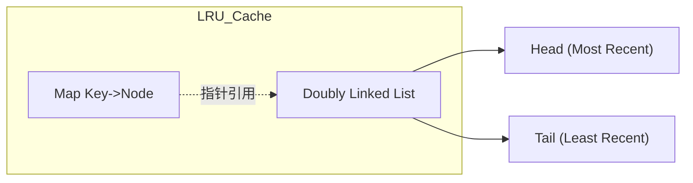

## 💻 阶段七：手写代码与算法实战

### 7.1 常见数据结构实现
#### Q34: 手写一个线程安全的 LRU Cache。

**难度**：⭐⭐⭐⭐ | **频率**：🔥 高频

**考点**：Map + 双向链表、并发控制、`container/list`。

**💡 记忆关键词**：Map 查 O1、双向链表、RWMutex 保护、最近使用放头部

**答案要点**：
- **结构**：使用 `map[key]*Node` 实现 O(1) 查找，使用双向链表维护访问顺序（最近使用的在头部）。
- **Get**：从 Map 找节点，若存在则移到链表头部，返回值。
- **Put**：若存在则更新值并移到头部；若不存在则插入头部，若超容则删除尾部节点并从 Map 移除。
- **并发**：使用 `sync.RWMutex` 保护读写。




### 7.2 并发模式实现
#### Q35: 实现一个单例模式（Singleton），要求线程安全且高性能。

**难度**：⭐⭐ | **频率**：🔥 高频

**考点**：`sync.Once`、双重检查锁（不推荐）。

**💡 记忆关键词**：sync.Once、原子操作、初始化一次、优于双重检查

**答案要点**：
- **最佳实践**：使用 `sync.Once`。内部基于原子操作和 Mutex 实现，保证初始化函数只执行一次，且性能优于双重检查锁。
```go
var instance *Singleton
var once sync.Once

func GetInstance() *Singleton {
    once.Do(func() {
        instance = &Singleton{}
    })
    return instance
}
```


#### Q36: 如何使用 Go 实现 Pipeline（管道）模式？

**难度**：⭐⭐⭐ | **频率**：📌 常考

**考点**：Channel 组合、Stage 拆分、Fan-in/Fan-out。

**💡 记忆关键词**：Stage 拆分、Channel 串联、Fan-out 并行、Fan-in 合并

**答案要点**：
- 将复杂任务拆分为多个 Stage，每个 Stage 是一个函数，接收 `chan In` 返回 `chan Out`。
- 每个 Stage 内部启动 Goroutine 读取输入，处理后写入输出。
- 使用 `Fan-out` 并行处理，使用 `Fan-in` 合并结果。
- **注意**：确保所有 Channel 在 Goroutine 结束时关闭，防止死锁。


---

