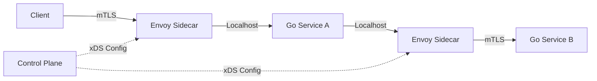

## 🛡️ 阶段九：高可用架构设计

### 9.1 服务治理
#### Q41: 什么是服务熔断（Circuit Breaker）？Go 中如何实现？

**难度**：⭐⭐⭐ | **频率**：🔥 高频

**考点**：熔断器状态机、降级策略、`sony/gobreaker`。

**💡 记忆关键词**：Closed/Open/Half-Open、错误率阈值、降级逻辑

**答案要点**：
- **状态**：Closed（正常）、Open（熔断，直接拒绝）、Half-Open（试探性放行）。
- **触发条件**：错误率/慢调用比例超过阈值，或连续失败 N 次。
- **实现**：使用 `sony/gobreaker` 或自研中间件，结合 `context` 超时控制。熔断后执行降级逻辑（返回缓存、默认值或友好提示）。

#### Q42: 分布式系统中如何保证接口幂等性？

**难度**：⭐⭐⭐ | **频率**：🔥 高频

**考点**：唯一请求 ID、Token 机制、数据库唯一索引。

**💡 记忆关键词**：Request-ID、唯一索引、乐观锁、Redis 去重

**答案要点**：
- **前端防重**：按钮置灰、请求去重。
- **网关层**：基于 `Request-ID` 在 Redis 记录已处理请求，重复请求直接返回上次结果。
- **业务层**：插入操作依赖数据库唯一索引；更新操作使用乐观锁（`version` 字段）或状态机校验。

### 9.2 服务网格 (Service Mesh)
#### Q43: Sidecar 模式在 Go 微服务中如何落地？Istio 与 Go 的关系？

**难度**：⭐⭐⭐⭐ | **频率**：📌 常考

**考点**：流量劫持、Envoy 代理、mTLS、控制面/数据面。

**💡 记忆关键词**：流量劫持、Envoy 代理、mTLS、xDS 协议

**答案要点**：
- Go 服务无需引入 SDK，通过 Sidecar（如 Envoy）接管进出流量，实现服务发现、负载均衡、熔断限流、可观测性。
- **优势**：语言无关，Go 业务代码更轻量；**劣势**：增加网络跳数（Hop）和延迟。
- **Go 生态**：`go-control-plane` 用于编写 Istio 控制面插件；`grpc-go` 原生支持 xDS 协议。

---

