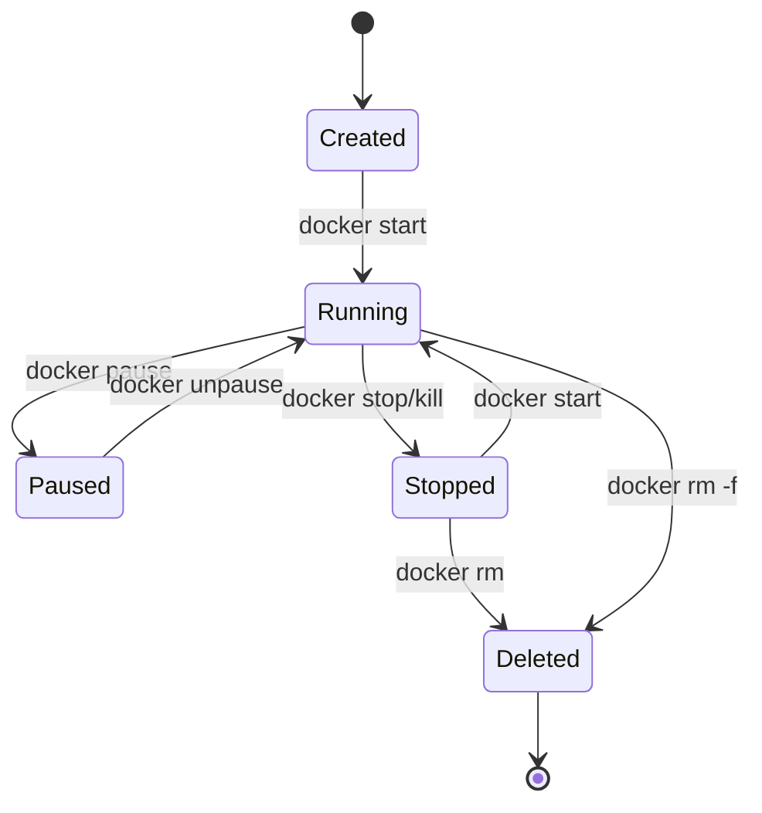
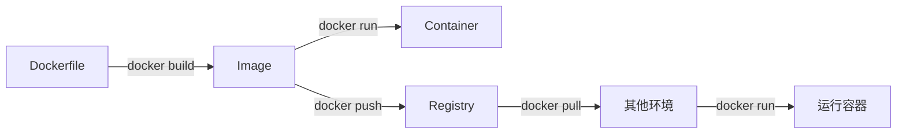
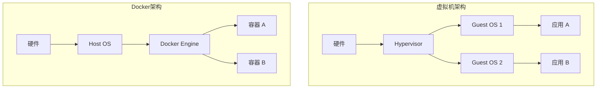

## 🐳 阶段二十五：容器技术 (Docker/K8s)

---

### Q160: 为什么需要 DevOps？

**难度**：⭐ | **频率**：📌 常考

**考点**：开发运维协同、自动化、持续交付

**💡 记忆关键词**：开发运维协同、自动化、持续交付

**答案要点**：
- 打破开发与运维之间的壁垒
- 实现快速、频繁、可靠的软件交付
- 自动化构建、测试、部署流程
- 缩短反馈循环，提高产品质量
- 技术发展：CI/CD 流水线、IaC、GitOps


**📝 一句话总结**：开发运维破壁垒，快速交付自动化；构建测试部署链，反馈缩短质量升。

---

### Q161: Docker 是什么？

**难度**：⭐ | **频率**：📌 常考

**考点**：容器引擎、镜像、隔离

**💡 记忆关键词**：容器引擎、Namespace、Cgroups、镜像

**答案要点**：
- Docker 是开源的容器化平台
- 基于 Linux 内核特性（Namespace + Cgroups）
- 将应用及其依赖打包为镜像，实现"一次构建，到处运行"
- 比虚拟机更轻量，启动更快


**📝 一句话总结**：Docker容器化平台，Namespace加Cgroups；镜像打包依赖全，一次构建到处跑。

---

### Q162: DevOps 有哪些优势？

**难度**：⭐ | **频率**：📌 常考

**考点**：交付速度、质量、协作

**💡 记忆关键词**：交付速度、部署频率、故障恢复

**答案要点**：
- 更快的交付速度（天级→分钟级）
- 更高的部署频率和更低的失败率
- 更快的故障恢复
- 更好的团队协作
- 自动化减少人为错误


**📝 一句话总结**：交付速度分钟级，部署频繁失败低；故障恢复快速回，团队协作自动化。

---

### Q163: CI 服务有什么用途？

**难度**：⭐ | **频率**：📌 常考

**考点**：持续集成、自动化测试、代码质量

**💡 记忆关键词**：持续集成、自动测试、代码质量

**答案要点**：
- 自动拉取代码、构建、运行测试
- 及时发现集成问题
- 代码质量检查（lint、覆盖率）
- 生成构建产物供 CD 使用
- 常见工具：GitHub Actions、GitLab CI、Jenkins

```yaml
# 示例：GitHub Actions Go CI 配置
name: Go CI
on: [push, pull_request]

jobs:
  build:
    runs-on: ubuntu-latest
    steps:
      - uses: actions/checkout@v4
      - uses: actions/setup-go@v5
        with:
          go-version: '1.22'
      - run: go mod download
      - run: go vet ./...
      - run: go test -race -coverprofile=coverage.out ./...
      - run: go build -o app ./cmd/server
```


**📝 一句话总结**：CI自动拉码建，测试质量及时现；lint覆盖产物全，GitHub Actions常见。

---

### Q164: 如何使用 Docker 技术创建与环境无关的容器系统？

**难度**：⭐⭐ | **频率**：📌 常考

**考点**：镜像分层、依赖打包、配置分离

**💡 记忆关键词**：多阶段构建、依赖打包、配置分离

**答案要点**：
- 将应用和所有依赖打包到镜像中
- 使用多阶段构建减小镜像体积
- 配置通过环境变量或挂载注入
- 基础镜像选择：Alpine（小）vs Distroless（安全）

```dockerfile
# 多阶段构建示例
FROM golang:1.22-alpine AS builder
WORKDIR /app
COPY go.mod go.sum ./
RUN go mod download
COPY . .
RUN CGO_ENABLED=0 GOOS=linux go build -o /app/server ./cmd/server

FROM alpine:3.19
RUN apk --no-cache add ca-certificates
WORKDIR /root/
COPY --from=builder /app/server .
EXPOSE 8080
CMD ["./server"]
```


**📝 一句话总结**：多阶段构建体积小，依赖打包镜像里；环境变量配分离，Alpine安全Distroless。

---

### Q165: Dockerfile 中 COPY 和 ADD 指令有什么不同？

**难度**：⭐ | **频率**：📖 了解

**考点**：指令差异、最佳实践

**💡 记忆关键词**：COPY复制、ADD解压、最佳实践

**答案要点**：
- `COPY`：仅复制本地文件到镜像（推荐）
- `ADD`：额外支持 URL 下载和自动解压 tar
- 最佳实践：优先使用 `COPY`，需要自动解压时用 `ADD`

```dockerfile
COPY ./app /app              # 复制本地文件（推荐）
ADD https://example.com/file /dst  # 下载（不推荐）
ADD archive.tar.gz /dst      # 自动解压
```


**📝 一句话总结**：COPY仅复制本地，ADD额外解压下载；最佳实践优先COPY，需解压时才用ADD。

---

### Q166: Docker 映像（Image）是什么？

**难度**：⭐ | **频率**：📌 常考

**考点**：只读模板、分层结构、联合文件系统

**💡 记忆关键词**：只读模板、分层结构、联合文件系统

**答案要点**：
- 镜像是容器的只读模板
- 由多层只读文件系统叠加而成
- 每层对应 Dockerfile 的一条指令
- 镜像层可共享，节省存储和传输


**📝 一句话总结**：镜像只读模板层，分层叠加文件系；每层对应指令条，共享存储省空间。

---

### Q167: Docker 容器（Container）是什么？

**难度**：⭐ | **频率**：📌 常考

**考点**：运行实例、可写层、进程隔离

**💡 记忆关键词**：运行实例、可写层、进程隔离

**答案要点**：
- 容器是镜像的运行实例
- 在镜像层之上添加可写层
- 通过 Namespace 实现隔离，Cgroups 实现资源限制
- 容器 = 镜像 + 可写层 + 运行时配置


**📝 一句话总结**：容器镜像运行例，可写层上加配置；Namespace隔离进程，Cgroups限资源。

---

### Q168: Docker Hub 什么概念？

**难度**：⭐ | **频率**：📖 了解

**考点**：镜像仓库、公共/私有、版本标签

**💡 记忆关键词**：公共仓库、镜像存储、分发

**答案要点**：
- Docker Hub 是官方的公共镜像仓库
- 存储、分发 Docker 镜像
- 支持官方镜像、用户镜像、自动化构建
- 企业可用私有仓库（Harbor、ACR）


**📝 一句话总结**：Docker Hub公共仓，镜像存储分发生；官方用户自动化，企业私有Harbor建。

---

### Q169: Docker 容器可能存在的运行阶段？

**难度**：⭐ | **频率**：📖 了解

**考点**：生命周期、状态转换

**💡 记忆关键词**：生命周期、状态转换、Paused

**答案要点**：
- Created → Running → Paused → Stopped → Deleted
- Created：容器已创建但未启动
- Running：进程正在执行
- Paused：进程被冻结（SIGSTOP）
- Stopped：进程已退出
- Deleted：容器已删除




**📝 一句话总结**：创建运行暂停停，删除五态生命周期；start停来pause冻，rm删容器状态清。

---

### Q170: 如何确定 Docker 容器运行状态？

**难度**：⭐ | **频率**：📌 常考

**考点**：docker ps、inspect、健康检查

**💡 记忆关键词**：docker ps、inspect、健康检查

**答案要点**：
- `docker ps`：查看运行中的容器
- `docker ps -a`：查看所有容器
- `docker inspect <container>`：详细信息
- 健康检查：`HEALTHCHECK` 指令定义探针

```dockerfile
# 健康检查示例
HEALTHCHECK --interval=30s --timeout=3s --start-period=5s --retries=3 \
  CMD curl -f http://localhost:8080/health || exit 1
```


**📝 一句话总结**：ps查看运行容，inspect详细信息全；HEALTHCHECK定义探，状态确定方法多。

---

### Q171: Dockerfile 中最常用的指令有哪些？

**难度**：⭐ | **频率**：📌 常考

**考点**：FROM、RUN、COPY、CMD、ENTRYPOINT、EXPOSE

**💡 记忆关键词**：FROM、RUN、COPY、CMD、ENTRYPOINT

**答案要点**：
- `FROM`：指定基础镜像
- `RUN`：构建时执行命令
- `COPY/ADD`：复制文件
- `CMD`：容器启动命令（可被覆盖）
- `ENTRYPOINT`：容器入口点（不易被覆盖）
- `EXPOSE`：声明端口
- `ENV`：设置环境变量
- `WORKDIR`：设置工作目录


**📝 一句话总结**：FROM基础RUN构建，COPY文件CMD启；ENTRYPOINT入口固，EXPOSE端口ENV配。

---

### Q172: 什么类型的应用更适合 Docker 容器？

**难度**：⭐ | **频率**：📌 常考

**考点**：无状态 vs 有状态、水平扩展

**💡 记忆关键词**：无状态应用、水平扩展、持久化

**答案要点**：
- **无状态应用**：最适合，可随意扩缩容（Web 服务、API）
- **有状态应用**：可运行但需额外处理（数据持久化、主从同步）
- 最佳实践：容器内不存持久数据，使用外部存储


**📝 一句话总结**：无状态应用最适合，随意扩缩容器里；有状态需额外理，数据持久外部存。

---

### Q173: 解释基本 Docker 应用流程

**难度**：⭐ | **频率**：📖 了解

**考点**：编写→构建→运行→分发

**💡 记忆关键词**：编写构建运行分发

**答案要点**：
1. 编写 Dockerfile 定义镜像
2. `docker build` 构建镜像
3. `docker run` 启动容器
4. `docker push` 推送到仓库
5. 其他环境 `docker pull` 拉取运行




**📝 一句话总结**：Dockerfile编写起，docker build镜像成；docker run容器跑，push pull分发全。

---

### Q174: Docker Image 和 Docker Layer 有什么不同？

**难度**：⭐ | **频率**：📖 了解

**考点**：整体与部分、复用、缓存

**💡 记忆关键词**：整体与部分、复用、缓存

**答案要点**：
- **Image**：完整的只读模板，由多个 Layer 组成
- **Layer**：镜像的每一层，对应一条 Dockerfile 指令
- Layer 可被多个 Image 共享，节省存储
- 构建时利用 Layer 缓存加速


**📝 一句话总结**：Image完整多Layer，Layer只读对应令；Layer共享省存储，构建缓存加速快。

---

### Q175: 虚拟化技术是什么？

**难度**：⭐ | **频率**：📖 了解

**考点**：Hypervisor、硬件抽象、资源隔离

**💡 记忆关键词**：Hypervisor、硬件抽象、VM

**答案要点**：
- 通过 Hypervisor 在物理机上运行多个虚拟机
- 每个 VM 包含完整 OS，资源隔离彻底
- 类型：Type 1（裸金属，如 ESXi）、Type 2（宿主型，如 VirtualBox）
- 缺点：资源开销大、启动慢


**📝 一句话总结**：虚拟化Hypervisor管，物理机上多VM跑；每VM含完整OS，资源隔离彻底好。

---

### Q176: 虚拟管理层（Hypervisor）是什么？

**难度**：⭐ | **频率**：📖 了解

**考点**：VMM、资源分配、隔离

**💡 记忆关键词**：VMM、Type1、Type2、资源分配

**答案要点**：
- Hypervisor 是创建和运行虚拟机的软件
- Type 1：直接运行在硬件上（KVM、ESXi、Hyper-V）
- Type 2：运行在操作系统上（VirtualBox、VMware Workstation）
- 负责 CPU、内存、IO 的虚拟化和分配


**📝 一句话总结**：Hypervisor创VM，Type1裸金属ESXi；Type2宿主VirtualBox，CPU内存IO分配。

---

### Q177: Docker Swarm 是什么？

**难度**：⭐ | **频率**：📖 了解

**考点**：原生编排、服务发现、负载均衡

**💡 记忆关键词**：原生编排、服务发现、滚动更新

**答案要点**：
- Docker 原生的容器编排工具
- 将多个 Docker 主机组成集群
- 提供服务发现、负载均衡、滚动更新
- 相比 K8s 更简单，但功能较少


**📝 一句话总结**：Swarm Docker原生编，多主机集群服务现；发现负载滚动更，相比K8s简单少。

---

### Q178: 如何监控 Docker 容器运行？

**难度**：⭐ | **频率**：📌 常考

**考点**：docker stats、Prometheus、cAdvisor

**💡 记忆关键词**：docker stats、Prometheus、cAdvisor

**答案要点**：
- `docker stats`：实时查看容器资源使用
- cAdvisor：Google 开源的容器监控工具
- Prometheus + Grafana：指标采集与可视化
- ELK/EFK：日志聚合分析


**📝 一句话总结**：stats实时查资源，cAdvisor Google开；Prometheus Grafana看，ELK日志聚合析。

---

### Q179: 什么是孤儿卷及如何删除它？

**难度**：⭐ | **频率**：📖 了解

**考点**：数据卷、生命周期、清理

**💡 记忆关键词**：数据卷、匿名卷、prune清理

**答案要点**：
- 孤儿卷：容器删除后未被删除的匿名数据卷
- 查看：`docker volume ls`
- 删除：`docker volume prune` 清理所有未使用卷
- 最佳实践：使用命名卷，便于管理


**📝 一句话总结**：孤儿卷容器删后留，volume ls查看全；prune清理未使用，命名卷便于管理。

---

### Q180: 什么是半虚拟化（Paravirtualization）？

**难度**：⭐ | **频率**：📖 了解

**考点**：修改 Guest OS、性能优化、Xen

**💡 记忆关键词**：修改Guest OS、hypercall、Xen

**答案要点**：
- 修改 Guest OS 使其感知虚拟化环境
- 通过 hypercall 直接与 Hypervisor 通信
- 性能优于全虚拟化，但需修改 OS
- 代表：Xen


**📝 一句话总结**：半虚修改Guest OS，hypercall直通信；性能优于全虚拟化，Xen代表需改系统。

---

### Q181: Docker 技术与虚拟机技术有何不同？

**难度**：⭐⭐ | **频率**：📌 常考

**考点**：架构对比、性能、隔离级别

**💡 记忆关键词**：共享内核、秒级启动、MB体积、进程隔离

**答案要点**：

| 维度 | Docker | VM |
|------|--------|-----|
| 内核 | 共享宿主机 | 独立内核 |
| 启动 | 秒级 | 分钟级 |
| 体积 | MB 级 | GB 级 |
| 性能 | 接近原生 | 有损耗 |
| 隔离 | 进程级 | 系统级 |
| 安全性 | 较低 | 较高 |




**📝 一句话总结**：Docker共享内核秒启MB级，VM独立内核分钟GB级；容器进程级隔离，VM系统级更安全。

---

### Q182: Dockerfile 中 ONBUILD 指令的用途？

**难度**：⭐ | **频率**：📖 了解

**考点**：触发器、基础镜像、构建链

**💡 记忆关键词**：触发器、基础镜像、构建链

**答案要点**：
- `ONBUILD` 定义触发器，当该镜像作为其他镜像的基础镜像时执行
- 适合创建通用基础镜像
- 例：`ONBUILD COPY . /app` 子镜像构建时自动复制代码

```dockerfile
# 基础镜像
FROM node:22
ONBUILD COPY . /app
ONBUILD RUN npm install

# 子镜像（自动触发 ONBUILD）
FROM my-node-base
# 自动执行 COPY 和 npm install
```


**📝 一句话总结**：ONBUILD定义触发器，子镜像构建时执行；适合通用基础镜，COPY安装自动链。

---

### Q183: 有状态 Docker 应用的较好实践？

**难度**：⭐⭐ | **频率**：📌 常考

**考点**：数据持久化、StatefulSet、备份

**💡 记忆关键词**：Volume持久化、StatefulSet、备份

**答案要点**：
- 使用 Volume 或 Bind Mount 持久化数据
- K8s 中使用 StatefulSet 管理有状态服务
- 定期备份数据到外部存储
- 适合场景：数据库、消息队列、缓存
- 不适合频繁迁移的场景

```yaml
# Docker Compose 有状态服务示例
version: '3.8'
services:
  postgres:
    image: postgres:16
    environment:
      POSTGRES_PASSWORD: secret
    volumes:
      - pgdata:/var/lib/postgresql/data
    ports:
      - "5432:5432"

volumes:
  pgdata:
    driver: local
```


**📝 一句话总结**：Volume持久化数据，K8s StatefulSet管；定期备份外部存，数据库消息队列适。

---

### Q184: 在 Windows 系统上可以运行原生 Docker 容器吗？

**难度**：⭐ | **频率**：📖 了解

**考点**：Windows Container、Linux 容器、WSL2

**💡 记忆关键词**：Windows Container、WSL2、Docker Desktop

**答案要点**：
- Windows Server 可运行 Windows Container（原生）
- Windows 10/11 通过 WSL2 后端运行 Linux 容器
- Docker Desktop 提供两种模式切换
- Windows 容器仅支持 Windows 基础镜像


**📝 一句话总结**：Windows Server原生容，Win10/11 WSL2跑；Docker Desktop两模式，Windows容器限Win镜。

---

### Q185: 在非 Linux 操作系统上如何运行 Docker？

**难度**：⭐ | **频率**：📖 了解

**考点**：虚拟机、WSL2、HyperKit

**💡 记忆关键词**：Linux VM、WSL2、HyperKit

**答案要点**：
- macOS：Docker Desktop 使用 Linux VM（HyperKit/Apple Virtualization）
- Windows：Docker Desktop 使用 WSL2 或 Hyper-V
- 本质：Docker 依赖 Linux 内核特性，非 Linux 需通过 VM 模拟


**📝 一句话总结**：Docker依赖Linux核，macOS HyperKit虚；Windows WSL2后端，本质VM模拟Linux。

---

### Q186: 容器化技术在底层的运行原理？

**难度**：⭐⭐⭐ | **频率**：📌 常考

**考点**：Namespace、Cgroups、UnionFS

**💡 记忆关键词**：Namespace、Cgroups、UnionFS

**答案要点**：
- **Namespace**：隔离进程视图（PID、Network、Mount、UTS、IPC、User）
- **Cgroups**：限制资源使用（CPU、内存、IO）
- **UnionFS**：联合文件系统，实现镜像分层
- Docker 是这些内核特性的封装

```go
// 示例：Linux Namespace 隔离演示（简化版）
package main

import (
    "os/exec"
    "syscall"
    "os"
)

func main() {
    cmd := exec.Command("sh")
    cmd.Stdin = os.Stdin
    cmd.Stdout = os.Stdout
    cmd.Stderr = os.Stderr
    
    // 创建新的 PID、UTS、Mount Namespace
    cmd.SysProcAttr = &syscall.SysProcAttr{
        Cloneflags: syscall.CLONE_NEWPID | syscall.CLONE_NEWUTS | syscall.CLONE_NEWNS,
    }
    
    cmd.Run()
}
```


**📝 一句话总结**：Namespace隔离视图，Cgroups限制资源用；UnionFS联合文件系，Docker封装内核特。

---

### Q187: 说说容器化技术与虚拟化技术的优缺点

**难度**：⭐⭐ | **频率**：📌 常考

**考点**：对比分析、场景选择

**💡 记忆关键词**：轻量快速、隔离弱、强隔离、资源浪费

**答案要点**：
- 容器优点：轻量、快速、资源利用率高、适合微服务
- 容器缺点：隔离性弱、共享内核有安全风险
- VM 优点：强隔离、安全、可运行不同 OS
- VM 缺点：重、慢、资源浪费
- 选择：开发/微服务用容器，多 OS/强安全用 VM


**📝 一句话总结**：容器轻量快速微服适，隔离弱共享核有风险；VM强隔离安全多OS，重慢资源浪费大。

---

### Q188: 如何使 Docker 适应多种运行环境？

**难度**：⭐⭐ | **频率**：📌 常考

**考点**：多阶段构建、环境变量、配置管理

**💡 记忆关键词**：多阶段构建、环境变量、ConfigMap

**答案要点**：
- 多阶段构建：开发→测试→生产不同阶段
- 环境变量注入配置（12-Factor）
- 使用 docker-compose 定义多服务环境
- K8s 中通过 ConfigMap/Secret 管理配置

```dockerfile
# 多阶段构建：开发 vs 生产
# 开发阶段
FROM golang:1.22 AS dev
WORKDIR /app
COPY . .
RUN go install github.com/go-delve/delve/cmd/dlv@latest

# 生产阶段
FROM golang:1.22-alpine AS prod
WORKDIR /app
COPY . .
RUN CGO_ENABLED=0 go build -ldflags="-s -w" -o server .

# 最终镜像
FROM alpine:3.19
COPY --from=prod /app/server .
CMD ["./server"]
```


**📝 一句话总结**：多阶段构建分环境，环境变量注入配；docker-compose多服务，K8s ConfigMap Secret管。

---

### Q189: 为什么 Docker Compose 不等待依赖服务就绪再启动？

**难度**：⭐⭐ | **频率**：📌 常考

**考点**：启动策略、健康检查、重试机制

**💡 记忆关键词**：启动策略、健康检查、重试机制

**答案要点**：
- Compose 按依赖顺序启动，但不等待服务完全就绪
- 原因：无法通用判断服务"就绪"标准
- 解决：
  1. 使用 `healthcheck` + `depends_on.condition: service_healthy`
  2. 应用层实现重试逻辑
  3. 使用 wait-for-it 脚本

```yaml
# 使用健康检查确保依赖就绪
version: '3.8'
services:
  web:
    build: .
    depends_on:
      db:
        condition: service_healthy
      redis:
        condition: service_healthy

  db:
    image: postgres:16
    healthcheck:
      test: ["CMD-SHELL", "pg_isready -U postgres"]
      interval: 5s
      timeout: 3s
      retries: 5

  redis:
    image: redis:7
    healthcheck:
      test: ["CMD", "redis-cli", "ping"]
      interval: 5s
      timeout: 3s
      retries: 5
```


**📝 一句话总结**：Compose顺序启不等就绪，healthcheck加condition解；应用重试wait-for-it，依赖就绪再连接。

---

---
