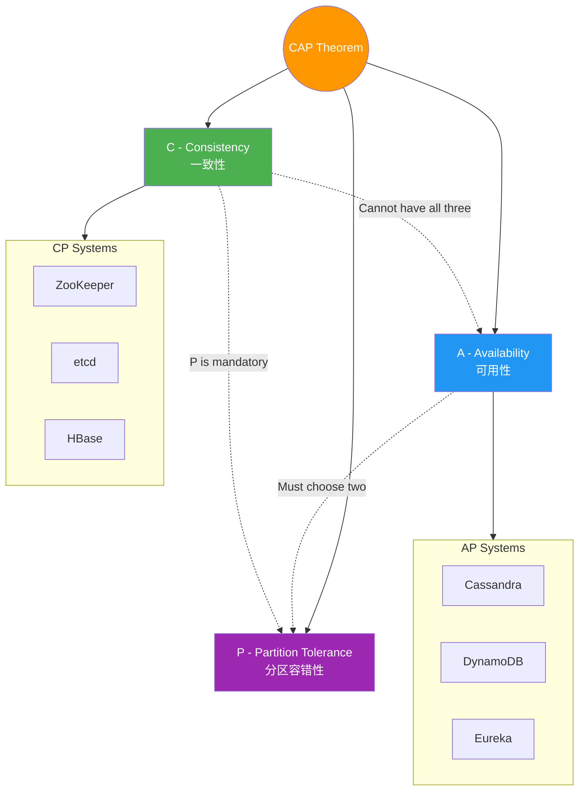
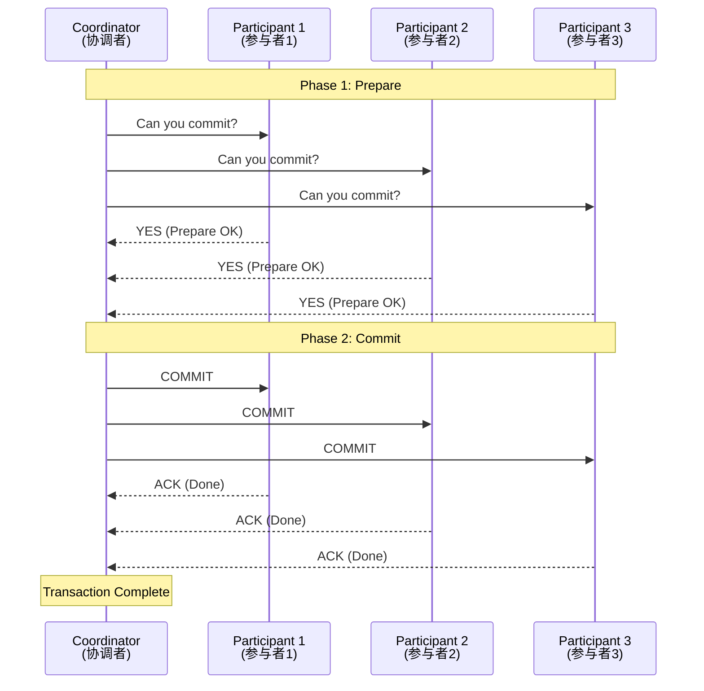
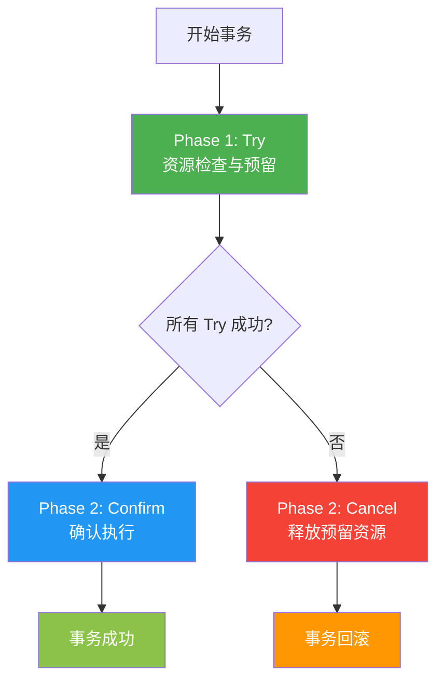

## 🌍 阶段三十二：分布式系统原理

### Q334: 分布式服务接口的幂等性如何设计？

**难度**：⭐⭐⭐ | **频率**：🔥 高频

**考点**：唯一标识、状态机、去重表

**💡 记忆关键词**：唯一ID、唯一索引、状态机转换

**答案要点**：
- **唯一请求 ID**：每次请求携带唯一 ID，服务端去重
- **数据库唯一索引**：利用唯一约束拦截重复插入
- **状态机**：操作只能从特定状态转换（如订单 Created→Paid）
- **Token 机制**：先获取 Token，提交时验证并删除
- **乐观锁**：版本号控制，`UPDATE ... WHERE version = old`

**📝 一句话总结**：幂等唯一 ID 去重，唯一索引拦重复；状态机转 Token 验，乐观锁版保一致。

---

### Q335: 分布式系统中的接口调用如何保证顺序性？

**难度**：⭐⭐ | **频率**：📌 常考

**考点**：消息队列、全局有序、版本号

**💡 记忆关键词**：单分区有序、key路由、版本号排序

**答案要点**：
- 使用消息队列的单分区有序特性
- 全局有序：单 Partition（牺牲吞吐）
- 局部有序：相同业务 key 路由到同一 Partition
- 版本号/时间戳：接收端按顺序处理
- 分布式锁：串行化执行（性能差）

**📝 一句话总结**：顺序保证单分区，全局有序吞吐低；相同 key 路由同区，版本号排接收端。

---

### Q336: ZooKeeper 一般都有哪些使用场景？

**难度**：⭐⭐ | **频率**：📌 常考

**考点**：配置管理、服务发现、分布式锁

**💡 记忆关键词**：配置集中、服务注册、分布式锁选举

**答案要点**：
- **配置管理**：集中存储配置，Watch 机制动态推送
- **服务发现**：服务注册与发现
- **分布式锁**：临时顺序节点实现
- **Leader 选举**：ZAB 协议
- **命名服务**：统一命名管理
- **集群管理**：节点上下线感知

**📝 一句话总结**：ZK 配置集中管，服务发现注册忙；分布式锁 Leader 选，命名集群全覆盖。

---

### Q337: 说说你们的分布式 Session 方案是啥？怎么做的？

**难度**：⭐⭐ | **频率**：📌 常考

**考点**：Session 共享、Redis 存储、JWT 替代

**💡 记忆关键词**：Redis共享、JWT无状态、粘性不推

**答案要点**：
- **方案一**：Session 存储到 Redis，所有服务共享
  - 使用 Spring Session 或自定义中间件
  - 优点：透明迁移，缺点：依赖 Redis
- **方案二**：JWT 无状态 Token
  - 客户端存储 Token，服务端验证签名
  - 优点：无状态，缺点：无法主动失效
- **方案三**：粘性 Session（不推荐）

**📝 一句话总结**：Session 存 Redis 共享，JWT 无状态 Token 签；粘性 Session 不推荐，方案选择看场景。

---

### Q338: 分布式事务了解吗？

**难度**：⭐⭐⭐ | **频率**：🔥 高频

**考点**：CAP、最终一致性、Saga、TCC

**💡 记忆关键词**：最终一致性、Saga补偿、TCC三阶段

**答案要点**：
- 分布式事务涉及多个服务/数据库的一致性
- **强一致性**：2PC/XA（性能差，少用）
- **最终一致性**：
  1. **Saga**：长事务拆分，失败补偿
  2. **TCC**：Try-Confirm-Cancel
  3. **本地消息表**：业务与消息同事务
  4. **可靠消息**：RocketMQ 事务消息
  5. **最大努力通知**：重试 + 对账

**📝 一句话总结**：分布式事务多服务，强一致 2PC 性能差；最终一致 Saga TCC，本地消息可靠传。

---

### Q339: 常见的分布式锁有哪些解决方案？

**难度**：⭐⭐⭐ | **频率**：🔥 高频

**考点**：Redis、ZK、数据库、etcd

**💡 记忆关键词**：Redis SETNX、ZK临时节点、etcd Lease

**答案要点**：
- **Redis**：`SETNX + EXPIRE`，看门狗续期，Redlock
- **ZooKeeper**：临时顺序节点，天然支持
- **数据库**：唯一索引 + 行锁
- **etcd**：Lease + CompareAndSwap
- 选择：Redis（高性能）、ZK/etcd（强一致性）、DB（简单场景）

**📝 一句话总结**：Redis SETNX 高性能，ZK 临时节点强一致；etcd Lease DB 锁，场景选择看需求。

---

### Q340: ZK 和 Redis 的区别，各自有什么优缺点？

**难度**：⭐⭐ | **频率**：📌 常考

**考点**：一致性、性能、功能

**💡 记忆关键词**：CP强一致、AP高性能、场景选择

**答案要点**：

| 维度 | ZooKeeper | Redis |
|------|-----------|-------|
| 一致性 | CP（强一致） | AP（最终一致） |
| 性能 | 较低 | 极高 |
| 功能 | 协调服务 | 数据结构丰富 |
| 分布式锁 | 天然支持（临时节点） | 需额外实现 |
| 适用场景 | 配置/选举/锁 | 缓存/队列/锁 |

**📝 一句话总结**：ZK CP 强一致低性能，Redis AP 高性能弱一致；分布式锁各支持，场景选择看需求。

---

### Q341: MySQL 如何做分布式锁？

**难度**：⭐⭐ | **频率**：📌 常考

**考点**：唯一索引、行锁、乐观锁

**💡 记忆关键词**：唯一插入、FOR UPDATE、乐观锁版本

**答案要点**：
- **唯一索引**：`INSERT INTO lock(key) VALUES('xxx')`，冲突则获取失败
- **行锁**：`SELECT ... FOR UPDATE`，事务提交释放
- **乐观锁**：`UPDATE ... WHERE version = old_version`
- 缺点：性能差、无锁续期、依赖 DB
- 仅适合低并发场景

**📝 一句话总结**：MySQL 锁唯一插入，行锁 FOR UPDATE 事务；乐观锁版性能差，低并发场景才适用。

---

### Q342: 你了解业界哪些大公司的分布式锁框架？

**难度**：⭐ | **频率**：📖 了解

**考点**：Redisson、Curator、ShedLock

**💡 记忆关键词**：Redisson丰富、Curator ZK、Go-redis-lock

**答案要点**：
- **Redisson**（Java）：功能最丰富，支持 Redlock、看门狗
- **Curator**（Java）：ZK 客户端，提供分布式锁实现
- **ShedLock**：定时任务分布式锁
- **Go-redis-lock**：Go 语言的 Redis 分布式锁
- **etcd concurrency**：etcd 官方锁实现

**📝 一句话总结**：Redisson 功能最丰富，Curator ZK 锁实现；ShedLock 定时 Go 锁，etcd 官方并发管。

---

### Q343: 请讲一下你对 CAP 理论的理解

**难度**：⭐⭐⭐ | **频率**：🔥 高频

**考点**：一致性、可用性、分区容错性、三选二

**💡 记忆关键词**：CAP三选二、P必须保、CP或AP

**答案要点**：
- **C（Consistency）**：所有节点数据一致
- **A（Availability）**：每个请求都有响应
- **P（Partition Tolerance）**：网络分区时系统继续运行
- **CAP 定理**：分布式系统最多满足两项
- 实际：P 必须保证，选择 CP 或 AP
- CP：ZooKeeper、etcd、HBase
- AP：Cassandra、DynamoDB、Eureka

**📝 一句话总结**：CAP 理论三选二，P 必须保 CP 或 AP；一致可用分区容，分布式系统核心理。

---

### Q344: 请讲一下你对 BASE 理论的理解

**难度**：⭐⭐ | **频率**：📌 常考

**考点**：基本可用、软状态、最终一致性

**💡 记忆关键词**：基本可用、软状态、最终一致

**答案要点**：
- BASE 是 CAP 中 AP 方案的延伸
- **BA**（Basically Available）：基本可用，允许部分功能降级
- **S**（Soft State）：软状态，允许中间状态
- **E**（Eventually Consistent）：最终一致性
- 核心：牺牲强一致性，追求可用性

**📝 一句话总结**：BASE 理论 AP 延，基本可用软状态；最终一致性核心，牺牲强一致求可用。

---

### Q345: 分布式与集群的区别是什么？

**难度**：⭐⭐ | **频率**：📌 常考

**考点**：概念区分、协作方式

**💡 记忆关键词**：分布式分工、集群分担、协作vs负载

**答案要点**：
- **分布式**：不同服务部署在不同机器，协作完成业务（分工）
- **集群**：相同服务部署在多台机器，共同承担负载（分担）
- 分布式关注服务拆分和通信，集群关注高可用和负载均衡
- 实际系统通常既是分布式又是集群

**📝 一句话总结**：分布式是不同服务分工协作，集群是相同服务分担负载；分布式拆分通信，集群高可用均衡。

---

### Q346: 请讲一下 BASE 理论的三要素

**难度**：⭐⭐ | **频率**：📌 常考

**考点**：Basically Available、Soft State、Eventually Consistent

**💡 记忆关键词**：基本可用、软状态中间、最终一致性

**答案要点**：
- **基本可用**：核心功能可用，非核心可降级
- **软状态**：允许数据存在中间状态，不要求实时一致
- **最终一致性**：经过一段时间后，所有节点数据达成一致
- 例：电商下单后库存延迟扣减，用户稍后看到更新

**📝 一句话总结**：基本可用核心保，软状态允中间态；最终一致时间达，电商库存延迟减。

---

### Q347: 请说一下对两阶段提交协议的理解

**难度**：⭐⭐⭐ | **频率**：📌 常考

**考点**：Prepare、Commit、协调者、参与者

**💡 记忆关键词**：Prepare询问、Commit/Abort、同步阻塞

**答案要点**：
- **Phase 1（Prepare）**：协调者询问所有参与者是否可以提交
- **Phase 2（Commit/Abort）**：
  - 全部同意 → 发送 Commit
  - 任一拒绝 → 发送 Abort
- 缺点：同步阻塞、单点故障、数据不一致风险
- 适用场景：强一致性要求高、性能要求不高的场景

**📝 一句话总结**：两阶段提交 Prepare 问，全部同意 Commit 执；同步阻塞单点故障，强一致场景才适用。

---

### Q348: 请讲一下对 TCC 协议的理解

**难度**：⭐⭐⭐ | **频率**：📌 常考

**考点**：Try、Confirm、Cancel、业务侵入

**💡 记忆关键词**：Try预留、Confirm确认、Cancel释放

**答案要点**：
- **Try**：资源检查和预留
- **Confirm**：确认执行，使用预留资源
- **Cancel**：取消执行，释放预留资源
- 优点：性能高于 2PC，无锁
- 缺点：业务侵入性强，需实现三个接口
- 适用场景：对性能要求高的金融场景

**📝 一句话总结**：TCC 协议 Try 预留，Confirm 确认 Cancel 释；性能高于 2PC 无锁，业务侵入金融场景。

---

