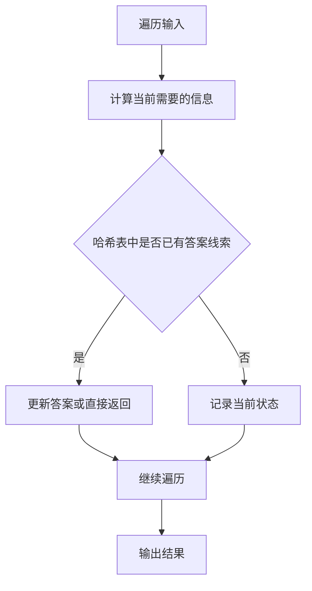
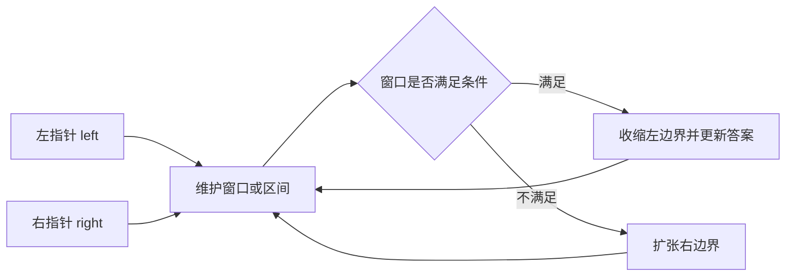
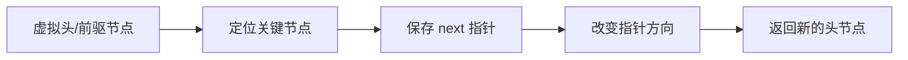

# 🔥 Code Top 100 — 手写算法 (JavaScript ES6+)

> 精选 LeetCode 高频 100 题，按数据结构和算法分类。本文基于题号和标题对题意做中文重述，并为每题整理 JavaScript ES6+ 实现、Mermaid 图解、关键思路与复杂度分析。

> 说明：题目描述为复习向转述，不逐字搬运 LeetCode 原文；示例保留为便于快速验证代码行为。

---

# 一、哈希表

## 1. 两数之和 🟢

**频度：** 301 | **难度：** 简单 | **LeetCode 1**

**官方链接：** [LeetCode 1](https://leetcode.com/problems/two-sum/)

### LeetCode 题意（中文重述）
给定整数数组和目标值，找到两个不同下标，使它们对应元素之和等于目标值，并返回这两个下标。

**示例：**
```
输入：nums = [2,7,11,15], target = 9
输出：[0,1]
```

### 解题详解
核心是把“回头查找”变成 O(1) 的状态查询。遍历到当前位置时，只关心此前是否出现过能与当前元素组成答案的值、前缀和或连续段起点。

**关键步骤：**
- Map/Set 用来记录已经见过的值或状态。
- 先查再存可以避免当前元素和自己配对。
- 前缀和题要预置 0 出现 1 次，覆盖从下标 0 开始的子数组。

### Mermaid 图解


### JavaScript 实现
```javascript
function twoSum(nums, target) {
  const map = new Map();
  for (let i = 0; i < nums.length; i++) {
    const complement = target - nums[i];
    if (map.has(complement)) {
      return [map.get(complement), i];
    }
    map.set(nums[i], i);
  }
  return [];
}
```

### 复杂度分析
- 时间复杂度: O(n)
- 空间复杂度: O(n)

---

## 2. 和为 K 的子数组 🟡

**频度：** 78 | **难度：** 中等 | **LeetCode 560**

**官方链接：** [LeetCode 560](https://leetcode.com/problems/subarray-sum-equals-k/)

### LeetCode 题意（中文重述）
给定整数数组和整数 k，统计所有元素和等于 k 的连续子数组数量，数组中可以包含负数。

**示例：**
```
输入：nums = [1,1,1], k = 2
输出：2
```

### 解题详解
核心是把“回头查找”变成 O(1) 的状态查询。遍历到当前位置时，只关心此前是否出现过能与当前元素组成答案的值、前缀和或连续段起点。

**关键步骤：**
- Map/Set 用来记录已经见过的值或状态。
- 先查再存可以避免当前元素和自己配对。
- 前缀和题要预置 0 出现 1 次，覆盖从下标 0 开始的子数组。

### Mermaid 图解


### JavaScript 实现
```javascript
function subarraySum(nums, k) {
  const prefixMap = new Map();
  prefixMap.set(0, 1);
  let sum = 0, count = 0;
  for (const num of nums) {
    sum += num;
    if (prefixMap.has(sum - k)) {
      count += prefixMap.get(sum - k);
    }
    prefixMap.set(sum, (prefixMap.get(sum) || 0) + 1);
  }
  return count;
}
```

### 复杂度分析
- 时间复杂度: O(n)
- 空间复杂度: O(n)

---

## 3. 最长连续序列 🟡

**频度：** 91 | **难度：** 中等 | **LeetCode 128**

**官方链接：** [LeetCode 128](https://leetcode.com/problems/longest-consecutive-sequence/)

### LeetCode 题意（中文重述）
给定未排序整数数组，返回数字值连续的最长序列长度，要求尽量在线性时间内完成。

**示例：**
```
输入：nums = [100,4,200,1,3,2]
输出：4
```

### 解题详解
核心是把“回头查找”变成 O(1) 的状态查询。遍历到当前位置时，只关心此前是否出现过能与当前元素组成答案的值、前缀和或连续段起点。

**关键步骤：**
- Map/Set 用来记录已经见过的值或状态。
- 先查再存可以避免当前元素和自己配对。
- 前缀和题要预置 0 出现 1 次，覆盖从下标 0 开始的子数组。

### Mermaid 图解


### JavaScript 实现
```javascript
function longestConsecutive(nums) {
  const set = new Set(nums);
  let maxLen = 0;
  for (const num of set) {
    if (!set.has(num - 1)) {
      let cur = num, count = 1;
      while (set.has(cur + 1)) { cur++; count++; }
      maxLen = Math.max(maxLen, count);
    }
  }
  return maxLen;
}
```

### 复杂度分析
- 时间复杂度: O(n)
- 空间复杂度: O(n)

---

# 二、双指针与滑动窗口

## 4. 无重复字符的最长子串 🟡

**频度：** 1140 | **难度：** 中等 | **LeetCode 3**

**官方链接：** [LeetCode 3](https://leetcode.com/problems/longest-substring-without-repeating-characters/)

### LeetCode 题意（中文重述）
给定字符串，返回不含重复字符的最长连续子串长度。

**示例：**
```
输入：s = "abcabcbb"
输出：3  ("abc")
```

### 解题详解
核心是让两个指针只向一个方向移动，窗口内维护当前可验证的信息。满足条件时尝试收缩，不满足时继续扩张。

**关键步骤：**
- 右指针负责扩张候选范围，左指针负责排除不再需要的元素。
- 只要指针不回退，整体复杂度就是线性的。
- 去重题通常在排序后跳过相同元素。

### Mermaid 图解


### JavaScript 实现
```javascript
function lengthOfLongestSubstring(s) {
  const map = new Map();
  let maxLen = 0, l = 0;
  for (let r = 0; r < s.length; r++) {
    if (map.has(s[r]) && map.get(s[r]) >= l) {
      l = map.get(s[r]) + 1;
    }
    map.set(s[r], r);
    maxLen = Math.max(maxLen, r - l + 1);
  }
  return maxLen;
}
```

### 复杂度分析
- 时间复杂度: O(n)
- 空间复杂度: O(Σ)

---

## 5. 三数之和 🟡

**频度：** 477 | **难度：** 中等 | **LeetCode 15**

**官方链接：** [LeetCode 15](https://leetcode.com/problems/3sum/)

### LeetCode 题意（中文重述）
在数组中找出所有不重复的三元组，使三数之和为 0。

**示例：**
```
输入：nums = [-1,0,1,2,-1,-4]
输出：[[-1,-1,2],[-1,0,1]]
```

### 解题详解
核心是让两个指针只向一个方向移动，窗口内维护当前可验证的信息。满足条件时尝试收缩，不满足时继续扩张。

**关键步骤：**
- 右指针负责扩张候选范围，左指针负责排除不再需要的元素。
- 只要指针不回退，整体复杂度就是线性的。
- 去重题通常在排序后跳过相同元素。

### Mermaid 图解


### JavaScript 实现
```javascript
function threeSum(nums) {
  const result = [];
  nums.sort((a, b) => a - b);
  for (let i = 0; i < nums.length - 2; i++) {
    if (i > 0 && nums[i] === nums[i - 1]) continue;
    let l = i + 1, r = nums.length - 1;
    while (l < r) {
      const sum = nums[i] + nums[l] + nums[r];
      if (sum === 0) {
        result.push([nums[i], nums[l], nums[r]]);
        while (l < r && nums[l] === nums[l + 1]) l++;
        while (l < r && nums[r] === nums[r - 1]) r--;
        l++; r--;
      } else if (sum < 0) l++;
      else r--;
    }
  }
  return result;
}
```

### 复杂度分析
- 时间复杂度: O(n²)
- 空间复杂度: O(log n)

---

## 6. 合并两个有序数组 🟢

**频度：** 294 | **难度：** 简单 | **LeetCode 88**

**官方链接：** [LeetCode 88](https://leetcode.com/problems/merge-sorted-array/)

### LeetCode 题意（中文重述）
将两个非递减数组合并到第一个数组中，结果仍保持非递减顺序。

**示例：**
```
输入：nums1 = [1,2,3,0,0,0], m=3, nums2 = [2,5,6], n=3
输出：[1,2,2,3,5,6]
```

### 解题详解
核心是让两个指针只向一个方向移动，窗口内维护当前可验证的信息。满足条件时尝试收缩，不满足时继续扩张。

**关键步骤：**
- 右指针负责扩张候选范围，左指针负责排除不再需要的元素。
- 只要指针不回退，整体复杂度就是线性的。
- 去重题通常在排序后跳过相同元素。

### Mermaid 图解


### JavaScript 实现
```javascript
function merge(nums1, m, nums2, n) {
  let p1 = m - 1, p2 = n - 1, p = m + n - 1;
  while (p1 >= 0 && p2 >= 0) {
    nums1[p--] = nums1[p1] > nums2[p2] ? nums1[p1--] : nums2[p2--];
  }
  while (p2 >= 0) nums1[p--] = nums2[p2--];
}
```

### 复杂度分析
- 时间复杂度: O(m + n)
- 空间复杂度: O(1)

---

## 7. 接雨水 🔴

**频度：** 196 | **难度：** 困难 | **LeetCode 42**

**官方链接：** [LeetCode 42](https://leetcode.com/problems/trapping-rain-water/)

### LeetCode 题意（中文重述）
给定柱状图高度，计算雨后这些柱子之间最多能接住多少水。

**示例：**
```
输入：height = [0,1,0,2,1,0,1,3,2,1,2,1]
输出：6
```

### 解题详解
核心是让两个指针只向一个方向移动，窗口内维护当前可验证的信息。满足条件时尝试收缩，不满足时继续扩张。

**关键步骤：**
- 右指针负责扩张候选范围，左指针负责排除不再需要的元素。
- 只要指针不回退，整体复杂度就是线性的。
- 去重题通常在排序后跳过相同元素。

### Mermaid 图解


### JavaScript 实现
```javascript
function trap(height) {
  let l = 0, r = height.length - 1;
  let leftMax = 0, rightMax = 0, ans = 0;
  while (l < r) {
    if (height[l] < height[r]) {
      if (height[l] >= leftMax) leftMax = height[l];
      else ans += leftMax - height[l];
      l++;
    } else {
      if (height[r] >= rightMax) rightMax = height[r];
      else ans += rightMax - height[r];
      r--;
    }
  }
  return ans;
}
```

### 复杂度分析
- 时间复杂度: O(n)
- 空间复杂度: O(1)

---

## 8. 最小覆盖子串 🔴

**频度：** 130 | **难度：** 困难 | **LeetCode 76**

**官方链接：** [LeetCode 76](https://leetcode.com/problems/minimum-window-substring/)

### LeetCode 题意（中文重述）
在字符串 s 中找到包含字符串 t 全部字符及其出现次数的最短连续子串。

**示例：**
```
输入：s = "ADOBECODEBANC", t = "ABC"
输出："BANC"
```

### 解题详解
核心是让两个指针只向一个方向移动，窗口内维护当前可验证的信息。满足条件时尝试收缩，不满足时继续扩张。

**关键步骤：**
- 右指针负责扩张候选范围，左指针负责排除不再需要的元素。
- 只要指针不回退，整体复杂度就是线性的。
- 去重题通常在排序后跳过相同元素。

### Mermaid 图解


### JavaScript 实现
```javascript
function minWindow(s, t) {
  const need = new Map();
  for (const c of t) need.set(c, (need.get(c) || 0) + 1);
  let l = 0, r = 0, matched = 0;
  let minLen = Infinity, start = 0;
  const window = new Map();
  while (r < s.length) {
    const c = s[r];
    window.set(c, (window.get(c) || 0) + 1);
    if (need.has(c) && window.get(c) === need.get(c)) matched++;
    r++;
    while (matched === need.size) {
      if (r - l < minLen) { minLen = r - l; start = l; }
      const leftChar = s[l];
      window.set(leftChar, window.get(leftChar) - 1);
      if (need.has(leftChar) && window.get(leftChar) < need.get(leftChar)) matched--;
      l++;
    }
  }
  return minLen === Infinity ? "" : s.substr(start, minLen);
}
```

### 复杂度分析
- 时间复杂度: O(n)
- 空间复杂度: O(|t|)

---

## 9. 长度最小的子数组 🟡

**频度：** 72 | **难度：** 中等 | **LeetCode 209**

**官方链接：** [LeetCode 209](https://leetcode.com/problems/minimum-size-subarray-sum/)

### LeetCode 题意（中文重述）
给定正整数数组和目标值，返回和至少为目标值的最短连续子数组长度。

**示例：**
```
输入：target=7, nums=[2,3,1,2,4,3]
输出：2  ([4,3])
```

### 解题详解
核心是让两个指针只向一个方向移动，窗口内维护当前可验证的信息。满足条件时尝试收缩，不满足时继续扩张。

**关键步骤：**
- 右指针负责扩张候选范围，左指针负责排除不再需要的元素。
- 只要指针不回退，整体复杂度就是线性的。
- 去重题通常在排序后跳过相同元素。

### Mermaid 图解


### JavaScript 实现
```javascript
function minSubArrayLen(target, nums) {
  let l = 0, sum = 0, minLen = Infinity;
  for (let r = 0; r < nums.length; r++) {
    sum += nums[r];
    while (sum >= target) {
      minLen = Math.min(minLen, r - l + 1);
      sum -= nums[l++];
    }
  }
  return minLen === Infinity ? 0 : minLen;
}
```

### 复杂度分析
- 时间复杂度: O(n)
- 空间复杂度: O(1)

---

## 10. 移动零 🟢

**频度：** 67 | **难度：** 简单 | **LeetCode 283**

**官方链接：** [LeetCode 283](https://leetcode.com/problems/move-zeroes/)

### LeetCode 题意（中文重述）
在原数组上把所有 0 移动到末尾，同时保持非零元素的相对顺序。

**示例：**
```
输入：nums = [0,1,0,3,12]
输出：[1,3,12,0,0]
```

### 解题详解
核心是让两个指针只向一个方向移动，窗口内维护当前可验证的信息。满足条件时尝试收缩，不满足时继续扩张。

**关键步骤：**
- 右指针负责扩张候选范围，左指针负责排除不再需要的元素。
- 只要指针不回退，整体复杂度就是线性的。
- 去重题通常在排序后跳过相同元素。

### Mermaid 图解


### JavaScript 实现
```javascript
function moveZeroes(nums) {
  let l = 0;
  for (let r = 0; r < nums.length; r++) {
    if (nums[r] !== 0) {
      [nums[l], nums[r]] = [nums[r], nums[l]];
      l++;
    }
  }
}
```

### 复杂度分析
- 时间复杂度: O(n)
- 空间复杂度: O(1)

---

## 11. 删除链表的倒数第 N 个节点 🟡

**频度：** 181 | **难度：** 中等 | **LeetCode 19**

**官方链接：** [LeetCode 19](https://leetcode.com/problems/remove-nth-node-from-end-of-list/)

### LeetCode 题意（中文重述）
删除单链表倒数第 n 个节点，并返回删除后的头节点。

**示例：**
```
输入：head=[1,2,3,4,5], n=2
输出：[1,2,3,5]
```

### 解题详解
核心是让两个指针只向一个方向移动，窗口内维护当前可验证的信息。满足条件时尝试收缩，不满足时继续扩张。

**关键步骤：**
- 使用 dummy 节点可以统一处理头节点被删除或反转的情况。
- 改指针前先保存后继节点，避免链表断开后无法继续遍历。
- 返回值通常是 dummy.next 或反转后的新头节点。

### Mermaid 图解


### JavaScript 实现
```javascript
function removeNthFromEnd(head, n) {
  const dummy = new ListNode(0, head);
  let fast = dummy, slow = dummy;
  for (let i = 0; i < n; i++) fast = fast.next;
  while (fast.next) { slow = slow.next; fast = fast.next; }
  slow.next = slow.next.next;
  return dummy.next;
}
```

### 复杂度分析
- 时间复杂度: O(n)
- 空间复杂度: O(1)

---

# 三、链表操作

## 12. 反转链表 🟢

**频度：** 741 | **难度：** 简单 | **LeetCode 206**

**官方链接：** [LeetCode 206](https://leetcode.com/problems/reverse-linked-list/)

### LeetCode 题意（中文重述）
反转单链表。


### 解题详解
链表题的关键是先保存后继节点，再改指针。涉及删除、反转、分组时通常引入 dummy 节点统一处理头节点变化。

**关键步骤：**
- 使用 dummy 节点可以统一处理头节点被删除或反转的情况。
- 改指针前先保存后继节点，避免链表断开后无法继续遍历。
- 返回值通常是 dummy.next 或反转后的新头节点。

### Mermaid 图解


### JavaScript 实现
```javascript
function reverseList(head) {
  let prev = null, curr = head;
  while (curr) {
    const next = curr.next;
    curr.next = prev;
    prev = curr;
    curr = next;
  }
  return prev;
}
```

### 复杂度分析
- 时间复杂度: O(n)
- 空间复杂度: O(1)

---

## 13. K 个一组翻转链表 🔴

**频度：** 514 | **难度：** 困难 | **LeetCode 25**

**官方链接：** [LeetCode 25](https://leetcode.com/problems/reverse-nodes-in-k-group/)

### LeetCode 题意（中文重述）
每 k 个节点一组翻转。

**示例：**
```
输入：[1,2,3,4,5], k=2
输出：[2,1,4,3,5]
```

### 解题详解
链表题的关键是先保存后继节点，再改指针。涉及删除、反转、分组时通常引入 dummy 节点统一处理头节点变化。

**关键步骤：**
- 使用 dummy 节点可以统一处理头节点被删除或反转的情况。
- 改指针前先保存后继节点，避免链表断开后无法继续遍历。
- 返回值通常是 dummy.next 或反转后的新头节点。

### Mermaid 图解


### JavaScript 实现
```javascript
function reverseKGroup(head, k) {
  const dummy = new ListNode(0, head);
  let prev = dummy;
  while (true) {
    let tail = prev;
    for (let i = 0; i < k; i++) {
      tail = tail.next;
      if (!tail) return dummy.next;
    }
    const nextGroup = tail.next;
    const reversed = reverse(prev.next, tail);
    const oldHead = prev.next;
    prev.next = reversed;
    oldHead.next = nextGroup;
    prev = oldHead;
  }
}
function reverse(head, tail) {
  let prev = null, curr = head;
  while (prev !== tail) {
    const next = curr.next;
    curr.next = prev;
    prev = curr;
    curr = next;
  }
  return tail;
}
```

### 复杂度分析
- 时间复杂度: O(n)
- 空间复杂度: O(1)

---

## 14. 合并两个有序链表 🟢

**频度：** 330 | **难度：** 简单 | **LeetCode 21**

**官方链接：** [LeetCode 21](https://leetcode.com/problems/merge-two-sorted-lists/)

### LeetCode 题意（中文重述）
合并两个升序链表。


### 解题详解
链表题的关键是先保存后继节点，再改指针。涉及删除、反转、分组时通常引入 dummy 节点统一处理头节点变化。

**关键步骤：**
- 使用 dummy 节点可以统一处理头节点被删除或反转的情况。
- 改指针前先保存后继节点，避免链表断开后无法继续遍历。
- 返回值通常是 dummy.next 或反转后的新头节点。

### Mermaid 图解


### JavaScript 实现
```javascript
function mergeTwoLists(l1, l2) {
  const dummy = new ListNode(-1);
  let curr = dummy;
  while (l1 && l2) {
    if (l1.val < l2.val) { curr.next = l1; l1 = l1.next; }
    else { curr.next = l2; l2 = l2.next; }
    curr = curr.next;
  }
  curr.next = l1 || l2;
  return dummy.next;
}
```

### 复杂度分析
- 时间复杂度: O(m+n)
- 空间复杂度: O(1)

---

## 15. 反转链表 II 🟡

**频度：** 267 | **难度：** 中等 | **LeetCode 92**

**官方链接：** [LeetCode 92](https://leetcode.com/problems/reverse-linked-list-ii/)

### LeetCode 题意（中文重述）
反转从 left 到 right 的节点。


### 解题详解
链表题的关键是先保存后继节点，再改指针。涉及删除、反转、分组时通常引入 dummy 节点统一处理头节点变化。

**关键步骤：**
- 使用 dummy 节点可以统一处理头节点被删除或反转的情况。
- 改指针前先保存后继节点，避免链表断开后无法继续遍历。
- 返回值通常是 dummy.next 或反转后的新头节点。

### Mermaid 图解


### JavaScript 实现
```javascript
function reverseBetween(head, left, right) {
  const dummy = new ListNode(0, head);
  let prev = dummy;
  for (let i = 1; i < left; i++) prev = prev.next;
  let curr = prev.next;
  for (let i = 0; i < right - left; i++) {
    const next = curr.next;
    curr.next = next.next;
    next.next = prev.next;
    prev.next = next;
  }
  return dummy.next;
}
```

### 复杂度分析
- 时间复杂度: O(n)
- 空间复杂度: O(1)

---

## 16. 重排链表 🟡

**频度：** 249 | **难度：** 中等 | **LeetCode 143**

**官方链接：** [LeetCode 143](https://leetcode.com/problems/reorder-list/)

### LeetCode 题意（中文重述）
0→Ln→L1→Ln-1→...。


### 解题详解
链表题的关键是先保存后继节点，再改指针。涉及删除、反转、分组时通常引入 dummy 节点统一处理头节点变化。

**关键步骤：**
- 使用 dummy 节点可以统一处理头节点被删除或反转的情况。
- 改指针前先保存后继节点，避免链表断开后无法继续遍历。
- 返回值通常是 dummy.next 或反转后的新头节点。

### Mermaid 图解


### JavaScript 实现
```javascript
function reorderList(head) {
  if (!head || !head.next) return;
  let slow = head, fast = head;
  while (fast.next && fast.next.next) { slow = slow.next; fast = fast.next.next; }
  let prev = null, curr = slow.next;
  slow.next = null;
  while (curr) {
    const next = curr.next; curr.next = prev;
    prev = curr; curr = next;
  }
  let l1 = head, l2 = prev;
  while (l2) {
    const t1 = l1.next, t2 = l2.next;
    l1.next = l2; l2.next = t1;
    l1 = t1; l2 = t2;
  }
}
```

### 复杂度分析
- 时间复杂度: O(n)
- 空间复杂度: O(1)

---

## 17. 环形链表 🟢

**频度：** 248 | **难度：** 简单 | **LeetCode 141**

**官方链接：** [LeetCode 141](https://leetcode.com/problems/linked-list-cycle/)

### LeetCode 题意（中文重述）
判断链表是否有环。


### 解题详解
链表题的关键是先保存后继节点，再改指针。涉及删除、反转、分组时通常引入 dummy 节点统一处理头节点变化。

**关键步骤：**
- 使用 dummy 节点可以统一处理头节点被删除或反转的情况。
- 改指针前先保存后继节点，避免链表断开后无法继续遍历。
- 返回值通常是 dummy.next 或反转后的新头节点。

### Mermaid 图解


### JavaScript 实现
```javascript
function hasCycle(head) {
  let slow = head, fast = head;
  while (fast && fast.next) {
    slow = slow.next;
    fast = fast.next.next;
    if (slow === fast) return true;
  }
  return false;
}
```

### 复杂度分析
- 时间复杂度: O(n)
- 空间复杂度: O(1)

---

## 18. 相交链表 🟢

**频度：** 200 | **难度：** 简单 | **LeetCode 160**

**官方链接：** [LeetCode 160](https://leetcode.com/problems/intersection-of-two-linked-lists/)

### LeetCode 题意（中文重述）
找到两个链表的相交节点。


### 解题详解
链表题的关键是先保存后继节点，再改指针。涉及删除、反转、分组时通常引入 dummy 节点统一处理头节点变化。

**关键步骤：**
- 使用 dummy 节点可以统一处理头节点被删除或反转的情况。
- 改指针前先保存后继节点，避免链表断开后无法继续遍历。
- 返回值通常是 dummy.next 或反转后的新头节点。

### Mermaid 图解


### JavaScript 实现
```javascript
function getIntersectionNode(headA, headB) {
  if (!headA || !headB) return null;
  let pA = headA, pB = headB;
  while (pA !== pB) {
    pA = pA ? pA.next : headB;
    pB = pB ? pB.next : headA;
  }
  return pA;
}
```

### 复杂度分析
- 时间复杂度: O(m+n)
- 空间复杂度: O(1)

---

## 19. 删除排序链表中的重复元素 II 🟡

**频度：** 184 | **难度：** 中等 | **LeetCode 82**

**官方链接：** [LeetCode 82](https://leetcode.com/problems/remove-duplicates-from-sorted-list-ii/)

### LeetCode 题意（中文重述）
删除所有重复数字的节点。


### 解题详解
链表题的关键是先保存后继节点，再改指针。涉及删除、反转、分组时通常引入 dummy 节点统一处理头节点变化。

**关键步骤：**
- 使用 dummy 节点可以统一处理头节点被删除或反转的情况。
- 改指针前先保存后继节点，避免链表断开后无法继续遍历。
- 返回值通常是 dummy.next 或反转后的新头节点。

### Mermaid 图解


### JavaScript 实现
```javascript
function deleteDuplicates(head) {
  const dummy = new ListNode(0, head);
  let prev = dummy, curr = head;
  while (curr && curr.next) {
    if (curr.val === curr.next.val) {
      while (curr.next && curr.val === curr.next.val) curr = curr.next;
      prev.next = curr.next;
    } else {
      prev = curr;
    }
    curr = curr.next;
  }
  return dummy.next;
}
```

### 复杂度分析
- 时间复杂度: O(n)
- 空间复杂度: O(1)

---

## 20. 环形链表 II 🟡

**频度：** 170 | **难度：** 中等 | **LeetCode 142**

**官方链接：** [LeetCode 142](https://leetcode.com/problems/linked-list-cycle-ii/)

### LeetCode 题意（中文重述）
返回入环第一个节点。


### 解题详解
链表题的关键是先保存后继节点，再改指针。涉及删除、反转、分组时通常引入 dummy 节点统一处理头节点变化。

**关键步骤：**
- 使用 dummy 节点可以统一处理头节点被删除或反转的情况。
- 改指针前先保存后继节点，避免链表断开后无法继续遍历。
- 返回值通常是 dummy.next 或反转后的新头节点。

### Mermaid 图解


### JavaScript 实现
```javascript
function detectCycle(head) {
  let slow = head, fast = head;
  while (fast && fast.next) {
    slow = slow.next; fast = fast.next.next;
    if (slow === fast) {
      slow = head;
      while (slow !== fast) { slow = slow.next; fast = fast.next; }
      return slow;
    }
  }
  return null;
}
```

### 复杂度分析
- 时间复杂度: O(n)
- 空间复杂度: O(1)

---

## 21. 排序链表 🟡

**频度：** 146 | **难度：** 中等 | **LeetCode 148**

**官方链接：** [LeetCode 148](https://leetcode.com/problems/sort-list/)

### LeetCode 题意（中文重述）
(n log n) 时间排序链表。


### 解题详解
链表题的关键是先保存后继节点，再改指针。涉及删除、反转、分组时通常引入 dummy 节点统一处理头节点变化。

**关键步骤：**
- 使用 dummy 节点可以统一处理头节点被删除或反转的情况。
- 改指针前先保存后继节点，避免链表断开后无法继续遍历。
- 返回值通常是 dummy.next 或反转后的新头节点。

### Mermaid 图解
```mermaid
flowchart LR
    D["虚拟头/前驱节点"] --> A["定位关键节点"]
    A --> B["保存 next 指针"]
    B --> C["改变指针方向"]
    C --> E["返回新的头节点"]
```

### JavaScript 实现
```javascript
function sortList(head) {
  if (!head || !head.next) return head;
  let slow = head, fast = head;
  while (fast.next && fast.next.next) { slow = slow.next; fast = fast.next.next; }
  const right = sortList(slow.next);
  slow.next = null;
  const left = sortList(head);
  return mergeTwoLists(left, right);
}
```

### 复杂度分析
- 时间复杂度: O(n log n)
- 空间复杂度: O(log n)

---

## 22. 回文链表 🟢

**频度：** 85 | **难度：** 简单 | **LeetCode 234**

**官方链接：** [LeetCode 234](https://leetcode.com/problems/palindrome-linked-list/)

### LeetCode 题意（中文重述）
判断链表是否回文。


### 解题详解
链表题的关键是先保存后继节点，再改指针。涉及删除、反转、分组时通常引入 dummy 节点统一处理头节点变化。

**关键步骤：**
- 使用 dummy 节点可以统一处理头节点被删除或反转的情况。
- 改指针前先保存后继节点，避免链表断开后无法继续遍历。
- 返回值通常是 dummy.next 或反转后的新头节点。

### Mermaid 图解
```mermaid
flowchart LR
    D["虚拟头/前驱节点"] --> A["定位关键节点"]
    A --> B["保存 next 指针"]
    B --> C["改变指针方向"]
    C --> E["返回新的头节点"]
```

### JavaScript 实现
```javascript
function isPalindrome(head) {
  if (!head || !head.next) return true;
  let slow = head, fast = head;
  while (fast.next && fast.next.next) slow = slow.next, fast = fast.next.next;
  let prev = null, curr = slow.next;
  while (curr) {
    const next = curr.next; curr.next = prev;
    prev = curr; curr = next;
  }
  let left = head, right = prev;
  while (right) {
    if (left.val !== right.val) return false;
    left = left.next; right = right.next;
  }
  return true;
}
```

### 复杂度分析
- 时间复杂度: O(n)
- 空间复杂度: O(1)

---

## 23. 两两交换链表中的节点 🟡

**频度：** 70 | **难度：** 中等 | **LeetCode 24**

**官方链接：** [LeetCode 24](https://leetcode.com/problems/swap-nodes-in-pairs/)

### LeetCode 题意（中文重述）
两两交换相邻节点。


### 解题详解
链表题的关键是先保存后继节点，再改指针。涉及删除、反转、分组时通常引入 dummy 节点统一处理头节点变化。

**关键步骤：**
- 使用 dummy 节点可以统一处理头节点被删除或反转的情况。
- 改指针前先保存后继节点，避免链表断开后无法继续遍历。
- 返回值通常是 dummy.next 或反转后的新头节点。

### Mermaid 图解
```mermaid
flowchart LR
    D["虚拟头/前驱节点"] --> A["定位关键节点"]
    A --> B["保存 next 指针"]
    B --> C["改变指针方向"]
    C --> E["返回新的头节点"]
```

### JavaScript 实现
```javascript
function swapPairs(head) {
  if (!head || !head.next) return head;
  const first = head, second = head.next;
  first.next = swapPairs(second.next);
  second.next = first;
  return second;
}
```

### 复杂度分析
- 时间复杂度: O(n)
- 空间复杂度: O(n) 递归

---

# 四、二叉树遍历与属性

## 24. 二叉树的层序遍历 🟡

**频度：** 326 | **难度：** 中等 | **LeetCode 102**

**官方链接：** [LeetCode 102](https://leetcode.com/problems/binary-tree-level-order-traversal/)

### LeetCode 题意（中文重述）
按层返回节点值。

**示例：**
```
输入：[3,9,20,null,null,15,7]
输出：[[3],[9,20],[15,7]]
```

### 解题详解
树题通常把大问题拆成“当前节点 + 左子树 + 右子树”。递归函数要明确返回值代表什么，全局答案只在必要时维护。

**关键步骤：**
- 先确定遍历顺序：需要层级信息用 BFS，需要子树状态用 DFS。
- 递归返回值只表达当前子树能贡献给父节点的信息。
- 空节点是最重要的边界条件。

### Mermaid 图解
```mermaid
flowchart TD
    A["当前节点"] --> B{"节点是否为空"}
    B -->|是| C["返回边界值"]
    B -->|否| D["处理左子树"]
    B -->|否| E["处理右子树"]
    D --> F["合并左右结果"]
    E --> F
    F --> G["更新答案/返回状态"]
```

### JavaScript 实现
```javascript
function levelOrder(root) {
  if (!root) return [];
  const result = [], queue = [root];
  while (queue.length) {
    const len = queue.length;
    const level = [];
    for (let i = 0; i < len; i++) {
      const node = queue.shift();
      level.push(node.val);
      if (node.left) queue.push(node.left);
      if (node.right) queue.push(node.right);
    }
    result.push(level);
  }
  return result;
}
```

### 复杂度分析
- 时间复杂度: O(n)
- 空间复杂度: O(n)

---

## 25. 二叉树的锯齿形层次遍历 🟡

**频度：** 265 | **难度：** 中等 | **LeetCode 103**

**官方链接：** [LeetCode 103](https://leetcode.com/problems/binary-tree-zigzag-level-order-traversal/)

### LeetCode 题意（中文重述）
字形层序遍历。


### 解题详解
树题通常把大问题拆成“当前节点 + 左子树 + 右子树”。递归函数要明确返回值代表什么，全局答案只在必要时维护。

**关键步骤：**
- 先确定遍历顺序：需要层级信息用 BFS，需要子树状态用 DFS。
- 递归返回值只表达当前子树能贡献给父节点的信息。
- 空节点是最重要的边界条件。

### Mermaid 图解
```mermaid
flowchart TD
    A["当前节点"] --> B{"节点是否为空"}
    B -->|是| C["返回边界值"]
    B -->|否| D["处理左子树"]
    B -->|否| E["处理右子树"]
    D --> F["合并左右结果"]
    E --> F
    F --> G["更新答案/返回状态"]
```

### JavaScript 实现
```javascript
function zigzagLevelOrder(root) {
  if (!root) return [];
  const result = [], queue = [root];
  let leftToRight = true;
  while (queue.length) {
    const len = queue.length;
    const level = [];
    for (let i = 0; i < len; i++) {
      const node = queue.shift();
      if (leftToRight) level.push(node.val);
      else level.unshift(node.val);
      if (node.left) queue.push(node.left);
      if (node.right) queue.push(node.right);
    }
    result.push(level);
    leftToRight = !leftToRight;
  }
  return result;
}
```

### 复杂度分析
- 时间复杂度: O(n)
- 空间复杂度: O(n)

---

## 26. 二叉树的最近公共祖先 🟡

**频度：** 264 | **难度：** 中等 | **LeetCode 236**

**官方链接：** [LeetCode 236](https://leetcode.com/problems/lowest-common-ancestor-of-a-binary-tree/)

### LeetCode 题意（中文重述）
找到两个节点的最近公共祖先。


### 解题详解
树题通常把大问题拆成“当前节点 + 左子树 + 右子树”。递归函数要明确返回值代表什么，全局答案只在必要时维护。

**关键步骤：**
- 先确定遍历顺序：需要层级信息用 BFS，需要子树状态用 DFS。
- 递归返回值只表达当前子树能贡献给父节点的信息。
- 空节点是最重要的边界条件。

### Mermaid 图解
```mermaid
flowchart TD
    A["当前节点"] --> B{"节点是否为空"}
    B -->|是| C["返回边界值"]
    B -->|否| D["处理左子树"]
    B -->|否| E["处理右子树"]
    D --> F["合并左右结果"]
    E --> F
    F --> G["更新答案/返回状态"]
```

### JavaScript 实现
```javascript
function lowestCommonAncestor(root, p, q) {
  if (!root || root === p || root === q) return root;
  const left = lowestCommonAncestor(root.left, p, q);
  const right = lowestCommonAncestor(root.right, p, q);
  if (left && right) return root;
  return left || right;
}
```

### 复杂度分析
- 时间复杂度: O(n)
- 空间复杂度: O(n)

---

## 27. 二叉树的右视图 🟡

**频度：** 160 | **难度：** 中等 | **LeetCode 199**

**官方链接：** [LeetCode 199](https://leetcode.com/problems/binary-tree-right-side-view/)

### LeetCode 题意（中文重述）
返回从右侧看到的节点值。


### 解题详解
树题通常把大问题拆成“当前节点 + 左子树 + 右子树”。递归函数要明确返回值代表什么，全局答案只在必要时维护。

**关键步骤：**
- 先确定遍历顺序：需要层级信息用 BFS，需要子树状态用 DFS。
- 递归返回值只表达当前子树能贡献给父节点的信息。
- 空节点是最重要的边界条件。

### Mermaid 图解
```mermaid
flowchart TD
    A["当前节点"] --> B{"节点是否为空"}
    B -->|是| C["返回边界值"]
    B -->|否| D["处理左子树"]
    B -->|否| E["处理右子树"]
    D --> F["合并左右结果"]
    E --> F
    F --> G["更新答案/返回状态"]
```

### JavaScript 实现
```javascript
function rightSideView(root) {
  if (!root) return [];
  const result = [], queue = [root];
  while (queue.length) {
    const len = queue.length;
    let last;
    for (let i = 0; i < len; i++) {
      const node = queue.shift();
      last = node.val;
      if (node.left) queue.push(node.left);
      if (node.right) queue.push(node.right);
    }
    result.push(last);
  }
  return result;
}
```

### 复杂度分析
- 时间复杂度: O(n)
- 空间复杂度: O(n)

---

## 28. 二叉树的中序遍历 🟢

**频度：** 142 | **难度：** 简单 | **LeetCode 94**

**官方链接：** [LeetCode 94](https://leetcode.com/problems/binary-tree-inorder-traversal/)

### LeetCode 题意（中文重述）
中序遍历。


### 解题详解
树题通常把大问题拆成“当前节点 + 左子树 + 右子树”。递归函数要明确返回值代表什么，全局答案只在必要时维护。

**关键步骤：**
- 先确定遍历顺序：需要层级信息用 BFS，需要子树状态用 DFS。
- 递归返回值只表达当前子树能贡献给父节点的信息。
- 空节点是最重要的边界条件。

### Mermaid 图解
```mermaid
flowchart TD
    A["当前节点"] --> B{"节点是否为空"}
    B -->|是| C["返回边界值"]
    B -->|否| D["处理左子树"]
    B -->|否| E["处理右子树"]
    D --> F["合并左右结果"]
    E --> F
    F --> G["更新答案/返回状态"]
```

### JavaScript 实现
```javascript
function inorderTraversal(root) {
  const result = [], stack = [];
  let curr = root;
  while (curr || stack.length) {
    while (curr) { stack.push(curr); curr = curr.left; }
    curr = stack.pop();
    result.push(curr.val);
    curr = curr.right;
  }
  return result;
}
```

### 复杂度分析
- 时间复杂度: O(n)
- 空间复杂度: O(n)

---

## 29. 从前序与中序遍历序列构造二叉树 🟡

**频度：** 114 | **难度：** 中等 | **LeetCode 105**

**官方链接：** [LeetCode 105](https://leetcode.com/problems/construct-binary-tree-from-preorder-and-inorder-traversal/)

### LeetCode 题意（中文重述）
根据前序和中序构造二叉树。


### 解题详解
树题通常把大问题拆成“当前节点 + 左子树 + 右子树”。递归函数要明确返回值代表什么，全局答案只在必要时维护。

**关键步骤：**
- 先确定遍历顺序：需要层级信息用 BFS，需要子树状态用 DFS。
- 递归返回值只表达当前子树能贡献给父节点的信息。
- 空节点是最重要的边界条件。

### Mermaid 图解
```mermaid
flowchart TD
    A["当前节点"] --> B{"节点是否为空"}
    B -->|是| C["返回边界值"]
    B -->|否| D["处理左子树"]
    B -->|否| E["处理右子树"]
    D --> F["合并左右结果"]
    E --> F
    F --> G["更新答案/返回状态"]
```

### JavaScript 实现
```javascript
function buildTree(preorder, inorder) {
  if (!preorder.length) return null;
  const val = preorder[0];
  const root = new TreeNode(val);
  const idx = inorder.indexOf(val);
  root.left = buildTree(preorder.slice(1, idx + 1), inorder.slice(0, idx));
  root.right = buildTree(preorder.slice(idx + 1), inorder.slice(idx + 1));
  return root;
}
```

### 复杂度分析
- 时间复杂度: O(n²)，可用哈希表优化到 O(n)
- 空间复杂度: O(n)

---

## 30. 对称二叉树 🟢

**频度：** 96 | **难度：** 简单 | **LeetCode 101**

**官方链接：** [LeetCode 101](https://leetcode.com/problems/symmetric-tree/)

### LeetCode 题意（中文重述）
围绕“对称二叉树”的 LeetCode 高频题，按题意要求返回目标结果或在原数据结构上完成修改。


### 解题详解
树题通常把大问题拆成“当前节点 + 左子树 + 右子树”。递归函数要明确返回值代表什么，全局答案只在必要时维护。

**关键步骤：**
- 先确定遍历顺序：需要层级信息用 BFS，需要子树状态用 DFS。
- 递归返回值只表达当前子树能贡献给父节点的信息。
- 空节点是最重要的边界条件。

### Mermaid 图解
```mermaid
flowchart TD
    A["当前节点"] --> B{"节点是否为空"}
    B -->|是| C["返回边界值"]
    B -->|否| D["处理左子树"]
    B -->|否| E["处理右子树"]
    D --> F["合并左右结果"]
    E --> F
    F --> G["更新答案/返回状态"]
```

### JavaScript 实现
```javascript
function isSymmetric(root) {
  if (!root) return true;
  return isMirror(root.left, root.right);
}
function isMirror(l, r) {
  if (!l && !r) return true;
  if (!l || !r) return false;
  return l.val === r.val && isMirror(l.left, r.right) && isMirror(l.right, r.left);
}
```

### 复杂度分析
- 时间复杂度: O(n)
- 空间复杂度: O(n)

---

## 31. 二叉树的最大深度 🟢

**频度：** 91 | **难度：** 简单 | **LeetCode 104**

**官方链接：** [LeetCode 104](https://leetcode.com/problems/maximum-depth-of-binary-tree/)

### LeetCode 题意（中文重述）
围绕“二叉树的最大深度”的 LeetCode 高频题，按题意要求返回目标结果或在原数据结构上完成修改。


### 解题详解
树题通常把大问题拆成“当前节点 + 左子树 + 右子树”。递归函数要明确返回值代表什么，全局答案只在必要时维护。

**关键步骤：**
- 先确定遍历顺序：需要层级信息用 BFS，需要子树状态用 DFS。
- 递归返回值只表达当前子树能贡献给父节点的信息。
- 空节点是最重要的边界条件。

### Mermaid 图解
```mermaid
flowchart TD
    A["当前节点"] --> B{"节点是否为空"}
    B -->|是| C["返回边界值"]
    B -->|否| D["处理左子树"]
    B -->|否| E["处理右子树"]
    D --> F["合并左右结果"]
    E --> F
    F --> G["更新答案/返回状态"]
```

### JavaScript 实现
```javascript
function maxDepth(root) {
  if (!root) return 0;
  return Math.max(maxDepth(root.left), maxDepth(root.right)) + 1;
}
```

### 复杂度分析
- 时间复杂度: O(n)
- 空间复杂度: O(n)

---

## 32. 平衡二叉树 🟢

**频度：** 87 | **难度：** 简单 | **LeetCode 110**

**官方链接：** [LeetCode 110](https://leetcode.com/problems/balanced-binary-tree/)

### LeetCode 题意（中文重述）
围绕“平衡二叉树”的 LeetCode 高频题，按题意要求返回目标结果或在原数据结构上完成修改。


### 解题详解
树题通常把大问题拆成“当前节点 + 左子树 + 右子树”。递归函数要明确返回值代表什么，全局答案只在必要时维护。

**关键步骤：**
- 先确定遍历顺序：需要层级信息用 BFS，需要子树状态用 DFS。
- 递归返回值只表达当前子树能贡献给父节点的信息。
- 空节点是最重要的边界条件。

### Mermaid 图解
```mermaid
flowchart TD
    A["当前节点"] --> B{"节点是否为空"}
    B -->|是| C["返回边界值"]
    B -->|否| D["处理左子树"]
    B -->|否| E["处理右子树"]
    D --> F["合并左右结果"]
    E --> F
    F --> G["更新答案/返回状态"]
```

### JavaScript 实现
```javascript
function isBalanced(root) {
  return height(root) !== -1;
}
function height(root) {
  if (!root) return 0;
  const l = height(root.left);
  if (l === -1) return -1;
  const r = height(root.right);
  if (r === -1) return -1;
  if (Math.abs(l - r) > 1) return -1;
  return Math.max(l, r) + 1;
}
```

### 复杂度分析
- 时间复杂度: O(n)
- 空间复杂度: O(n)

---

## 33. 验证二叉搜索树 🟡

**频度：** 84 | **难度：** 中等 | **LeetCode 98**

**官方链接：** [LeetCode 98](https://leetcode.com/problems/validate-binary-search-tree/)

### LeetCode 题意（中文重述）
围绕“验证二叉搜索树”的 LeetCode 高频题，按题意要求返回目标结果或在原数据结构上完成修改。


### 解题详解
树题通常把大问题拆成“当前节点 + 左子树 + 右子树”。递归函数要明确返回值代表什么，全局答案只在必要时维护。

**关键步骤：**
- 先把题目要求转成可维护的不变量。
- 遍历过程中只更新与答案直接相关的状态。
- 最后根据题意返回结果或完成原地修改。

### Mermaid 图解
```mermaid
flowchart TD
    A["当前节点"] --> B{"节点是否为空"}
    B -->|是| C["返回边界值"]
    B -->|否| D["处理左子树"]
    B -->|否| E["处理右子树"]
    D --> F["合并左右结果"]
    E --> F
    F --> G["更新答案/返回状态"]
```

### JavaScript 实现
```javascript
function isValidBST(root) {
  let prev = -Infinity;
  function inorder(node) {
    if (!node) return true;
    if (!inorder(node.left)) return false;
    if (node.val <= prev) return false;
    prev = node.val;
    return inorder(node.right);
  }
  return inorder(root);
}
```

### 复杂度分析
- 时间复杂度: O(n)
- 空间复杂度: O(n)

---

## 34. 二叉树的前序遍历 🟢

**频度：** 84 | **难度：** 简单 | **LeetCode 144**

**官方链接：** [LeetCode 144](https://leetcode.com/problems/binary-tree-preorder-traversal/)

### LeetCode 题意（中文重述）
围绕“二叉树的前序遍历”的 LeetCode 高频题，按题意要求返回目标结果或在原数据结构上完成修改。


### 解题详解
树题通常把大问题拆成“当前节点 + 左子树 + 右子树”。递归函数要明确返回值代表什么，全局答案只在必要时维护。

**关键步骤：**
- 先确定遍历顺序：需要层级信息用 BFS，需要子树状态用 DFS。
- 递归返回值只表达当前子树能贡献给父节点的信息。
- 空节点是最重要的边界条件。

### Mermaid 图解
```mermaid
flowchart TD
    A["当前节点"] --> B{"节点是否为空"}
    B -->|是| C["返回边界值"]
    B -->|否| D["处理左子树"]
    B -->|否| E["处理右子树"]
    D --> F["合并左右结果"]
    E --> F
    F --> G["更新答案/返回状态"]
```

### JavaScript 实现
```javascript
function preorderTraversal(root) {
  if (!root) return [];
  const result = [], stack = [root];
  while (stack.length) {
    const node = stack.pop();
    result.push(node.val);
    if (node.right) stack.push(node.right);
    if (node.left) stack.push(node.left);
  }
  return result;
}
```

### 复杂度分析
- 时间复杂度: O(n)
- 空间复杂度: O(n)

---

## 35. 二叉树的最大宽度 🟡

**频度：** 82 | **难度：** 中等 | **LeetCode 662**

**官方链接：** [LeetCode 662](https://leetcode.com/problems/maximum-width-of-binary-tree/)

### LeetCode 题意（中文重述）
围绕“二叉树的最大宽度”的 LeetCode 高频题，按题意要求返回目标结果或在原数据结构上完成修改。


### 解题详解
树题通常把大问题拆成“当前节点 + 左子树 + 右子树”。递归函数要明确返回值代表什么，全局答案只在必要时维护。

**关键步骤：**
- 先确定遍历顺序：需要层级信息用 BFS，需要子树状态用 DFS。
- 递归返回值只表达当前子树能贡献给父节点的信息。
- 空节点是最重要的边界条件。

### Mermaid 图解
```mermaid
flowchart TD
    A["当前节点"] --> B{"节点是否为空"}
    B -->|是| C["返回边界值"]
    B -->|否| D["处理左子树"]
    B -->|否| E["处理右子树"]
    D --> F["合并左右结果"]
    E --> F
    F --> G["更新答案/返回状态"]
```

### JavaScript 实现
```javascript
function widthOfBinaryTree(root) {
  if (!root) return 0;
  const queue = [[root, 0n]];
  let maxWidth = 0n;
  while (queue.length) {
    const len = queue.length;
    const leftIdx = queue[0][1];
    for (let i = 0; i < len; i++) {
      const [node, idx] = queue.shift();
      if (i === len - 1) {
        const w = idx - leftIdx + 1n;
        if (w > maxWidth) maxWidth = w;
      }
      if (node.left) queue.push([node.left, idx * 2n]);
      if (node.right) queue.push([node.right, idx * 2n + 1n]);
    }
  }
  return Number(maxWidth);
}
```

### 复杂度分析
- 时间复杂度: O(n)
- 空间复杂度: O(n)

---

## 36. 二叉树的直径 🟢

**频度：** 81 | **难度：** 简单 | **LeetCode 543**

**官方链接：** [LeetCode 543](https://leetcode.com/problems/diameter-of-binary-tree/)

### LeetCode 题意（中文重述）
围绕“二叉树的直径”的 LeetCode 高频题，按题意要求返回目标结果或在原数据结构上完成修改。


### 解题详解
树题通常把大问题拆成“当前节点 + 左子树 + 右子树”。递归函数要明确返回值代表什么，全局答案只在必要时维护。

**关键步骤：**
- 先确定遍历顺序：需要层级信息用 BFS，需要子树状态用 DFS。
- 递归返回值只表达当前子树能贡献给父节点的信息。
- 空节点是最重要的边界条件。

### Mermaid 图解
```mermaid
flowchart TD
    A["当前节点"] --> B{"节点是否为空"}
    B -->|是| C["返回边界值"]
    B -->|否| D["处理左子树"]
    B -->|否| E["处理右子树"]
    D --> F["合并左右结果"]
    E --> F
    F --> G["更新答案/返回状态"]
```

### JavaScript 实现
```javascript
function diameterOfBinaryTree(root) {
  let diameter = 0;
  function depth(node) {
    if (!node) return 0;
    const l = depth(node.left), r = depth(node.right);
    diameter = Math.max(diameter, l + r);
    return Math.max(l, r) + 1;
  }
  depth(root);
  return diameter;
}
```

### 复杂度分析
- 时间复杂度: O(n)
- 空间复杂度: O(n)

---

## 37. 翻转二叉树 🟢

**频度：** 68 | **难度：** 简单 | **LeetCode 226**

**官方链接：** [LeetCode 226](https://leetcode.com/problems/invert-binary-tree/)

### LeetCode 题意（中文重述）
围绕“翻转二叉树”的 LeetCode 高频题，按题意要求返回目标结果或在原数据结构上完成修改。


### 解题详解
树题通常把大问题拆成“当前节点 + 左子树 + 右子树”。递归函数要明确返回值代表什么，全局答案只在必要时维护。

**关键步骤：**
- 先确定遍历顺序：需要层级信息用 BFS，需要子树状态用 DFS。
- 递归返回值只表达当前子树能贡献给父节点的信息。
- 空节点是最重要的边界条件。

### Mermaid 图解
```mermaid
flowchart TD
    A["当前节点"] --> B{"节点是否为空"}
    B -->|是| C["返回边界值"]
    B -->|否| D["处理左子树"]
    B -->|否| E["处理右子树"]
    D --> F["合并左右结果"]
    E --> F
    F --> G["更新答案/返回状态"]
```

### JavaScript 实现
```javascript
function invertTree(root) {
  if (!root) return null;
  [root.left, root.right] = [root.right, root.left];
  invertTree(root.left); invertTree(root.right);
  return root;
}
```

### 复杂度分析
- 时间复杂度: O(n)
- 空间复杂度: O(n)

---

## 38. 路径总和 🟢

**频度：** 72 | **难度：** 简单 | **LeetCode 112**

**官方链接：** [LeetCode 112](https://leetcode.com/problems/path-sum/)

### LeetCode 题意（中文重述）
围绕“路径总和”的 LeetCode 高频题，按题意要求返回目标结果或在原数据结构上完成修改。


### 解题详解
树题通常把大问题拆成“当前节点 + 左子树 + 右子树”。递归函数要明确返回值代表什么，全局答案只在必要时维护。

**关键步骤：**
- 先确定遍历顺序：需要层级信息用 BFS，需要子树状态用 DFS。
- 递归返回值只表达当前子树能贡献给父节点的信息。
- 空节点是最重要的边界条件。

### Mermaid 图解
```mermaid
flowchart TD
    A["当前节点"] --> B{"节点是否为空"}
    B -->|是| C["返回边界值"]
    B -->|否| D["处理左子树"]
    B -->|否| E["处理右子树"]
    D --> F["合并左右结果"]
    E --> F
    F --> G["更新答案/返回状态"]
```

### JavaScript 实现
```javascript
function hasPathSum(root, targetSum) {
  if (!root) return false;
  targetSum -= root.val;
  if (!root.left && !root.right) return targetSum === 0;
  return hasPathSum(root.left, targetSum) || hasPathSum(root.right, targetSum);
}
```

### 复杂度分析
- 时间复杂度: O(n)
- 空间复杂度: O(n)

---

## 39. 路径总和 II 🟡

**频度：** 77 | **难度：** 中等 | **LeetCode 113**

**官方链接：** [LeetCode 113](https://leetcode.com/problems/path-sum-ii/)

### LeetCode 题意（中文重述）
围绕“路径总和 II”的 LeetCode 高频题，按题意要求返回目标结果或在原数据结构上完成修改。


### 解题详解
树题通常把大问题拆成“当前节点 + 左子树 + 右子树”。递归函数要明确返回值代表什么，全局答案只在必要时维护。

**关键步骤：**
- 先确定遍历顺序：需要层级信息用 BFS，需要子树状态用 DFS。
- 递归返回值只表达当前子树能贡献给父节点的信息。
- 空节点是最重要的边界条件。

### Mermaid 图解
```mermaid
flowchart TD
    A["当前节点"] --> B{"节点是否为空"}
    B -->|是| C["返回边界值"]
    B -->|否| D["处理左子树"]
    B -->|否| E["处理右子树"]
    D --> F["合并左右结果"]
    E --> F
    F --> G["更新答案/返回状态"]
```

### JavaScript 实现
```javascript
function pathSum(root, targetSum) {
  const result = [];
  function dfs(node, remain, path) {
    if (!node) return;
    path.push(node.val);
    if (!node.left && !node.right && remain === node.val) {
      result.push([...path]);
    } else {
      dfs(node.left, remain - node.val, path);
      dfs(node.right, remain - node.val, path);
    }
    path.pop();
  }
  dfs(root, targetSum, []);
  return result;
}
```

### 复杂度分析
- 时间复杂度: O(n²)
- 空间复杂度: O(n)

---

## 40. 求根到叶子节点数字之和 🟡

**频度：** 100 | **难度：** 中等 | **LeetCode 129**

**官方链接：** [LeetCode 129](https://leetcode.com/problems/sum-root-to-leaf-numbers/)

### LeetCode 题意（中文重述）
围绕“求根到叶子节点数字之和”的 LeetCode 高频题，按题意要求返回目标结果或在原数据结构上完成修改。


### 解题详解
树题通常把大问题拆成“当前节点 + 左子树 + 右子树”。递归函数要明确返回值代表什么，全局答案只在必要时维护。

**关键步骤：**
- 先把题目要求转成可维护的不变量。
- 遍历过程中只更新与答案直接相关的状态。
- 最后根据题意返回结果或完成原地修改。

### Mermaid 图解
```mermaid
flowchart TD
    A["当前节点"] --> B{"节点是否为空"}
    B -->|是| C["返回边界值"]
    B -->|否| D["处理左子树"]
    B -->|否| E["处理右子树"]
    D --> F["合并左右结果"]
    E --> F
    F --> G["更新答案/返回状态"]
```

### JavaScript 实现
```javascript
function sumNumbers(root) {
  let total = 0;
  function dfs(node, curr) {
    if (!node) return;
    curr = curr * 10 + node.val;
    if (!node.left && !node.right) { total += curr; return; }
    dfs(node.left, curr);
    dfs(node.right, curr);
  }
  dfs(root, 0);
  return total;
}
```

### 复杂度分析
- 时间复杂度: O(n)
- 空间复杂度: O(n)

---

## 41. 二叉树中的最大路径和 🔴

**频度：** 182 | **难度：** 困难 | **LeetCode 124**

**官方链接：** [LeetCode 124](https://leetcode.com/problems/binary-tree-maximum-path-sum/)

### LeetCode 题意（中文重述）
围绕“二叉树中的最大路径和”的 LeetCode 高频题，按题意要求返回目标结果或在原数据结构上完成修改。


### 解题详解
树题通常把大问题拆成“当前节点 + 左子树 + 右子树”。递归函数要明确返回值代表什么，全局答案只在必要时维护。

**关键步骤：**
- 先确定遍历顺序：需要层级信息用 BFS，需要子树状态用 DFS。
- 递归返回值只表达当前子树能贡献给父节点的信息。
- 空节点是最重要的边界条件。

### Mermaid 图解
```mermaid
flowchart TD
    A["当前节点"] --> B{"节点是否为空"}
    B -->|是| C["返回边界值"]
    B -->|否| D["处理左子树"]
    B -->|否| E["处理右子树"]
    D --> F["合并左右结果"]
    E --> F
    F --> G["更新答案/返回状态"]
```

### JavaScript 实现
```javascript
function maxPathSum(root) {
  let maxSum = -Infinity;
  function dfs(node) {
    if (!node) return 0;
    const l = Math.max(dfs(node.left), 0);
    const r = Math.max(dfs(node.right), 0);
    maxSum = Math.max(maxSum, l + r + node.val);
    return node.val + Math.max(l, r);
  }
  dfs(root);
  return maxSum;
}
```

### 复杂度分析
- 时间复杂度: O(n)
- 空间复杂度: O(n)

---

# 五、动态规划

## 42. 最大子数组和 🟡

**频度：** 371 | **难度：** 中等 | **LeetCode 53**

**官方链接：** [LeetCode 53](https://leetcode.com/problems/maximum-subarray/)

### LeetCode 题意（中文重述）
找出和最大的连续子数组。

**示例：**
```
输入：[-2,1,-3,4,-1,2,1,-5,4]
输出：6  ([4,-1,2,1])
```

### 解题详解
先定义状态，再写出状态从哪里来。边界初始化决定第一行、第一列或第一个元素能否正确参与后续转移。

**关键步骤：**
- 明确 dp 下标含义，避免只记公式不记状态。
- 先处理空串、第一行、第一列或第一个元素。
- 如果当前状态只依赖上一行/上一项，可以继续优化空间。

### Mermaid 图解
```mermaid
flowchart TD
    A["定义 dp 状态"] --> B["初始化边界"]
    B --> C["枚举状态"]
    C --> D["根据转移方程更新"]
    D --> E{"还有状态?"}
    E -->|是| C
    E -->|否| F["返回目标状态"]
```

### JavaScript 实现
```javascript
function maxSubArray(nums) {
  let curr = nums[0], max = nums[0];
  for (let i = 1; i < nums.length; i++) {
    curr = Math.max(nums[i], curr + nums[i]);
    max = Math.max(max, curr);
  }
  return max;
}
```

### 复杂度分析
- 时间复杂度: O(n)
- 空间复杂度: O(1)

---

## 43. 最长上升子序列 🟡

**频度：** 262 | **难度：** 中等 | **LeetCode 300**

**官方链接：** [LeetCode 300](https://leetcode.com/problems/longest-increasing-subsequence/)

### LeetCode 题意（中文重述）
最长严格递增子序列长度。

**示例：**
```
输入：[10,9,2,5,3,7,101,18]
输出：4  ([2,3,7,101])
```

### 解题详解
先定义状态，再写出状态从哪里来。边界初始化决定第一行、第一列或第一个元素能否正确参与后续转移。

**关键步骤：**
- 明确 dp 下标含义，避免只记公式不记状态。
- 先处理空串、第一行、第一列或第一个元素。
- 如果当前状态只依赖上一行/上一项，可以继续优化空间。

### Mermaid 图解
```mermaid
flowchart TD
    A["定义 dp 状态"] --> B["初始化边界"]
    B --> C["枚举状态"]
    C --> D["根据转移方程更新"]
    D --> E{"还有状态?"}
    E -->|是| C
    E -->|否| F["返回目标状态"]
```

### JavaScript 实现
```javascript
function lengthOfLIS(nums) {
  const tails = [];
  for (const num of nums) {
    let left = 0;
    let right = tails.length;
    while (left < right) {
      const mid = (left + right) >> 1;
      if (tails[mid] < num) left = mid + 1;
      else right = mid;
    }
    tails[left] = num;
  }
  return tails.length;
}
```

### 复杂度分析
- 时间复杂度: O(n²) / O(n log n)
- 空间复杂度: O(n)

---

## 44. 编辑距离 🔴

**频度：** 199 | **难度：** 困难 | **LeetCode 72**

**官方链接：** [LeetCode 72](https://leetcode.com/problems/edit-distance/)

### LeetCode 题意（中文重述）
将 word1 转为 word2 的最小操作数（插入/删除/替换）。

**示例：**
```
输入：word1="horse", word2="ros"
输出：3
```

### 解题详解
先定义状态，再写出状态从哪里来。边界初始化决定第一行、第一列或第一个元素能否正确参与后续转移。

**关键步骤：**
- 明确 dp 下标含义，避免只记公式不记状态。
- 先处理空串、第一行、第一列或第一个元素。
- 如果当前状态只依赖上一行/上一项，可以继续优化空间。

### Mermaid 图解
```mermaid
flowchart TD
    A["定义 dp 状态"] --> B["初始化边界"]
    B --> C["枚举状态"]
    C --> D["根据转移方程更新"]
    D --> E{"还有状态?"}
    E -->|是| C
    E -->|否| F["返回目标状态"]
```

### JavaScript 实现
```javascript
function minDistance(word1, word2) {
  const m = word1.length, n = word2.length;
  const dp = Array.from({length: m+1}, () => new Array(n+1).fill(0));
  for (let i = 0; i <= m; i++) dp[i][0] = i;
  for (let j = 0; j <= n; j++) dp[0][j] = j;
  for (let i = 1; i <= m; i++) {
    for (let j = 1; j <= n; j++) {
      if (word1[i-1] === word2[j-1]) dp[i][j] = dp[i-1][j-1];
      else dp[i][j] = 1 + Math.min(dp[i-1][j], dp[i][j-1], dp[i-1][j-1]);
    }
  }
  return dp[m][n];
}
```

### 复杂度分析
- 时间复杂度: O(mn)
- 空间复杂度: O(mn)

---

## 45. 最长公共子序列 🟡

**频度：** 193 | **难度：** 中等 | **LeetCode 1143**

**官方链接：** [LeetCode 1143](https://leetcode.com/problems/longest-common-subsequence/)

### LeetCode 题意（中文重述）
两个字符串的最长公共子序列长度。

**示例：**
```
输入：text1="abcde", text2="ace"
输出：3
```

### 解题详解
先定义状态，再写出状态从哪里来。边界初始化决定第一行、第一列或第一个元素能否正确参与后续转移。

**关键步骤：**
- 明确 dp 下标含义，避免只记公式不记状态。
- 先处理空串、第一行、第一列或第一个元素。
- 如果当前状态只依赖上一行/上一项，可以继续优化空间。

### Mermaid 图解
```mermaid
flowchart TD
    A["定义 dp 状态"] --> B["初始化边界"]
    B --> C["枚举状态"]
    C --> D["根据转移方程更新"]
    D --> E{"还有状态?"}
    E -->|是| C
    E -->|否| F["返回目标状态"]
```

### JavaScript 实现
```javascript
function longestCommonSubsequence(text1, text2) {
  const m = text1.length, n = text2.length;
  const dp = Array.from({length: m+1}, () => new Array(n+1).fill(0));
  for (let i = 1; i <= m; i++) {
    for (let j = 1; j <= n; j++) {
      if (text1[i-1] === text2[j-1]) dp[i][j] = dp[i-1][j-1] + 1;
      else dp[i][j] = Math.max(dp[i-1][j], dp[i][j-1]);
    }
  }
  return dp[m][n];
}
```

### 复杂度分析
- 时间复杂度: O(mn)
- 空间复杂度: O(mn)

---

## 46. 最长有效括号 🔴

**频度：** 146 | **难度：** 困难 | **LeetCode 32**

**官方链接：** [LeetCode 32](https://leetcode.com/problems/longest-valid-parentheses/)

### LeetCode 题意（中文重述）
最长有效括号子串长度。

**示例：**
```
输入：s = ")()())"
输出：4  (()())
```

### 解题详解
先定义状态，再写出状态从哪里来。边界初始化决定第一行、第一列或第一个元素能否正确参与后续转移。

**关键步骤：**
- 明确 dp 下标含义，避免只记公式不记状态。
- 先处理空串、第一行、第一列或第一个元素。
- 如果当前状态只依赖上一行/上一项，可以继续优化空间。

### Mermaid 图解
```mermaid
flowchart TD
    A["定义 dp 状态"] --> B["初始化边界"]
    B --> C["枚举状态"]
    C --> D["根据转移方程更新"]
    D --> E{"还有状态?"}
    E -->|是| C
    E -->|否| F["返回目标状态"]
```

### JavaScript 实现
```javascript
function longestValidParentheses(s) {
  const dp = new Array(s.length).fill(0);
  let max = 0;
  for (let i = 1; i < s.length; i++) {
    if (s[i] === ')') {
      if (s[i-1] === '(') {
        dp[i] = (i >= 2 ? dp[i-2] : 0) + 2;
      } else if (i - dp[i-1] - 1 >= 0 && s[i - dp[i-1] - 1] === '(') {
        dp[i] = dp[i-1] + 2 + (i - dp[i-1] - 2 >= 0 ? dp[i - dp[i-1] - 2] : 0);
      }
      max = Math.max(max, dp[i]);
    }
  }
  return max;
}
```

### 复杂度分析
- 时间复杂度: O(n)
- 空间复杂度: O(n)

---

## 47. 零钱兑换 🟡

**频度：** 132 | **难度：** 中等 | **LeetCode 322**

**官方链接：** [LeetCode 322](https://leetcode.com/problems/coin-change/)

### LeetCode 题意（中文重述）
凑成 amount 的最少硬币数。


### 解题详解
先定义状态，再写出状态从哪里来。边界初始化决定第一行、第一列或第一个元素能否正确参与后续转移。

**关键步骤：**
- 明确 dp 下标含义，避免只记公式不记状态。
- 先处理空串、第一行、第一列或第一个元素。
- 如果当前状态只依赖上一行/上一项，可以继续优化空间。

### Mermaid 图解
```mermaid
flowchart TD
    A["定义 dp 状态"] --> B["初始化边界"]
    B --> C["枚举状态"]
    C --> D["根据转移方程更新"]
    D --> E{"还有状态?"}
    E -->|是| C
    E -->|否| F["返回目标状态"]
```

### JavaScript 实现
```javascript
function coinChange(coins, amount) {
  const dp = new Array(amount + 1).fill(Infinity);
  dp[0] = 0;
  for (let i = 1; i <= amount; i++) {
    for (const coin of coins) {
      if (coin <= i) dp[i] = Math.min(dp[i], dp[i - coin] + 1);
    }
  }
  return dp[amount] === Infinity ? -1 : dp[amount];
}
```

### 复杂度分析
- 时间复杂度: O(amount × coins.length)
- 空间复杂度: O(amount)

---

## 48. 爬楼梯 🟢

**频度：** 128 | **难度：** 简单 | **LeetCode 70**

**官方链接：** [LeetCode 70](https://leetcode.com/problems/climbing-stairs/)

### LeetCode 题意（中文重述）
阶楼梯，每次 1 或 2 阶，多少种方法？。


### 解题详解
先定义状态，再写出状态从哪里来。边界初始化决定第一行、第一列或第一个元素能否正确参与后续转移。

**关键步骤：**
- 明确 dp 下标含义，避免只记公式不记状态。
- 先处理空串、第一行、第一列或第一个元素。
- 如果当前状态只依赖上一行/上一项，可以继续优化空间。

### Mermaid 图解
```mermaid
flowchart TD
    A["定义 dp 状态"] --> B["初始化边界"]
    B --> C["枚举状态"]
    C --> D["根据转移方程更新"]
    D --> E{"还有状态?"}
    E -->|是| C
    E -->|否| F["返回目标状态"]
```

### JavaScript 实现
```javascript
function climbStairs(n) {
  if (n <= 2) return n;
  let a = 1, b = 2;
  for (let i = 3; i <= n; i++) {
    const c = a + b;
    a = b; b = c;
  }
  return b;
}
```

### 复杂度分析
- 时间复杂度: O(n)
- 空间复杂度: O(1)

---

## 49. 乘积最大子数组 🟡

**频度：** 83 | **难度：** 中等 | **LeetCode 152**

**官方链接：** [LeetCode 152](https://leetcode.com/problems/maximum-product-subarray/)

### LeetCode 题意（中文重述）
乘积最大的连续子数组。

**示例：**
```
输入：[2,3,-2,4]
输出：6  ([2,3])
```

### 解题详解
先定义状态，再写出状态从哪里来。边界初始化决定第一行、第一列或第一个元素能否正确参与后续转移。

**关键步骤：**
- 明确 dp 下标含义，避免只记公式不记状态。
- 先处理空串、第一行、第一列或第一个元素。
- 如果当前状态只依赖上一行/上一项，可以继续优化空间。

### Mermaid 图解
```mermaid
flowchart TD
    A["定义 dp 状态"] --> B["初始化边界"]
    B --> C["枚举状态"]
    C --> D["根据转移方程更新"]
    D --> E{"还有状态?"}
    E -->|是| C
    E -->|否| F["返回目标状态"]
```

### JavaScript 实现
```javascript
function maxProduct(nums) {
  let max = nums[0], min = nums[0], res = nums[0];
  for (let i = 1; i < nums.length; i++) {
    const prevMax = max;
    max = Math.max(nums[i], prevMax * nums[i], min * nums[i]);
    min = Math.min(nums[i], prevMax * nums[i], min * nums[i]);
    res = Math.max(res, max);
  }
  return res;
}
```

### 复杂度分析
- 时间复杂度: O(n)
- 空间复杂度: O(1)

---

## 50. 不同路径 🟡

**频度：** 77 | **难度：** 中等 | **LeetCode 62**

**官方链接：** [LeetCode 62](https://leetcode.com/problems/unique-paths/)

### LeetCode 题意（中文重述）
×n 网格，从左上到右下，只能向右或向下，多少条路？。

**示例：**
```
输入：m=3, n=7
输出：28
```

### 解题详解
先定义状态，再写出状态从哪里来。边界初始化决定第一行、第一列或第一个元素能否正确参与后续转移。

**关键步骤：**
- 明确 dp 下标含义，避免只记公式不记状态。
- 先处理空串、第一行、第一列或第一个元素。
- 如果当前状态只依赖上一行/上一项，可以继续优化空间。

### Mermaid 图解
```mermaid
flowchart TD
    A["定义 dp 状态"] --> B["初始化边界"]
    B --> C["枚举状态"]
    C --> D["根据转移方程更新"]
    D --> E{"还有状态?"}
    E -->|是| C
    E -->|否| F["返回目标状态"]
```

### JavaScript 实现
```javascript
function uniquePaths(m, n) {
  const dp = new Array(n).fill(1);
  for (let i = 1; i < m; i++) {
    for (let j = 1; j < n; j++) {
      dp[j] += dp[j - 1];
    }
  }
  return dp[n - 1];
}
```

### 复杂度分析
- 时间复杂度: O(mn)
- 空间复杂度: O(n)

---

## 51. 打家劫舍 🟡

**频度：** 73 | **难度：** 中等 | **LeetCode 198**

**官方链接：** [LeetCode 198](https://leetcode.com/problems/house-robber/)

### LeetCode 题意（中文重述）
偷窃相邻报警，最高金额。


### 解题详解
先定义状态，再写出状态从哪里来。边界初始化决定第一行、第一列或第一个元素能否正确参与后续转移。

**关键步骤：**
- 明确 dp 下标含义，避免只记公式不记状态。
- 先处理空串、第一行、第一列或第一个元素。
- 如果当前状态只依赖上一行/上一项，可以继续优化空间。

### Mermaid 图解
```mermaid
flowchart TD
    A["定义 dp 状态"] --> B["初始化边界"]
    B --> C["枚举状态"]
    C --> D["根据转移方程更新"]
    D --> E{"还有状态?"}
    E -->|是| C
    E -->|否| F["返回目标状态"]
```

### JavaScript 实现
```javascript
function rob(nums) {
  let prev2 = 0, prev1 = 0;
  for (const num of nums) {
    const curr = Math.max(prev1, prev2 + num);
    prev2 = prev1;
    prev1 = curr;
  }
  return prev1;
}
```

### 复杂度分析
- 时间复杂度: O(n)
- 空间复杂度: O(1)

---

## 52. 最小路径和 🟡

**频度：** 94 | **难度：** 中等 | **LeetCode 64**

**官方链接：** [LeetCode 64](https://leetcode.com/problems/minimum-path-sum/)

### LeetCode 题意（中文重述）
左上到右下路径数字和最小。


### 解题详解
先定义状态，再写出状态从哪里来。边界初始化决定第一行、第一列或第一个元素能否正确参与后续转移。

**关键步骤：**
- 明确 dp 下标含义，避免只记公式不记状态。
- 先处理空串、第一行、第一列或第一个元素。
- 如果当前状态只依赖上一行/上一项，可以继续优化空间。

### Mermaid 图解
```mermaid
flowchart TD
    A["定义 dp 状态"] --> B["初始化边界"]
    B --> C["枚举状态"]
    C --> D["根据转移方程更新"]
    D --> E{"还有状态?"}
    E -->|是| C
    E -->|否| F["返回目标状态"]
```

### JavaScript 实现
```javascript
function minPathSum(grid) {
  const m = grid.length, n = grid[0].length;
  for (let i = 1; i < m; i++) grid[i][0] += grid[i-1][0];
  for (let j = 1; j < n; j++) grid[0][j] += grid[0][j-1];
  for (let i = 1; i < m; i++) {
    for (let j = 1; j < n; j++) {
      grid[i][j] += Math.min(grid[i-1][j], grid[i][j-1]);
    }
  }
  return grid[m-1][n-1];
}
```

### 复杂度分析
- 时间复杂度: O(mn)
- 空间复杂度: O(1)

---

## 53. 最大正方形 🟡

**频度：** 88 | **难度：** 中等 | **LeetCode 221**

**官方链接：** [LeetCode 221](https://leetcode.com/problems/maximal-square/)

### LeetCode 题意（中文重述）
只含 1 的最大正方形面积。


### 解题详解
先定义状态，再写出状态从哪里来。边界初始化决定第一行、第一列或第一个元素能否正确参与后续转移。

**关键步骤：**
- 明确 dp 下标含义，避免只记公式不记状态。
- 先处理空串、第一行、第一列或第一个元素。
- 如果当前状态只依赖上一行/上一项，可以继续优化空间。

### Mermaid 图解
```mermaid
flowchart TD
    A["定义 dp 状态"] --> B["初始化边界"]
    B --> C["枚举状态"]
    C --> D["根据转移方程更新"]
    D --> E{"还有状态?"}
    E -->|是| C
    E -->|否| F["返回目标状态"]
```

### JavaScript 实现
```javascript
function maximalSquare(matrix) {
  const m = matrix.length, n = matrix[0].length;
  const dp = Array.from({length: m}, () => new Array(n).fill(0));
  let maxSide = 0;
  for (let i = 0; i < m; i++) {
    for (let j = 0; j < n; j++) {
      if (matrix[i][j] === '1') {
        if (i === 0 || j === 0) dp[i][j] = 1;
        else dp[i][j] = Math.min(dp[i-1][j], dp[i][j-1], dp[i-1][j-1]) + 1;
        maxSide = Math.max(maxSide, dp[i][j]);
      }
    }
  }
  return maxSide * maxSide;
}
```

### 复杂度分析
- 时间复杂度: O(mn)
- 空间复杂度: O(mn)

---

# 六、字符串处理

## 54. 最长回文子串 🟡

**频度：** 346 | **难度：** 中等 | **LeetCode 5**

**官方链接：** [LeetCode 5](https://leetcode.com/problems/longest-palindromic-substring/)

### LeetCode 题意（中文重述）
最长回文子串。

**示例：**
```
输入："babad"
输出："bab" 或 "aba"
```

### 解题详解
字符串题多是按字符扫描，并用栈、窗口、双指针或模拟状态机保存上下文。重点是边界字符和重复字符的处理。

**关键步骤：**
- 先把题目要求转成可维护的不变量。
- 遍历过程中只更新与答案直接相关的状态。
- 最后根据题意返回结果或完成原地修改。

### Mermaid 图解
```mermaid
flowchart TD
    A["扫描字符串"] --> B["识别字符含义"]
    B --> C{"需要栈/窗口/模拟?"}
    C -->|栈| D["入栈或出栈"]
    C -->|窗口| E["调整左右边界"]
    C -->|模拟| F["按规则累加结果"]
    D --> G["得到答案"]
    E --> G
    F --> G
```

### JavaScript 实现
```javascript
function longestPalindrome(s) {
  let start = 0, maxLen = 1;
  function expand(l, r) {
    while (l >= 0 && r < s.length && s[l] === s[r]) { l--; r++; }
    const len = r - l - 1;
    if (len > maxLen) { maxLen = len; start = l + 1; }
  }
  for (let i = 0; i < s.length; i++) {
    expand(i, i);
    expand(i, i + 1);
  }
  return s.substring(start, start + maxLen);
}
```

### 复杂度分析
- 时间复杂度: O(n²)
- 空间复杂度: O(1)

---

## 55. 有效的括号 🟢

**频度：** 292 | **难度：** 简单 | **LeetCode 20**

**官方链接：** [LeetCode 20](https://leetcode.com/problems/valid-parentheses/)

### LeetCode 题意（中文重述）
围绕“有效的括号”的 LeetCode 高频题，按题意要求返回目标结果或在原数据结构上完成修改。


### 解题详解
字符串题多是按字符扫描，并用栈、窗口、双指针或模拟状态机保存上下文。重点是边界字符和重复字符的处理。

**关键步骤：**
- 先把题目要求转成可维护的不变量。
- 遍历过程中只更新与答案直接相关的状态。
- 最后根据题意返回结果或完成原地修改。

### Mermaid 图解
```mermaid
flowchart TD
    A["扫描字符串"] --> B["识别字符含义"]
    B --> C{"需要栈/窗口/模拟?"}
    C -->|栈| D["入栈或出栈"]
    C -->|窗口| E["调整左右边界"]
    C -->|模拟| F["按规则累加结果"]
    D --> G["得到答案"]
    E --> G
    F --> G
```

### JavaScript 实现
```javascript
function isValid(s) {
  const stack = [];
  const map = {')': '(', ']': '[', '}': '{'};
  for (const c of s) {
    if (c === '(' || c === '[' || c === '{') stack.push(c);
    else if (stack.pop() !== map[c]) return false;
  }
  return stack.length === 0;
}
```

### 复杂度分析
- 时间复杂度: O(n)
- 空间复杂度: O(n)

---

## 56. 字符串相加 🟢

**频度：** 241 | **难度：** 简单 | **LeetCode 415**

**官方链接：** [LeetCode 415](https://leetcode.com/problems/add-strings/)

### LeetCode 题意（中文重述）
字符串形式的非负整数相加。


### 解题详解
字符串题多是按字符扫描，并用栈、窗口、双指针或模拟状态机保存上下文。重点是边界字符和重复字符的处理。

**关键步骤：**
- 先把题目要求转成可维护的不变量。
- 遍历过程中只更新与答案直接相关的状态。
- 最后根据题意返回结果或完成原地修改。

### Mermaid 图解
```mermaid
flowchart TD
    A["扫描字符串"] --> B["识别字符含义"]
    B --> C{"需要栈/窗口/模拟?"}
    C -->|栈| D["入栈或出栈"]
    C -->|窗口| E["调整左右边界"]
    C -->|模拟| F["按规则累加结果"]
    D --> G["得到答案"]
    E --> G
    F --> G
```

### JavaScript 实现
```javascript
function addStrings(num1, num2) {
  let i = num1.length - 1, j = num2.length - 1, carry = 0;
  const res = [];
  while (i >= 0 || j >= 0 || carry) {
    const sum = (+num1[i--] || 0) + (+num2[j--] || 0) + carry;
    res.push(sum % 10);
    carry = Math.floor(sum / 10);
  }
  return res.reverse().join('');
}
```

### 复杂度分析
- 时间复杂度: O(max(m,n))
- 空间复杂度: O(max(m,n))

---

## 57. 复原 IP 地址 🟡

**频度：** 185 | **难度：** 中等 | **LeetCode 93**

**官方链接：** [LeetCode 93](https://leetcode.com/problems/restore-ip-addresses/)

### LeetCode 题意（中文重述）
围绕“复原 IP 地址”的 LeetCode 高频题，按题意要求返回目标结果或在原数据结构上完成修改。


### 解题详解
字符串题多是按字符扫描，并用栈、窗口、双指针或模拟状态机保存上下文。重点是边界字符和重复字符的处理。

**关键步骤：**
- 先把题目要求转成可维护的不变量。
- 遍历过程中只更新与答案直接相关的状态。
- 最后根据题意返回结果或完成原地修改。

### Mermaid 图解
```mermaid
flowchart TD
    A["扫描字符串"] --> B["识别字符含义"]
    B --> C{"需要栈/窗口/模拟?"}
    C -->|栈| D["入栈或出栈"]
    C -->|窗口| E["调整左右边界"]
    C -->|模拟| F["按规则累加结果"]
    D --> G["得到答案"]
    E --> G
    F --> G
```

### JavaScript 实现
```javascript
function restoreIpAddresses(s) {
  const result = [];
  function backtrack(start, path) {
    if (path.length === 4) {
      if (start === s.length) result.push(path.join('.'));
      return;
    }
    for (let len = 1; len <= 3; len++) {
      const seg = s.substr(start, len);
      if (len > 1 && seg[0] === '0') break;
      if (+seg <= 255) {
        path.push(seg);
        backtrack(start + len, path);
        path.pop();
      }
    }
  }
  backtrack(0, []);
  return result;
}
```

### 复杂度分析
- 时间复杂度: O(1) — 最多 3⁴ 种
- 空间复杂度: O(1)

---

## 58. 比较版本号 🟡

**频度：** 160 | **难度：** 中等 | **LeetCode 165**

**官方链接：** [LeetCode 165](https://leetcode.com/problems/compare-version-numbers/)

### LeetCode 题意（中文重述）
围绕“比较版本号”的 LeetCode 高频题，按题意要求返回目标结果或在原数据结构上完成修改。


### 解题详解
字符串题多是按字符扫描，并用栈、窗口、双指针或模拟状态机保存上下文。重点是边界字符和重复字符的处理。

**关键步骤：**
- 先把题目要求转成可维护的不变量。
- 遍历过程中只更新与答案直接相关的状态。
- 最后根据题意返回结果或完成原地修改。

### Mermaid 图解
```mermaid
flowchart TD
    A["扫描字符串"] --> B["识别字符含义"]
    B --> C{"需要栈/窗口/模拟?"}
    C -->|栈| D["入栈或出栈"]
    C -->|窗口| E["调整左右边界"]
    C -->|模拟| F["按规则累加结果"]
    D --> G["得到答案"]
    E --> G
    F --> G
```

### JavaScript 实现
```javascript
function compareVersion(version1, version2) {
  const v1 = version1.split('.');
  const v2 = version2.split('.');
  const n = Math.max(v1.length, v2.length);
  for (let i = 0; i < n; i++) {
    const a = +(v1[i] || 0), b = +(v2[i] || 0);
    if (a > b) return 1;
    if (a < b) return -1;
  }
  return 0;
}
```

### 复杂度分析
- 时间复杂度: O(m+n)
- 空间复杂度: O(m+n)

---

## 59. 字符串转换整数 atoi 🟡

**频度：** 131 | **难度：** 中等 | **LeetCode 8**

**官方链接：** [LeetCode 8](https://leetcode.com/problems/string-to-integer-atoi/)

### LeetCode 题意（中文重述）
围绕“字符串转换整数 atoi”的 LeetCode 高频题，按题意要求返回目标结果或在原数据结构上完成修改。


### 解题详解
字符串题多是按字符扫描，并用栈、窗口、双指针或模拟状态机保存上下文。重点是边界字符和重复字符的处理。

**关键步骤：**
- 先把题目要求转成可维护的不变量。
- 遍历过程中只更新与答案直接相关的状态。
- 最后根据题意返回结果或完成原地修改。

### Mermaid 图解
```mermaid
flowchart TD
    A["扫描字符串"] --> B["识别字符含义"]
    B --> C{"需要栈/窗口/模拟?"}
    C -->|栈| D["入栈或出栈"]
    C -->|窗口| E["调整左右边界"]
    C -->|模拟| F["按规则累加结果"]
    D --> G["得到答案"]
    E --> G
    F --> G
```

### JavaScript 实现
```javascript
function myAtoi(s) {
  const INT_MAX = 2147483647, INT_MIN = -2147483648;
  let i = 0, sign = 1, result = 0;
  while (s[i] === ' ') i++;
  if (s[i] === '+' || s[i] === '-') sign = s[i++] === '-' ? -1 : 1;
  while (i < s.length && s[i] >= '0' && s[i] <= '9') {
    const digit = +s[i];
    if (result > (INT_MAX - digit) / 10) return sign === 1 ? INT_MAX : INT_MIN;
    result = result * 10 + digit;
    i++;
  }
  return sign * result;
}
```

### 复杂度分析
- 时间复杂度: O(n)
- 空间复杂度: O(1)

---

## 60. 字符串相乘 🟡

**频度：** 130 | **难度：** 中等 | **LeetCode 43**

**官方链接：** [LeetCode 43](https://leetcode.com/problems/multiply-strings/)

### LeetCode 题意（中文重述）
围绕“字符串相乘”的 LeetCode 高频题，按题意要求返回目标结果或在原数据结构上完成修改。


### 解题详解
字符串题多是按字符扫描，并用栈、窗口、双指针或模拟状态机保存上下文。重点是边界字符和重复字符的处理。

**关键步骤：**
- 先把题目要求转成可维护的不变量。
- 遍历过程中只更新与答案直接相关的状态。
- 最后根据题意返回结果或完成原地修改。

### Mermaid 图解
```mermaid
flowchart TD
    A["扫描字符串"] --> B["识别字符含义"]
    B --> C{"需要栈/窗口/模拟?"}
    C -->|栈| D["入栈或出栈"]
    C -->|窗口| E["调整左右边界"]
    C -->|模拟| F["按规则累加结果"]
    D --> G["得到答案"]
    E --> G
    F --> G
```

### JavaScript 实现
```javascript
function multiply(num1, num2) {
  if (num1 === '0' || num2 === '0') return '0';
  const m = num1.length, n = num2.length;
  const pos = new Array(m + n).fill(0);
  for (let i = m - 1; i >= 0; i--) {
    for (let j = n - 1; j >= 0; j--) {
      const prod = (num1[i] - '0') * (num2[j] - '0');
      const sum = prod + pos[i + j + 1];
      pos[i + j] += Math.floor(sum / 10);
      pos[i + j + 1] = sum % 10;
    }
  }
  let res = pos.join('');
  while (res[0] === '0') res = res.slice(1);
  return res;
}
```

### 复杂度分析
- 时间复杂度: O(mn)
- 空间复杂度: O(m+n)

---

## 61. 翻转字符串里的单词 🟡

**频度：** 105 | **难度：** 中等 | **LeetCode 151**

**官方链接：** [LeetCode 151](https://leetcode.com/problems/reverse-words-in-a-string/)

### LeetCode 题意（中文重述）
围绕“翻转字符串里的单词”的 LeetCode 高频题，按题意要求返回目标结果或在原数据结构上完成修改。


### 解题详解
字符串题多是按字符扫描，并用栈、窗口、双指针或模拟状态机保存上下文。重点是边界字符和重复字符的处理。

**关键步骤：**
- 先把题目要求转成可维护的不变量。
- 遍历过程中只更新与答案直接相关的状态。
- 最后根据题意返回结果或完成原地修改。

### Mermaid 图解
```mermaid
flowchart TD
    A["扫描字符串"] --> B["识别字符含义"]
    B --> C{"需要栈/窗口/模拟?"}
    C -->|栈| D["入栈或出栈"]
    C -->|窗口| E["调整左右边界"]
    C -->|模拟| F["按规则累加结果"]
    D --> G["得到答案"]
    E --> G
    F --> G
```

### JavaScript 实现
```javascript
function reverseWords(s) {
  return s.trim().split(/\s+/).reverse().join(' ');
}
```

### 复杂度分析
- 时间复杂度: O(n)
- 空间复杂度: O(n)

---

## 62. 最长公共前缀 🟢

**频度：** 83 | **难度：** 简单 | **LeetCode 14**

**官方链接：** [LeetCode 14](https://leetcode.com/problems/longest-common-prefix/)

### LeetCode 题意（中文重述）
围绕“最长公共前缀”的 LeetCode 高频题，按题意要求返回目标结果或在原数据结构上完成修改。


### 解题详解
字符串题多是按字符扫描，并用栈、窗口、双指针或模拟状态机保存上下文。重点是边界字符和重复字符的处理。

**关键步骤：**
- 先把题目要求转成可维护的不变量。
- 遍历过程中只更新与答案直接相关的状态。
- 最后根据题意返回结果或完成原地修改。

### Mermaid 图解
```mermaid
flowchart TD
    A["扫描字符串"] --> B["识别字符含义"]
    B --> C{"需要栈/窗口/模拟?"}
    C -->|栈| D["入栈或出栈"]
    C -->|窗口| E["调整左右边界"]
    C -->|模拟| F["按规则累加结果"]
    D --> G["得到答案"]
    E --> G
    F --> G
```

### JavaScript 实现
```javascript
function longestCommonPrefix(strs) {
  if (!strs.length) return '';
  for (let i = 0; i < strs[0].length; i++) {
    const c = strs[0][i];
    for (let j = 1; j < strs.length; j++) {
      if (i >= strs[j].length || strs[j][i] !== c) {
        return strs[0].slice(0, i);
      }
    }
  }
  return strs[0];
}
```

### 复杂度分析
- 时间复杂度: O(mn)
- 空间复杂度: O(1)

---

## 63. 括号生成 🟡

**频度：** 150 | **难度：** 中等 | **LeetCode 22**

**官方链接：** [LeetCode 22](https://leetcode.com/problems/generate-parentheses/)

### LeetCode 题意（中文重述）
围绕“括号生成”的 LeetCode 高频题，按题意要求返回目标结果或在原数据结构上完成修改。


### 解题详解
字符串题多是按字符扫描，并用栈、窗口、双指针或模拟状态机保存上下文。重点是边界字符和重复字符的处理。

**关键步骤：**
- 先把题目要求转成可维护的不变量。
- 遍历过程中只更新与答案直接相关的状态。
- 最后根据题意返回结果或完成原地修改。

### Mermaid 图解
```mermaid
flowchart TD
    A["扫描字符串"] --> B["识别字符含义"]
    B --> C{"需要栈/窗口/模拟?"}
    C -->|栈| D["入栈或出栈"]
    C -->|窗口| E["调整左右边界"]
    C -->|模拟| F["按规则累加结果"]
    D --> G["得到答案"]
    E --> G
    F --> G
```

### JavaScript 实现
```javascript
function generateParenthesis(n) {
  const result = [];
  function backtrack(str, left, right) {
    if (str.length === 2 * n) { result.push(str); return; }
    if (left < n) backtrack(str + '(', left + 1, right);
    if (right < left) backtrack(str + ')', left, right + 1);
  }
  backtrack('', 0, 0);
  return result;
}
```

### 复杂度分析
- 时间复杂度: O(4ⁿ/√n)
- 空间复杂度: O(n)

---

## 64. 字符串解码 🟡

**频度：** 97 | **难度：** 中等 | **LeetCode 394**

**官方链接：** [LeetCode 394](https://leetcode.com/problems/decode-string/)

### LeetCode 题意（中文重述）
围绕“字符串解码”的 LeetCode 高频题，按题意要求返回目标结果或在原数据结构上完成修改。


### 解题详解
字符串题多是按字符扫描，并用栈、窗口、双指针或模拟状态机保存上下文。重点是边界字符和重复字符的处理。

**关键步骤：**
- 先把题目要求转成可维护的不变量。
- 遍历过程中只更新与答案直接相关的状态。
- 最后根据题意返回结果或完成原地修改。

### Mermaid 图解
```mermaid
flowchart TD
    A["扫描字符串"] --> B["识别字符含义"]
    B --> C{"需要栈/窗口/模拟?"}
    C -->|栈| D["入栈或出栈"]
    C -->|窗口| E["调整左右边界"]
    C -->|模拟| F["按规则累加结果"]
    D --> G["得到答案"]
    E --> G
    F --> G
```

### JavaScript 实现
```javascript
function decodeString(s) {
  const numStack = [], strStack = [];
  let currNum = 0, currStr = '';
  for (const c of s) {
    if (c >= '0' && c <= '9') {
      currNum = currNum * 10 + +c;
    } else if (c === '[') {
      numStack.push(currNum);
      strStack.push(currStr);
      currNum = 0; currStr = '';
    } else if (c === ']') {
      currStr = strStack.pop() + currStr.repeat(numStack.pop());
    } else {
      currStr += c;
    }
  }
  return currStr;
}
```

### 复杂度分析
- 时间复杂度: O(n)
- 空间复杂度: O(n)

---

## 65. 基本计算器 II 🟡

**频度：** 69 | **难度：** 中等 | **LeetCode 227**

**官方链接：** [LeetCode 227](https://leetcode.com/problems/basic-calculator-ii/)

### LeetCode 题意（中文重述）
围绕“基本计算器 II”的 LeetCode 高频题，按题意要求返回目标结果或在原数据结构上完成修改。


### 解题详解
字符串题多是按字符扫描，并用栈、窗口、双指针或模拟状态机保存上下文。重点是边界字符和重复字符的处理。

**关键步骤：**
- 先把题目要求转成可维护的不变量。
- 遍历过程中只更新与答案直接相关的状态。
- 最后根据题意返回结果或完成原地修改。

### Mermaid 图解
```mermaid
flowchart TD
    A["扫描字符串"] --> B["识别字符含义"]
    B --> C{"需要栈/窗口/模拟?"}
    C -->|栈| D["入栈或出栈"]
    C -->|窗口| E["调整左右边界"]
    C -->|模拟| F["按规则累加结果"]
    D --> G["得到答案"]
    E --> G
    F --> G
```

### JavaScript 实现
```javascript
function calculate(s) {
  const stack = [];
  let num = 0, sign = '+';
  for (let i = 0; i <= s.length; i++) {
    const c = s[i];
    if (c >= '0' && c <= '9') {
      num = num * 10 + +c;
    } else if (c === '+' || c === '-' || c === '*' || c === '/' || i === s.length) {
      if (sign === '+') stack.push(num);
      else if (sign === '-') stack.push(-num);
      else if (sign === '*') stack.push(stack.pop() * num);
      else if (sign === '/') stack.push(parseInt(stack.pop() / num));
      sign = c; num = 0;
    }
  }
  return stack.reduce((a, b) => a + b, 0);
}
```

### 复杂度分析
- 时间复杂度: O(n)
- 空间复杂度: O(n)

---

# 七、二分查找

## 66. 搜索旋转排序数组 🟡

**频度：** 305 | **难度：** 中等 | **LeetCode 33**

**官方链接：** [LeetCode 33](https://leetcode.com/problems/search-in-rotated-sorted-array/)

### LeetCode 题意（中文重述）
旋转数组中找目标值。如 [4,5,6,7,0,1,2] 找 0 → 4。


### 解题详解
二分的本质是利用单调性丢弃一半候选。要先明确搜索的是值、下标、边界还是答案空间。

**关键步骤：**
- 循环条件、mid 取值和左右边界更新必须配套。
- 搜索边界时不要在找到目标后立刻返回，而是记录答案继续收缩。
- 旋转数组题要先判断哪一侧有序。

### Mermaid 图解
```mermaid
flowchart TD
    A["确定搜索区间 left/right"] --> B{"left <= right?"}
    B -->|否| F["返回答案"]
    B -->|是| C["计算 mid"]
    C --> D{"mid 是否满足目标侧"}
    D -->|是| E["收缩右边界或记录答案"]
    D -->|否| G["收缩左边界"]
    E --> B
    G --> B
```

### JavaScript 实现
```javascript
function search(nums, target) {
  let l = 0, r = nums.length - 1;
  while (l <= r) {
    const mid = (l + r) >> 1;
    if (nums[mid] === target) return mid;
    if (nums[l] <= nums[mid]) {
      if (nums[l] <= target && target < nums[mid]) r = mid - 1;
      else l = mid + 1;
    } else {
      if (nums[mid] < target && target <= nums[r]) l = mid + 1;
      else r = mid - 1;
    }
  }
  return -1;
}
```

### 复杂度分析
- 时间复杂度: O(log n)
- 空间复杂度: O(1)

---

## 67. 二分查找 🟢

**频度：** 150 | **难度：** 简单 | **LeetCode 704**

**官方链接：** [LeetCode 704](https://leetcode.com/problems/binary-search/)

### LeetCode 题意（中文重述）
围绕“二分查找”的 LeetCode 高频题，按题意要求返回目标结果或在原数据结构上完成修改。


### 解题详解
二分的本质是利用单调性丢弃一半候选。要先明确搜索的是值、下标、边界还是答案空间。

**关键步骤：**
- 循环条件、mid 取值和左右边界更新必须配套。
- 搜索边界时不要在找到目标后立刻返回，而是记录答案继续收缩。
- 旋转数组题要先判断哪一侧有序。

### Mermaid 图解
```mermaid
flowchart TD
    A["确定搜索区间 left/right"] --> B{"left <= right?"}
    B -->|否| F["返回答案"]
    B -->|是| C["计算 mid"]
    C --> D{"mid 是否满足目标侧"}
    D -->|是| E["收缩右边界或记录答案"]
    D -->|否| G["收缩左边界"]
    E --> B
    G --> B
```

### JavaScript 实现
```javascript
function search(nums, target) {
  let l = 0, r = nums.length - 1;
  while (l <= r) {
    const mid = (l + r) >> 1;
    if (nums[mid] === target) return mid;
    if (nums[mid] < target) l = mid + 1;
    else r = mid - 1;
  }
  return -1;
}
```

### 复杂度分析
- 时间复杂度: O(log n)
- 空间复杂度: O(1)

---

## 68. x 的平方根 🟢

**频度：** 146 | **难度：** 简单 | **LeetCode 69**

**官方链接：** [LeetCode 69](https://leetcode.com/problems/sqrtx/)

### LeetCode 题意（中文重述）
围绕“x 的平方根”的 LeetCode 高频题，按题意要求返回目标结果或在原数据结构上完成修改。


### 解题详解
二分的本质是利用单调性丢弃一半候选。要先明确搜索的是值、下标、边界还是答案空间。

**关键步骤：**
- 循环条件、mid 取值和左右边界更新必须配套。
- 搜索边界时不要在找到目标后立刻返回，而是记录答案继续收缩。
- 旋转数组题要先判断哪一侧有序。

### Mermaid 图解
```mermaid
flowchart TD
    A["确定搜索区间 left/right"] --> B{"left <= right?"}
    B -->|否| F["返回答案"]
    B -->|是| C["计算 mid"]
    C --> D{"mid 是否满足目标侧"}
    D -->|是| E["收缩右边界或记录答案"]
    D -->|否| G["收缩左边界"]
    E --> B
    G --> B
```

### JavaScript 实现
```javascript
function mySqrt(x) {
  let l = 0, r = x, ans = -1;
  while (l <= r) {
    const mid = (l + r) >> 1;
    if (mid * mid <= x) { ans = mid; l = mid + 1; }
    else r = mid - 1;
  }
  return ans;
}
```

### 复杂度分析
- 时间复杂度: O(log x)
- 空间复杂度: O(1)

---

## 69. 寻找两个正序数组的中位数 🔴

**频度：** 169 | **难度：** 困难 | **LeetCode 4**

**官方链接：** [LeetCode 4](https://leetcode.com/problems/median-of-two-sorted-arrays/)

### LeetCode 题意（中文重述）
围绕“寻找两个正序数组的中位数”的 LeetCode 高频题，按题意要求返回目标结果或在原数据结构上完成修改。


### 解题详解
二分的本质是利用单调性丢弃一半候选。要先明确搜索的是值、下标、边界还是答案空间。

**关键步骤：**
- 循环条件、mid 取值和左右边界更新必须配套。
- 搜索边界时不要在找到目标后立刻返回，而是记录答案继续收缩。
- 旋转数组题要先判断哪一侧有序。

### Mermaid 图解
```mermaid
flowchart TD
    A["确定搜索区间 left/right"] --> B{"left <= right?"}
    B -->|否| F["返回答案"]
    B -->|是| C["计算 mid"]
    C --> D{"mid 是否满足目标侧"}
    D -->|是| E["收缩右边界或记录答案"]
    D -->|否| G["收缩左边界"]
    E --> B
    G --> B
```

### JavaScript 实现
```javascript
function findMedianSortedArrays(nums1, nums2) {
  if (nums1.length > nums2.length) [nums1, nums2] = [nums2, nums1];
  const m = nums1.length, n = nums2.length;
  let l = 0, r = m;
  while (l <= r) {
    const i = (l + r) >> 1;
    const j = ((m + n + 1) >> 1) - i;
    const maxLeft1 = i === 0 ? -Infinity : nums1[i - 1];
    const minRight1 = i === m ? Infinity : nums1[i];
    const maxLeft2 = j === 0 ? -Infinity : nums2[j - 1];
    const minRight2 = j === n ? Infinity : nums2[j];
    if (maxLeft1 <= minRight2 && maxLeft2 <= minRight1) {
      if ((m + n) % 2 === 0) {
        return (Math.max(maxLeft1, maxLeft2) + Math.min(minRight1, minRight2)) / 2;
      } else {
        return Math.max(maxLeft1, maxLeft2);
      }
    } else if (maxLeft1 > minRight2) {
      r = i - 1;
    } else {
      l = i + 1;
    }
  }
}
```

### 复杂度分析
- 时间复杂度: O(log(min(m,n)))
- 空间复杂度: O(1)

---

## 70. 在排序数组中查找元素的第一个和最后一个位置 🟡

**频度：** 102 | **难度：** 中等 | **LeetCode 34**

**官方链接：** [LeetCode 34](https://leetcode.com/problems/find-first-and-last-position-of-element-in-sorted-array/)

### LeetCode 题意（中文重述）
围绕“在排序数组中查找元素的第一个和最后一个位置”的 LeetCode 高频题，按题意要求返回目标结果或在原数据结构上完成修改。


### 解题详解
二分的本质是利用单调性丢弃一半候选。要先明确搜索的是值、下标、边界还是答案空间。

**关键步骤：**
- 循环条件、mid 取值和左右边界更新必须配套。
- 搜索边界时不要在找到目标后立刻返回，而是记录答案继续收缩。
- 旋转数组题要先判断哪一侧有序。

### Mermaid 图解
```mermaid
flowchart TD
    A["确定搜索区间 left/right"] --> B{"left <= right?"}
    B -->|否| F["返回答案"]
    B -->|是| C["计算 mid"]
    C --> D{"mid 是否满足目标侧"}
    D -->|是| E["收缩右边界或记录答案"]
    D -->|否| G["收缩左边界"]
    E --> B
    G --> B
```

### JavaScript 实现
```javascript
function searchRange(nums, target) {
  function binarySearch(left) {
    let l = 0, r = nums.length;
    while (l < r) {
      const mid = (l + r) >> 1;
      if (nums[mid] > target || (left && nums[mid] === target)) r = mid;
      else l = mid + 1;
    }
    return l;
  }
  const first = binarySearch(true);
  if (first === nums.length || nums[first] !== target) return [-1, -1];
  const last = binarySearch(false) - 1;
  return [first, last];
}
```

### 复杂度分析
- 时间复杂度: O(log n)
- 空间复杂度: O(1)

---

## 71. 寻找峰值 🟡

**频度：** 80 | **难度：** 中等 | **LeetCode 162**

**官方链接：** [LeetCode 162](https://leetcode.com/problems/find-peak-element/)

### LeetCode 题意（中文重述）
围绕“寻找峰值”的 LeetCode 高频题，按题意要求返回目标结果或在原数据结构上完成修改。


### 解题详解
二分的本质是利用单调性丢弃一半候选。要先明确搜索的是值、下标、边界还是答案空间。

**关键步骤：**
- 循环条件、mid 取值和左右边界更新必须配套。
- 搜索边界时不要在找到目标后立刻返回，而是记录答案继续收缩。
- 旋转数组题要先判断哪一侧有序。

### Mermaid 图解
```mermaid
flowchart TD
    A["确定搜索区间 left/right"] --> B{"left <= right?"}
    B -->|否| F["返回答案"]
    B -->|是| C["计算 mid"]
    C --> D{"mid 是否满足目标侧"}
    D -->|是| E["收缩右边界或记录答案"]
    D -->|否| G["收缩左边界"]
    E --> B
    G --> B
```

### JavaScript 实现
```javascript
function findPeakElement(nums) {
  let l = 0, r = nums.length - 1;
  while (l < r) {
    const mid = (l + r) >> 1;
    if (nums[mid] > nums[mid + 1]) r = mid;
    else l = mid + 1;
  }
  return l;
}
```

### 复杂度分析
- 时间复杂度: O(log n)
- 空间复杂度: O(1)

---

# 八、栈与队列

## 72. 有效的括号 🟢（见字符串 55 题）

**官方链接：** [LeetCode 20](https://leetcode.com/problems/valid-parentheses/)

> 本题与前文同名题重复，完整题意、Mermaid 图解和 JS 实现见对应题目。

---

## 73. 用栈实现队列 🟢

**频度：** 143 | **难度：** 简单 | **LeetCode 232**

**官方链接：** [LeetCode 232](https://leetcode.com/problems/implement-queue-using-stacks/)

### LeetCode 题意（中文重述）
围绕“用栈实现队列”的 LeetCode 高频题，按题意要求返回目标结果或在原数据结构上完成修改。


### 解题详解
栈适合处理最近相关关系，队列适合维护先来先服务或窗口候选。辅助栈/双端队列常用于 O(1) 查询最值。

**关键步骤：**
- 先把题目要求转成可维护的不变量。
- 遍历过程中只更新与答案直接相关的状态。
- 最后根据题意返回结果或完成原地修改。

### Mermaid 图解
```mermaid
flowchart TD
    A["读取元素/操作"] --> B{"栈或队列状态"}
    B --> C["入栈/入队"]
    B --> D["出栈/出队"]
    C --> E["维护辅助结构"]
    D --> E
    E --> F["返回查询结果"]
```

### JavaScript 实现
```javascript
class MyQueue {
  constructor() {
    this.in = [];
    this.out = [];
  }
  push(x) {
    this.in.push(x);
  }
  pop() {
    this.peek();
    return this.out.pop();
  }
  peek() {
    if (!this.out.length) {
      while (this.in.length) this.out.push(this.in.pop());
    }
    return this.out[this.out.length - 1];
  }
  empty() {
    return !this.in.length && !this.out.length;
  }
}
```

### 复杂度分析
- 时间复杂度: 均摊 O(1)
- 空间复杂度: O(n)

---

## 74. 最小栈 🟡

**频度：** 99 | **难度：** 中等 | **LeetCode 155**

**官方链接：** [LeetCode 155](https://leetcode.com/problems/min-stack/)

### LeetCode 题意（中文重述）
围绕“最小栈”的 LeetCode 高频题，按题意要求返回目标结果或在原数据结构上完成修改。


### 解题详解
栈适合处理最近相关关系，队列适合维护先来先服务或窗口候选。辅助栈/双端队列常用于 O(1) 查询最值。

**关键步骤：**
- 先把题目要求转成可维护的不变量。
- 遍历过程中只更新与答案直接相关的状态。
- 最后根据题意返回结果或完成原地修改。

### Mermaid 图解
```mermaid
flowchart TD
    A["读取元素/操作"] --> B{"栈或队列状态"}
    B --> C["入栈/入队"]
    B --> D["出栈/出队"]
    C --> E["维护辅助结构"]
    D --> E
    E --> F["返回查询结果"]
```

### JavaScript 实现
```javascript
class MinStack {
  constructor() {
    this.stack = [];
    this.minStack = [Infinity];
  }
  push(x) {
    this.stack.push(x);
    this.minStack.push(Math.min(x, this.minStack[this.minStack.length - 1]));
  }
  pop() {
    this.stack.pop();
    this.minStack.pop();
  }
  top() {
    return this.stack[this.stack.length - 1];
  }
  getMin() {
    return this.minStack[this.minStack.length - 1];
  }
}
```

### 复杂度分析
- 时间复杂度: O(1)
- 空间复杂度: O(n)

---

## 75. 滑动窗口最大值 🔴

**频度：** 151 | **难度：** 困难 | **LeetCode 239**

**官方链接：** [LeetCode 239](https://leetcode.com/problems/sliding-window-maximum/)

### LeetCode 题意（中文重述）
围绕“滑动窗口最大值”的 LeetCode 高频题，按题意要求返回目标结果或在原数据结构上完成修改。


### 解题详解
栈适合处理最近相关关系，队列适合维护先来先服务或窗口候选。辅助栈/双端队列常用于 O(1) 查询最值。

**关键步骤：**
- 先把题目要求转成可维护的不变量。
- 遍历过程中只更新与答案直接相关的状态。
- 最后根据题意返回结果或完成原地修改。

### Mermaid 图解
```mermaid
flowchart TD
    A["读取元素/操作"] --> B{"栈或队列状态"}
    B --> C["入栈/入队"]
    B --> D["出栈/出队"]
    C --> E["维护辅助结构"]
    D --> E
    E --> F["返回查询结果"]
```

### JavaScript 实现
```javascript
function maxSlidingWindow(nums, k) {
  const result = [];
  const deque = [];  // 存储索引
  for (let i = 0; i < nums.length; i++) {
    while (deque.length && nums[deque[deque.length - 1]] < nums[i]) deque.pop();
    deque.push(i);
    if (deque[0] <= i - k) deque.shift();
    if (i >= k - 1) result.push(nums[deque[0]]);
  }
  return result;
}
```

### 复杂度分析
- 时间复杂度: O(n)
- 空间复杂度: O(k)

---

# 九、排序与 TopK

## 76. 手撕快速排序 🟡

**官方链接：** [LeetCode 912](https://leetcode.com/problems/sort-an-array/)


### LeetCode 题意（中文重述）
围绕“手撕快速排序”的 LeetCode 高频题，按题意要求返回目标结果或在原数据结构上完成修改。


### 解题详解
排序和 TopK 题关注比较规则、划分边界和是否需要完整排序。只要目标是第 K 个，通常可以避免排序全部元素。

**关键步骤：**
- 先把题目要求转成可维护的不变量。
- 遍历过程中只更新与答案直接相关的状态。
- 最后根据题意返回结果或完成原地修改。

### Mermaid 图解
```mermaid
flowchart TD
    A["选择划分/排序策略"] --> B["处理当前区间"]
    B --> C{"是否达到目标位置"}
    C -->|是| D["返回结果"]
    C -->|否| E["递归或迭代处理子区间"]
    E --> B
```

### JavaScript 实现
```javascript
function quickSort(arr, l = 0, r = arr.length - 1) {
  if (l >= r) return;
  const pivot = partition(arr, l, r);
  quickSort(arr, l, pivot - 1);
  quickSort(arr, pivot + 1, r);
  return arr;
}
function partition(arr, l, r) {
  const pivot = arr[r];
  let i = l;
  for (let j = l; j < r; j++) {
    if (arr[j] < pivot) {
      [arr[i], arr[j]] = [arr[j], arr[i]];
      i++;
    }
  }
  [arr[i], arr[r]] = [arr[r], arr[i]];
  return i;
}
```

### 复杂度分析
- 时间复杂度: O(n log n) 平均 / O(n²) 最坏
- 空间复杂度: O(log n)

---

## 77. 数组中的第 K 个最大元素 🟡

**频度：** 595 | **难度：** 中等 | **LeetCode 215**

**官方链接：** [LeetCode 215](https://leetcode.com/problems/kth-largest-element-in-an-array/)

### LeetCode 题意（中文重述）
围绕“数组中的第 K 个最大元素”的 LeetCode 高频题，按题意要求返回目标结果或在原数据结构上完成修改。


### 解题详解
排序和 TopK 题关注比较规则、划分边界和是否需要完整排序。只要目标是第 K 个，通常可以避免排序全部元素。

**关键步骤：**
- 先把题目要求转成可维护的不变量。
- 遍历过程中只更新与答案直接相关的状态。
- 最后根据题意返回结果或完成原地修改。

### Mermaid 图解
```mermaid
flowchart TD
    A["选择划分/排序策略"] --> B["处理当前区间"]
    B --> C{"是否达到目标位置"}
    C -->|是| D["返回结果"]
    C -->|否| E["递归或迭代处理子区间"]
    E --> B
```

### JavaScript 实现
```javascript
function findKthLargest(nums, k) {
  const target = nums.length - k;
  let l = 0, r = nums.length - 1;
  while (l < r) {
    const pivot = partition(nums, l, r);
    if (pivot === target) return nums[pivot];
    if (pivot < target) l = pivot + 1;
    else r = pivot - 1;
  }
  return nums[l];
}
function partition(arr, l, r) {
  const pivot = arr[r];
  let i = l;
  for (let j = l; j < r; j++) {
    if (arr[j] < pivot) { [arr[i], arr[j]] = [arr[j], arr[i]]; i++; }
  }
  [arr[i], arr[r]] = [arr[r], arr[i]];
  return i;
}
```

### 复杂度分析
- 时间复杂度: O(n) 平均 / O(n²) 最坏
- 空间复杂度: O(1)

---

## 78. 合并 K 个排序链表 🔴

**频度：** 251 | **难度：** 困难 | **LeetCode 23**

**官方链接：** [LeetCode 23](https://leetcode.com/problems/merge-k-sorted-lists/)

### LeetCode 题意（中文重述）
围绕“合并 K 个排序链表”的 LeetCode 高频题，按题意要求返回目标结果或在原数据结构上完成修改。


### 解题详解
排序和 TopK 题关注比较规则、划分边界和是否需要完整排序。只要目标是第 K 个，通常可以避免排序全部元素。

**关键步骤：**
- 使用 dummy 节点可以统一处理头节点被删除或反转的情况。
- 改指针前先保存后继节点，避免链表断开后无法继续遍历。
- 返回值通常是 dummy.next 或反转后的新头节点。

### Mermaid 图解
```mermaid
flowchart TD
    A["选择划分/排序策略"] --> B["处理当前区间"]
    B --> C{"是否达到目标位置"}
    C -->|是| D["返回结果"]
    C -->|否| E["递归或迭代处理子区间"]
    E --> B
```

### JavaScript 实现
```javascript
function mergeKLists(lists) {
  if (!lists.length) return null;
  while (lists.length > 1) {
    const merged = [];
    for (let i = 0; i < lists.length; i += 2) {
      const l1 = lists[i];
      const l2 = i + 1 < lists.length ? lists[i + 1] : null;
      merged.push(mergeTwoLists(l1, l2));
    }
    lists = merged;
  }
  return lists[0];
}
```

### 复杂度分析
- 时间复杂度: O(n log k)
- 空间复杂度: O(1)

---

## 79. 合并区间 🟡

**频度：** 237 | **难度：** 中等 | **LeetCode 56**

**官方链接：** [LeetCode 56](https://leetcode.com/problems/merge-intervals/)

### LeetCode 题意（中文重述）
围绕“合并区间”的 LeetCode 高频题，按题意要求返回目标结果或在原数据结构上完成修改。


### 解题详解
排序和 TopK 题关注比较规则、划分边界和是否需要完整排序。只要目标是第 K 个，通常可以避免排序全部元素。

**关键步骤：**
- 先把题目要求转成可维护的不变量。
- 遍历过程中只更新与答案直接相关的状态。
- 最后根据题意返回结果或完成原地修改。

### Mermaid 图解
```mermaid
flowchart TD
    A["选择划分/排序策略"] --> B["处理当前区间"]
    B --> C{"是否达到目标位置"}
    C -->|是| D["返回结果"]
    C -->|否| E["递归或迭代处理子区间"]
    E --> B
```

### JavaScript 实现
```javascript
function merge(intervals) {
  intervals.sort((a, b) => a[0] - b[0]);
  const result = [intervals[0]];
  for (let i = 1; i < intervals.length; i++) {
    const last = result[result.length - 1];
    if (intervals[i][0] <= last[1]) {
      last[1] = Math.max(last[1], intervals[i][1]);
    } else {
      result.push(intervals[i]);
    }
  }
  return result;
}
```

### 复杂度分析
- 时间复杂度: O(n log n)
- 空间复杂度: O(n)

---

## 80. 最大数 🟡

**频度：** 82 | **难度：** 中等 | **LeetCode 179**

**官方链接：** [LeetCode 179](https://leetcode.com/problems/largest-number/)

### LeetCode 题意（中文重述）
围绕“最大数”的 LeetCode 高频题，按题意要求返回目标结果或在原数据结构上完成修改。


### 解题详解
排序和 TopK 题关注比较规则、划分边界和是否需要完整排序。只要目标是第 K 个，通常可以避免排序全部元素。

**关键步骤：**
- 先把题目要求转成可维护的不变量。
- 遍历过程中只更新与答案直接相关的状态。
- 最后根据题意返回结果或完成原地修改。

### Mermaid 图解
```mermaid
flowchart TD
    A["选择划分/排序策略"] --> B["处理当前区间"]
    B --> C{"是否达到目标位置"}
    C -->|是| D["返回结果"]
    C -->|否| E["递归或迭代处理子区间"]
    E --> B
```

### JavaScript 实现
```javascript
function largestNumber(nums) {
  const sorted = nums.sort((a, b) => {
    const sa = '' + a + b, sb = '' + b + a;
    return sb.localeCompare(sa);
  });
  const result = sorted.join('');
  return result[0] === '0' ? '0' : result;
}
```

### 复杂度分析
- 时间复杂度: O(n log n)
- 空间复杂度: O(n)

---

# 十、回溯与递归

## 81. 全排列 🟡

**频度：** 296 | **难度：** 中等 | **LeetCode 46**

**官方链接：** [LeetCode 46](https://leetcode.com/problems/permutations/)

### LeetCode 题意（中文重述）
围绕“全排列”的 LeetCode 高频题，按题意要求返回目标结果或在原数据结构上完成修改。


### 解题详解
回溯题关注路径、选择列表和结束条件。每次递归前做选择，递归后撤销选择，保证同一层枚举互不污染。

**关键步骤：**
- 递归参数表示当前路径已经走到哪里。
- 剪枝可以减少无效分支，例如排序后跳过重复元素。
- 每次 push 后都要 pop，保证回到进入本层前的状态。

### Mermaid 图解
```mermaid
flowchart TD
    A["递归入口"] --> B{"是否满足结束条件"}
    B -->|是| C["收集一个答案"]
    B -->|否| D["枚举候选"]
    D --> E["做选择"]
    E --> F["进入下一层"]
    F --> G["撤销选择"]
    G --> D
```

### JavaScript 实现
```javascript
function permute(nums) {
  const result = [];
  function backtrack(path, used) {
    if (path.length === nums.length) {
      result.push([...path]);
      return;
    }
    for (let i = 0; i < nums.length; i++) {
      if (used[i]) continue;
      path.push(nums[i]);
      used[i] = true;
      backtrack(path, used);
      path.pop();
      used[i] = false;
    }
  }
  backtrack([], []);
  return result;
}
```

### 复杂度分析
- 时间复杂度: O(n × n!)
- 空间复杂度: O(n)

---

## 82. 组合总和 🟡

**频度：** 94 | **难度：** 中等 | **LeetCode 39**

**官方链接：** [LeetCode 39](https://leetcode.com/problems/combination-sum/)

### LeetCode 题意（中文重述）
围绕“组合总和”的 LeetCode 高频题，按题意要求返回目标结果或在原数据结构上完成修改。


### 解题详解
回溯题关注路径、选择列表和结束条件。每次递归前做选择，递归后撤销选择，保证同一层枚举互不污染。

**关键步骤：**
- 递归参数表示当前路径已经走到哪里。
- 剪枝可以减少无效分支，例如排序后跳过重复元素。
- 每次 push 后都要 pop，保证回到进入本层前的状态。

### Mermaid 图解
```mermaid
flowchart TD
    A["递归入口"] --> B{"是否满足结束条件"}
    B -->|是| C["收集一个答案"]
    B -->|否| D["枚举候选"]
    D --> E["做选择"]
    E --> F["进入下一层"]
    F --> G["撤销选择"]
    G --> D
```

### JavaScript 实现
```javascript
function combinationSum(candidates, target) {
  const result = [];
  function backtrack(start, path, sum) {
    if (sum === target) { result.push([...path]); return; }
    if (sum > target) return;
    for (let i = start; i < candidates.length; i++) {
      path.push(candidates[i]);
      backtrack(i, path, sum + candidates[i]);
      path.pop();
    }
  }
  backtrack(0, [], 0);
  return result;
}
```

### 复杂度分析
- 时间复杂度: O(2ⁿ)
- 空间复杂度: O(target)

---

## 83. 子集 🟡

**频度：** 104 | **难度：** 中等 | **LeetCode 78**

**官方链接：** [LeetCode 78](https://leetcode.com/problems/subsets/)

### LeetCode 题意（中文重述）
围绕“子集”的 LeetCode 高频题，按题意要求返回目标结果或在原数据结构上完成修改。


### 解题详解
回溯题关注路径、选择列表和结束条件。每次递归前做选择，递归后撤销选择，保证同一层枚举互不污染。

**关键步骤：**
- 递归参数表示当前路径已经走到哪里。
- 剪枝可以减少无效分支，例如排序后跳过重复元素。
- 每次 push 后都要 pop，保证回到进入本层前的状态。

### Mermaid 图解
```mermaid
flowchart TD
    A["递归入口"] --> B{"是否满足结束条件"}
    B -->|是| C["收集一个答案"]
    B -->|否| D["枚举候选"]
    D --> E["做选择"]
    E --> F["进入下一层"]
    F --> G["撤销选择"]
    G --> D
```

### JavaScript 实现
```javascript
function subsets(nums) {
  const result = [];
  function backtrack(start, path) {
    result.push([...path]);
    for (let i = start; i < nums.length; i++) {
      path.push(nums[i]);
      backtrack(i + 1, path);
      path.pop();
    }
  }
  backtrack(0, []);
  return result;
}
```

### 复杂度分析
- 时间复杂度: O(n × 2ⁿ)
- 空间复杂度: O(n)

---

## 84. 括号生成 🟡（见 63 题）

**官方链接：** [LeetCode 22](https://leetcode.com/problems/generate-parentheses/)

> 本题与前文同名题重复，完整题意、Mermaid 图解和 JS 实现见对应题目。

---

## 85. 单词拆分 🟡

**频度：** 69 | **难度：** 中等 | **LeetCode 139**

**官方链接：** [LeetCode 139](https://leetcode.com/problems/word-break/)

### LeetCode 题意（中文重述）
围绕“单词拆分”的 LeetCode 高频题，按题意要求返回目标结果或在原数据结构上完成修改。


### 解题详解
回溯题关注路径、选择列表和结束条件。每次递归前做选择，递归后撤销选择，保证同一层枚举互不污染。

**关键步骤：**
- 递归参数表示当前路径已经走到哪里。
- 剪枝可以减少无效分支，例如排序后跳过重复元素。
- 每次 push 后都要 pop，保证回到进入本层前的状态。

### Mermaid 图解
```mermaid
flowchart TD
    A["递归入口"] --> B{"是否满足结束条件"}
    B -->|是| C["收集一个答案"]
    B -->|否| D["枚举候选"]
    D --> E["做选择"]
    E --> F["进入下一层"]
    F --> G["撤销选择"]
    G --> D
```

### JavaScript 实现
```javascript
function wordBreak(s, wordDict) {
  const set = new Set(wordDict);
  const dp = new Array(s.length + 1).fill(false);
  dp[0] = true;
  for (let i = 1; i <= s.length; i++) {
    for (let j = 0; j < i; j++) {
      if (dp[j] && set.has(s.substring(j, i))) {
        dp[i] = true;
        break;
      }
    }
  }
  return dp[s.length];
}
```

### 复杂度分析
- 时间复杂度: O(n²)
- 空间复杂度: O(n)

---

# 十一、DFS/BFS/图

## 86. 岛屿数量 🟡

**频度：** 324 | **难度：** 中等 | **LeetCode 200**

**官方链接：** [LeetCode 200](https://leetcode.com/problems/number-of-islands/)

### LeetCode 题意（中文重述）
围绕“岛屿数量”的 LeetCode 高频题，按题意要求返回目标结果或在原数据结构上完成修改。


### 解题详解
图和网格题要先定义访问状态，防止重复访问。DFS 适合连通块和路径探索，BFS 适合层序扩散和拓扑依赖。

**关键步骤：**
- 访问过的节点要立即标记，避免重复入队或递归。
- 网格题先判断越界、障碍和访问状态。
- 拓扑排序通过入度判断依赖是否能全部完成。

### Mermaid 图解
```mermaid
flowchart TD
    A["构建访问状态"] --> B["选择起点"]
    B --> C{"栈/队列是否为空"}
    C -->|否| D["取出节点"]
    D --> E["访问相邻节点"]
    E --> C
    C -->|是| F["统计连通块/返回结果"]
```

### JavaScript 实现
```javascript
function numIslands(grid) {
  let count = 0;
  const m = grid.length, n = grid[0].length;
  function dfs(i, j) {
    if (i < 0 || i >= m || j < 0 || j >= n || grid[i][j] === '0') return;
    grid[i][j] = '0';
    dfs(i - 1, j);
    dfs(i + 1, j);
    dfs(i, j - 1);
    dfs(i, j + 1);
  }
  for (let i = 0; i < m; i++) {
    for (let j = 0; j < n; j++) {
      if (grid[i][j] === '1') {
        count++;
        dfs(i, j);
      }
    }
  }
  return count;
}
```

### 复杂度分析
- 时间复杂度: O(mn)
- 空间复杂度: O(mn)

---

## 87. 岛屿的最大面积 🟡

**频度：** 90 | **难度：** 中等 | **LeetCode 695**

**官方链接：** [LeetCode 695](https://leetcode.com/problems/max-area-of-island/)

### LeetCode 题意（中文重述）
围绕“岛屿的最大面积”的 LeetCode 高频题，按题意要求返回目标结果或在原数据结构上完成修改。


### 解题详解
图和网格题要先定义访问状态，防止重复访问。DFS 适合连通块和路径探索，BFS 适合层序扩散和拓扑依赖。

**关键步骤：**
- 访问过的节点要立即标记，避免重复入队或递归。
- 网格题先判断越界、障碍和访问状态。
- 拓扑排序通过入度判断依赖是否能全部完成。

### Mermaid 图解
```mermaid
flowchart TD
    A["构建访问状态"] --> B["选择起点"]
    B --> C{"栈/队列是否为空"}
    C -->|否| D["取出节点"]
    D --> E["访问相邻节点"]
    E --> C
    C -->|是| F["统计连通块/返回结果"]
```

### JavaScript 实现
```javascript
function maxAreaOfIsland(grid) {
  const m = grid.length, n = grid[0].length;
  let maxArea = 0;
  function dfs(i, j) {
    if (i < 0 || i >= m || j < 0 || j >= n || grid[i][j] === 0) return 0;
    grid[i][j] = 0;
    return 1 + dfs(i-1,j) + dfs(i+1,j) + dfs(i,j-1) + dfs(i,j+1);
  }
  for (let i = 0; i < m; i++) {
    for (let j = 0; j < n; j++) {
      if (grid[i][j] === 1) {
        maxArea = Math.max(maxArea, dfs(i, j));
      }
    }
  }
  return maxArea;
}
```

### 复杂度分析
- 时间复杂度: O(mn)
- 空间复杂度: O(mn)

---

## 88. 课程表 🟡

**频度：** 65 | **难度：** 中等 | **LeetCode 207**

**官方链接：** [LeetCode 207](https://leetcode.com/problems/course-schedule/)

### LeetCode 题意（中文重述）
围绕“课程表”的 LeetCode 高频题，按题意要求返回目标结果或在原数据结构上完成修改。


### 解题详解
图和网格题要先定义访问状态，防止重复访问。DFS 适合连通块和路径探索，BFS 适合层序扩散和拓扑依赖。

**关键步骤：**
- 访问过的节点要立即标记，避免重复入队或递归。
- 网格题先判断越界、障碍和访问状态。
- 拓扑排序通过入度判断依赖是否能全部完成。

### Mermaid 图解
```mermaid
flowchart TD
    A["构建访问状态"] --> B["选择起点"]
    B --> C{"栈/队列是否为空"}
    C -->|否| D["取出节点"]
    D --> E["访问相邻节点"]
    E --> C
    C -->|是| F["统计连通块/返回结果"]
```

### JavaScript 实现
```javascript
function canFinish(numCourses, prerequisites) {
  const inDegree = new Array(numCourses).fill(0);
  const graph = Array.from({length: numCourses}, () => []);
  for (const [course, pre] of prerequisites) {
    graph[pre].push(course);
    inDegree[course]++;
  }
  const queue = [];
  for (let i = 0; i < numCourses; i++) {
    if (inDegree[i] === 0) queue.push(i);
  }
  let visited = 0;
  while (queue.length) {
    const node = queue.shift();
    visited++;
    for (const next of graph[node]) {
      inDegree[next]--;
      if (inDegree[next] === 0) queue.push(next);
    }
  }
  return visited === numCourses;
}
```

### 复杂度分析
- 时间复杂度: O(V + E)
- 空间复杂度: O(V + E)

---

## 89. 二叉树的右视图 🟡（见 27 题）

**官方链接：** [LeetCode 199](https://leetcode.com/problems/binary-tree-right-side-view/)

> 本题与前文同名题重复，完整题意、Mermaid 图解和 JS 实现见对应题目。

---

## 90. 二叉树的层序遍历 🟡（见 24 题）

**官方链接：** [LeetCode 102](https://leetcode.com/problems/binary-tree-level-order-traversal/)

> 本题与前文同名题重复，完整题意、Mermaid 图解和 JS 实现见对应题目。

---

# 十二、设计题

## 91. LRU 缓存机制 🟡

**频度：** 917 | **难度：** 中等 | **LeetCode 146**

**官方链接：** [LeetCode 146](https://leetcode.com/problems/lru-cache/)

### LeetCode 题意（中文重述）
设计支持 get 和 put 的缓存，容量满时淘汰最久未使用的键值。


### 解题详解
设计题重点是让每个 API 的复杂度稳定。通常需要组合多个结构，例如哈希表负责定位，链表或有序结构负责顺序。

**关键步骤：**
- 先把题目要求转成可维护的不变量。
- 遍历过程中只更新与答案直接相关的状态。
- 最后根据题意返回结果或完成原地修改。

### Mermaid 图解
```mermaid
flowchart TD
    A["定义数据结构"] --> B["实现核心 API"]
    B --> C["维护不变量"]
    C --> D{"容量或随机性约束"}
    D --> E["淘汰/拒绝采样/更新状态"]
    E --> F["返回结果"]
```

### JavaScript 实现
```javascript
class LRUCache {
  constructor(capacity) {
    this.capacity = capacity;
    this.cache = new Map();
  }

  get(key) {
    if (!this.cache.has(key)) return -1;
    const value = this.cache.get(key);
    this.cache.delete(key);
    this.cache.set(key, value);
    return value;
  }

  put(key, value) {
    if (this.cache.has(key)) this.cache.delete(key);
    this.cache.set(key, value);
    if (this.cache.size > this.capacity) {
      const oldestKey = this.cache.keys().next().value;
      this.cache.delete(oldestKey);
    }
  }
}
```

### 复杂度分析
- 时间复杂度: O(1)
- 空间复杂度: O(capacity)

---

## 92. 用栈实现队列 🟢（见 73 题）

**官方链接：** [LeetCode 232](https://leetcode.com/problems/implement-queue-using-stacks/)

> 本题与前文同名题重复，完整题意、Mermaid 图解和 JS 实现见对应题目。

---

## 93. 用 Rand7 实现 Rand10 🟡

**频度：** 94 | **难度：** 中等 | **LeetCode 470**

**官方链接：** [LeetCode 470](https://leetcode.com/problems/implement-rand10-using-rand7/)

### LeetCode 题意（中文重述）
只能调用 rand7，生成 1 到 10 之间均匀分布的随机整数。


### 解题详解
设计题重点是让每个 API 的复杂度稳定。通常需要组合多个结构，例如哈希表负责定位，链表或有序结构负责顺序。

**关键步骤：**
- 先把题目要求转成可维护的不变量。
- 遍历过程中只更新与答案直接相关的状态。
- 最后根据题意返回结果或完成原地修改。

### Mermaid 图解
```mermaid
flowchart TD
    A["定义数据结构"] --> B["实现核心 API"]
    B --> C["维护不变量"]
    C --> D{"容量或随机性约束"}
    D --> E["淘汰/拒绝采样/更新状态"]
    E --> F["返回结果"]
```

### JavaScript 实现
```javascript
function rand10() {
  while (true) {
    const num = (rand7() - 1) * 7 + rand7();
    if (num <= 40) return ((num - 1) % 10) + 1;
  }
}
```

### 复杂度分析
- 时间复杂度: O(1) 期望
- 空间复杂度: O(1)

---

# 十三、其他经典

## 94. 买卖股票的最佳时机 🟢

**频度：** 278 | **难度：** 简单 | **LeetCode 121**

**官方链接：** [LeetCode 121](https://leetcode.com/problems/best-time-to-buy-and-sell-stock/)

### LeetCode 题意（中文重述）
只能买卖一次，最大利润。


### 解题详解
这类题更看重约束洞察：能否单趟维护答案、能否原地交换、能否把多步操作拆成可验证的不变量。

**关键步骤：**
- 先把题目要求转成可维护的不变量。
- 遍历过程中只更新与答案直接相关的状态。
- 最后根据题意返回结果或完成原地修改。

### Mermaid 图解
```mermaid
flowchart TD
    A["分析题目约束"] --> B["选择贪心/原地/模拟策略"]
    B --> C["单趟或分层处理"]
    C --> D["维护关键变量"]
    D --> E["输出或原地修改结果"]
```

### JavaScript 实现
```javascript
function maxProfit(prices) {
  let minPrice = Infinity, maxProfit = 0;
  for (const price of prices) {
    if (price < minPrice) minPrice = price;
    else maxProfit = Math.max(maxProfit, price - minPrice);
  }
  return maxProfit;
}
```

### 复杂度分析
- 时间复杂度: O(n)
- 空间复杂度: O(1)

---

## 95. 买卖股票的最佳时机 II 🟡

**频度：** 88 | **难度：** 中等 | **LeetCode 122**

**官方链接：** [LeetCode 122](https://leetcode.com/problems/best-time-to-buy-and-sell-stock-ii/)

### LeetCode 题意（中文重述）
可以多次买卖，最大利润。


### 解题详解
这类题更看重约束洞察：能否单趟维护答案、能否原地交换、能否把多步操作拆成可验证的不变量。

**关键步骤：**
- 先把题目要求转成可维护的不变量。
- 遍历过程中只更新与答案直接相关的状态。
- 最后根据题意返回结果或完成原地修改。

### Mermaid 图解
```mermaid
flowchart TD
    A["分析题目约束"] --> B["选择贪心/原地/模拟策略"]
    B --> C["单趟或分层处理"]
    C --> D["维护关键变量"]
    D --> E["输出或原地修改结果"]
```

### JavaScript 实现
```javascript
function maxProfit(prices) {
  let profit = 0;
  for (let i = 1; i < prices.length; i++) {
    if (prices[i] > prices[i - 1]) {
      profit += prices[i] - prices[i - 1];
    }
  }
  return profit;
}
```

### 复杂度分析
- 时间复杂度: O(n)
- 空间复杂度: O(1)

---

## 96. 多数元素 🟢

**频度：** 67 | **难度：** 简单 | **LeetCode 169**

**官方链接：** [LeetCode 169](https://leetcode.com/problems/majority-element/)

### LeetCode 题意（中文重述）
围绕“多数元素”的 LeetCode 高频题，按题意要求返回目标结果或在原数据结构上完成修改。


### 解题详解
这类题更看重约束洞察：能否单趟维护答案、能否原地交换、能否把多步操作拆成可验证的不变量。

**关键步骤：**
- 先把题目要求转成可维护的不变量。
- 遍历过程中只更新与答案直接相关的状态。
- 最后根据题意返回结果或完成原地修改。

### Mermaid 图解
```mermaid
flowchart TD
    A["分析题目约束"] --> B["选择贪心/原地/模拟策略"]
    B --> C["单趟或分层处理"]
    C --> D["维护关键变量"]
    D --> E["输出或原地修改结果"]
```

### JavaScript 实现
```javascript
function majorityElement(nums) {
  let count = 0, candidate = null;
  for (const num of nums) {
    if (count === 0) candidate = num;
    count += (num === candidate) ? 1 : -1;
  }
  return candidate;
}
```

### 复杂度分析
- 时间复杂度: O(n)
- 空间复杂度: O(1)

---

## 97. 缺失的第一个正数 🔴

**频度：** 113 | **难度：** 困难 | **LeetCode 41**

**官方链接：** [LeetCode 41](https://leetcode.com/problems/first-missing-positive/)

### LeetCode 题意（中文重述）
围绕“缺失的第一个正数”的 LeetCode 高频题，按题意要求返回目标结果或在原数据结构上完成修改。


### 解题详解
这类题更看重约束洞察：能否单趟维护答案、能否原地交换、能否把多步操作拆成可验证的不变量。

**关键步骤：**
- 先把题目要求转成可维护的不变量。
- 遍历过程中只更新与答案直接相关的状态。
- 最后根据题意返回结果或完成原地修改。

### Mermaid 图解
```mermaid
flowchart TD
    A["分析题目约束"] --> B["选择贪心/原地/模拟策略"]
    B --> C["单趟或分层处理"]
    C --> D["维护关键变量"]
    D --> E["输出或原地修改结果"]
```

### JavaScript 实现
```javascript
function firstMissingPositive(nums) {
  const n = nums.length;
  for (let i = 0; i < n; i++) {
    while (nums[i] > 0 && nums[i] <= n && nums[nums[i] - 1] !== nums[i]) {
      [nums[nums[i] - 1], nums[i]] = [nums[i], nums[nums[i] - 1]];
    }
  }
  for (let i = 0; i < n; i++) {
    if (nums[i] !== i + 1) return i + 1;
  }
  return n + 1;
}
```

### 复杂度分析
- 时间复杂度: O(n)
- 空间复杂度: O(1)

---

## 98. 旋转图像 🟡

**频度：** 83 | **难度：** 中等 | **LeetCode 48**

**官方链接：** [LeetCode 48](https://leetcode.com/problems/rotate-image/)

### LeetCode 题意（中文重述）
围绕“旋转图像”的 LeetCode 高频题，按题意要求返回目标结果或在原数据结构上完成修改。


### 解题详解
这类题更看重约束洞察：能否单趟维护答案、能否原地交换、能否把多步操作拆成可验证的不变量。

**关键步骤：**
- 先把题目要求转成可维护的不变量。
- 遍历过程中只更新与答案直接相关的状态。
- 最后根据题意返回结果或完成原地修改。

### Mermaid 图解
```mermaid
flowchart TD
    A["分析题目约束"] --> B["选择贪心/原地/模拟策略"]
    B --> C["单趟或分层处理"]
    C --> D["维护关键变量"]
    D --> E["输出或原地修改结果"]
```

### JavaScript 实现
```javascript
function rotate(matrix) {
  const n = matrix.length;
  for (let i = 0; i < n; i++) {
    for (let j = i + 1; j < n; j++) {
      [matrix[i][j], matrix[j][i]] = [matrix[j][i], matrix[i][j]];
    }
  }
  for (let i = 0; i < n; i++) {
    matrix[i].reverse();
  }
}
```

### 复杂度分析
- 时间复杂度: O(n²)
- 空间复杂度: O(1)

---

## 99. 螺旋矩阵 🟡

**频度：** 252 | **难度：** 中等 | **LeetCode 54**

**官方链接：** [LeetCode 54](https://leetcode.com/problems/spiral-matrix/)

### LeetCode 题意（中文重述）
围绕“螺旋矩阵”的 LeetCode 高频题，按题意要求返回目标结果或在原数据结构上完成修改。


### 解题详解
这类题更看重约束洞察：能否单趟维护答案、能否原地交换、能否把多步操作拆成可验证的不变量。

**关键步骤：**
- 先把题目要求转成可维护的不变量。
- 遍历过程中只更新与答案直接相关的状态。
- 最后根据题意返回结果或完成原地修改。

### Mermaid 图解
```mermaid
flowchart TD
    A["分析题目约束"] --> B["选择贪心/原地/模拟策略"]
    B --> C["单趟或分层处理"]
    C --> D["维护关键变量"]
    D --> E["输出或原地修改结果"]
```

### JavaScript 实现
```javascript
function spiralOrder(matrix) {
  if (!matrix.length) return [];
  const result = [];
  let top = 0, bottom = matrix.length - 1;
  let left = 0, right = matrix[0].length - 1;
  while (top <= bottom && left <= right) {
    for (let i = left; i <= right; i++) result.push(matrix[top][i]);
    top++;
    for (let i = top; i <= bottom; i++) result.push(matrix[i][right]);
    right--;
    if (top <= bottom) {
      for (let i = right; i >= left; i--) result.push(matrix[bottom][i]);
      bottom--;
    }
    if (left <= right) {
      for (let i = bottom; i >= top; i--) result.push(matrix[i][left]);
      left++;
    }
  }
  return result;
}
```

### 复杂度分析
- 时间复杂度: O(mn)
- 空间复杂度: O(1) (不算结果)

---

## 100. 下一个排列 🟡

**频度：** 136 | **难度：** 中等 | **LeetCode 31**

**官方链接：** [LeetCode 31](https://leetcode.com/problems/next-permutation/)

### LeetCode 题意（中文重述）
围绕“下一个排列”的 LeetCode 高频题，按题意要求返回目标结果或在原数据结构上完成修改。


### 解题详解
这类题更看重约束洞察：能否单趟维护答案、能否原地交换、能否把多步操作拆成可验证的不变量。

**关键步骤：**
- 先把题目要求转成可维护的不变量。
- 遍历过程中只更新与答案直接相关的状态。
- 最后根据题意返回结果或完成原地修改。

### Mermaid 图解
```mermaid
flowchart TD
    A["分析题目约束"] --> B["选择贪心/原地/模拟策略"]
    B --> C["单趟或分层处理"]
    C --> D["维护关键变量"]
    D --> E["输出或原地修改结果"]
```

### JavaScript 实现
```javascript
function nextPermutation(nums) {
  let i = nums.length - 2;
  while (i >= 0 && nums[i] >= nums[i + 1]) i--;
  if (i >= 0) {
    let j = nums.length - 1;
    while (nums[j] <= nums[i]) j--;
    [nums[i], nums[j]] = [nums[j], nums[i]];
  }
  let l = i + 1, r = nums.length - 1;
  while (l < r) {
    [nums[l], nums[r]] = [nums[r], nums[l]];
    l++; r--;
  }
}
```

### 复杂度分析
- 时间复杂度: O(n)
- 空间复杂度: O(1)

---

> 📌 **文档结束** — Code Top 100 高频手写算法题，全部使用 JavaScript ES6+ 实现。
