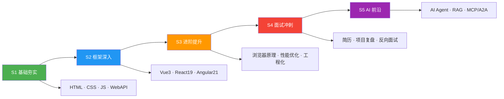
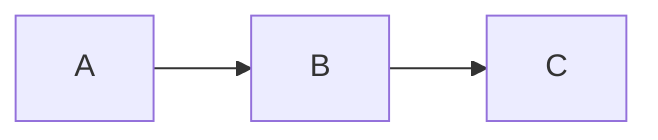

# 🎯 前端知识体系 Wiki

Welcome to the **Frontend Knowledge System** Wiki — a comprehensive documentation site for frontend engineers preparing for interviews and building production-grade React applications.

## Quick Links

| Section | Description |
|---------|-------------|
| [Architecture](#architecture) | System architecture, component tree, data flow |
| [Component Reference](#component-reference) | All 11 components with props, hooks, and behaviors |
| [Data Flow](#data-flow) | Content loading, navigation, search indexing |
| [Development Guide](#development-guide) | Setup, scripts, configuration, coding standards |
| [Content Contribution](#content-contribution-guide) | How to add/edit markdown content |
| [Deployment](#deployment) | Build process, GitHub Pages deployment |
| [Tech Stack](#tech-stack-decisions) | Technology decisions and rationale |

## Project Overview

A **React 19** static documentation site serving as a structured frontend knowledge base. Originally migrated from VitePress, it covers 6 learning stages from HTML/CSS fundamentals to Go backend development.

### Key Features

- **React 19** with TypeScript strict mode
- **Vite 8** build with rolldown and code splitting
- **Lazy loaded** Mermaid diagrams (60KB+ saved on initial load)
- **Global search** with deferred filtering across all content
- **Dark/light theme** with `useSyncExternalStore`
- **Image lightbox** with zoom and pan
- **Version update notifications** with polling

### Learning Paths



## Tech Stack

| Layer | Technology |
|-------|-----------|
| Framework | React 19 + TypeScript (strict) |
| Build | Vite 8 + rolldown |
| Routing | React Router 8.1 (HashRouter) |
| Content | Markdown via `import.meta.glob` |
| Rendering | react-markdown + remark-gfm |
| Highlighting | highlight.js |
| Diagrams | Mermaid 11 (lazy loaded) |
| Quality | Biome, TypeScript strict |
| Package | Bun |
| Deploy | GitHub Pages |

---

# Architecture

## Component Tree

```
<StrictMode>
  <HashRouter>
    <App>
      <Header>
        ├── Logo + NavDropdown (recursive from navConfig)
        ├── Search button → <GlobalSearch>
        ├── Theme toggle
        └── GitHub link
      <main>
        <ErrorBoundary>
          <Routes>
            <Route path="/">      → <HomePage>
                                    ├── <HeroCanvas> (particle animation)
                                    ├── Feature cards
                                    └── Motto section
             <Route path="/*">     → <DocPage>
                                     ├── <DocVirtualScroll>
                                     │   ├── Section 0 → <MarkdownRenderer>
                                     │   ├── Section 1 → <MarkdownRenderer>
                                     │   ├── Section 2 (placeholder)
                                     │   └── Section N (placeholder)
                                     │   ├── <MermaidDiagram> (lazy)
                                     │   ├── <CopyButton>
                                     │   └── <LightboxImage>
                                     └── <Outline>
          </Routes>
        </ErrorBoundary>
      </main>
      <UpdateNotification>
```

## Data Flow

```
┌─────────────┐     route change      ┌──────────────────┐
│  navigation │ ──────────────────►   │    DocPage       │
│  .ts        │                       │                  │
│  (static)   │   useLocation()       │ loadContent(url) │
└─────────────┘                       └────────┬─────────┘
                                               │
                                    ┌──────────▼──────────┐
                                    │   data/content.ts    │
                                    │                     │
                                    │ import.meta.glob    │
                                    │ ('/**/*.md?raw')    │
                                    │                     │
                                    │ 1. Look up URL→file │
                                    │ 2. Load .md module  │
                                    │ 3. Strip frontmatter│
                                    │ 4. Return {content} │
                                    └──────────┬──────────┘
                                               │
                    ┌──────────────────────────┼──────────┐
                    │                          │          │
             ┌──────▼──────┐          ┌───────▼──────┐   │
             │ Markdown    │          │  Outline     │   │
             │ Renderer    │          │  (headings)  │   │
             │             │          └──────────────┘   │
             │ code → hljs │                            │
             │ code mermaid│──lazy──► <MermaidDiagram>  │
             │ img  → lightbox                          │
             │ a    → navigate                          │
             └─────────────┘                            │
                                                        │
              ┌─────────────────────────────────────────┘
              │
       ┌──────▼──────┐
       │ GlobalSearch │
       │              │
       │ Loads ALL    │
       │ pages on     │
       │ open, builds │
       │ search index │
       └──────────────┘
```

## Route Design

| Path | Component | Description |
|------|-----------|-------------|
| `/` | HomePage | Landing page with hero, cards |
| `/*` | DocPage | Catch-all for all content pages |
| `/S1-基础夯实/...` | DocPage | Stage 1 content |
| `/S2-框架深入/...` | DocPage | Stage 2 content |
| `/S3-进阶提升/...` | DocPage | Stage 3 content |
| `/S4-面试冲刺/...` | DocPage | Stage 4 content |
| `/S5-AI/...` | DocPage | Stage 5 content |
| `/S6-Go/...` | DocPage | Stage 6 content |

All content routes use `HashRouter` — the hash portion (`#/path`) is not sent to the server, enabling static hosting without server-side redirect rules.

## State Management

There is no global state library. State is managed through:

| Pattern | Usage |
|---------|-------|
| `useState` | Local component state (search query, theme toggle, modals) |
| `useSyncExternalStore` | Theme subscription to `<html>` class mutations |
| `useMemo` | Derived data (headings from content, search results) |
| `useRef` | Transient values (drag state, timers, mermaid init) |
| `useDeferredValue` | Search query filtering to keep input responsive |

## Bundle Splitting

```
vendor chunk        → node_modules (react, react-dom, react-router-dom)
MermaidDiagram      → lazy loaded, separate chunk (~2.6KB)
Each S[1-6]-*/*.md  → code-split by Vite rolldown (2046 modules)
```

## Error Handling

- **ErrorBoundary** wraps all routes — catches render errors, shows error UI with reload button
- **DocPage catch** — handles `loadContent` promise rejections (network errors, bad imports)
- **UpdateNotification** — silent catch on version fetch failures

---

# Component Reference

## App (`src/App.tsx`)

Root layout component. Renders Header, Routes (with ErrorBoundary), and UpdateNotification.

```tsx
<App />
```

## Header (`src/components/Header.tsx`)

Fixed top navigation bar.

**Internal components:**
- `NavDropdown` — recursive nav menu from `navConfig`

**State:** `menuOpen` (mobile hamburger), `searchOpen`

**Behavior:**
- Renders `navConfig` as recursive dropdowns
- Mouse enter/leave with 200ms delay for submenu
- Mobile: hamburger toggle at ≤960px
- Search button opens `GlobalSearch` modal
- Theme toggle: checkbox controlling `<html>.dark` class

## HomePage (`src/components/HomePage.tsx`)

Landing page with hero section, feature cards, and motto section.

**Renders:** `<HeroCanvas>`

## HeroCanvas (`src/components/HeroCanvas.tsx`)

Canvas-based particle animation for the hero background.

**Behavior:**
- 60 particles with velocity, bounce off edges
- Lines drawn between particles within 150px distance
- Colors read from CSS variables `--c-brand` and `--c-brand-blue`
- Auto-resizes with window, cleanup on unmount

## DocPage (`src/components/DocPage.tsx`)

Content page that loads and renders markdown via virtual scroll.

**State:** `content`, `loading`, `notFound`

**Derived:** `headings` via `splitMarkdown()` + `useMemo`

**Behavior:**
- Calls `loadContent(location.pathname)` on route change
- Cancels in-flight requests via `cancelled` flag
- Extracts h1-h2 headings via `splitMarkdown()` for Outline sidebar
- Delegates rendering to `<DocVirtualScroll>` instead of rendering `<MarkdownRenderer>` directly
- Shows loading spinner, 404 page, or content

**Props:** (none — reads from `useLocation()`)

## DocVirtualScroll (`src/components/DocVirtualScroll.tsx`)

Virtual scrolling container for large markdown documents. Splits content by h1/h2 headings and only renders sections near the viewport.

**Props:**

| Prop | Type | Description |
|------|------|-------------|
| `content` | `string` | Raw markdown content to render |

**Behavior:**
- Splits markdown into sections via `splitMarkdown()` utility
- Uses `IntersectionObserver` with 600px root margin to detect visible sections
- Active sections render full markdown via `<MarkdownRenderer>`
- Off-screen sections render as lightweight placeholders (heading only, no markdown parsing)
- Overscan of 3 sections above/below viewport for smooth scroll
- `content-visibility: auto` CSS on all sections for browser-level optimization
- Hash navigation (e.g. `#section-title`) forces target section to render immediately
- Falls back to simple `<MarkdownRenderer>` when content has ≤1 section

**Internal State:**
- `activeRef` — `Set<number>` tracking which sections are active (stored in ref, triggers re-render via counter state)
- `heightCache` — `Map<number, number>` caching rendered section heights

**Performance:**
- Initial render only processes 5 sections (≈200–300 lines) through react-markdown
- 4000-line document → ~15-20 active sections vs 80+ total, 10-20x DOM reduction

## MarkdownRenderer (`src/components/MarkdownRenderer.tsx`)

Core markdown rendering engine.

**Props:**

| Prop | Type | Description |
|------|------|-------------|
| `content` | `string` | Raw markdown content |
| `basePath` | `string` | Current route path for resolving relative links |

**Custom Components:**

| Component | Description |
|-----------|-------------|
| `code` | Syntax highlighting via highlight.js; mermaid blocks rendered as `<MermaidDiagram>`; copy button on code blocks |
| `a` | External links → `target="_blank"`; internal links → React Router `navigate()`; anchor links → smooth scroll |
| `img` | Renders `<LightboxImage>` with click-to-zoom overlay |
| `h1/h2/h3` | Auto-generates `id` from text for anchor navigation |

**Internal Components:**

- `CopyButton` — clipboard write with fallback to `document.execCommand`
- `LightboxImage` — overlay with wheel zoom, mouse drag pan, double-click reset

## MermaidDiagram (`src/components/MermaidDiagram.tsx`)

Lazy-loaded diagram renderer.

**Props:**

| Prop | Type | Description |
|------|------|-------------|
| `chart` | `string` | Mermaid diagram source text |

**Behavior:**
- Initializes mermaid once (via `useRef` flag)
- Renders SVG inline
- Click opens lightbox overlay
- Auto-fits diagram to viewport on open
- Wheel zoom (0.25x–5x), mouse drag, double-click reset

## Outline (`src/components/Outline.tsx`)

Sticky table-of-contents sidebar.

**Props:**

| Prop | Type | Description |
|------|------|-------------|
| `headings` | `Heading[]` | Array of `{ level, text }` |

**Behavior:**
- Visible at ≥1280px viewport width
- Indentation based on heading level
- Smooth scroll to heading on click

## GlobalSearch (`src/components/GlobalSearch.tsx`)

Full-text search modal.

**Props:**

| Prop | Type | Description |
|------|------|-------------|
| `onClose` | `() => void` | Callback to close modal |

**State:** `query`, `activeIndex`, `items` (search index), `ready`

**Behavior:**
- On mount, loads ALL pages via `loadContent()` + extracts headings for indexing
- Filters using `useDeferredValue` for responsive typing
- Keyboard navigation: ArrowUp/Down, Enter, Escape
- Navigates to page/heading on select

## ErrorBoundary (`src/components/ErrorBoundary.tsx`)

Class component error boundary.

**Props:**

| Prop | Type | Description |
|------|------|-------------|
| `children` | `ReactNode` | Child components |

**Behavior:**
- Catches render errors via `getDerivedStateFromError`
- Shows error message with reload button

## UpdateNotification (`src/components/UpdateNotification.tsx`)

Version update polling notification.

**Behavior:**
- Fetches `version.json?t=${Date.now()}` on mount
- Polls every 5 minutes
- Shows notification when version changes
- "Refresh" button → stores new version + reloads
- "Dismiss" button → stores dismissed version
- Uses `useRef` to avoid redundant version fetches

---

# Data Flow

## Content Loading Pipeline

```
URL path (e.g., "/S1-基础夯实/01-HTML")
        │
        ▼
  decodeURIComponent()
        │
        ▼
  normalize trailing slash
        │
        ▼
  Look up in urlToFile Map
  (built at module init from import.meta.glob)
        │
        ▼
  import.meta.glob dynamically imports the .md file
  (each file is a separate Vite chunk)
        │
        ▼
  stripFrontmatter() removes YAML frontmatter
        │
        ▼
  Returns { content: string, url: string }
```

## URL-to-File Mapping

Built once at module load time in `data/content.ts`:

```typescript
const lazyModules = import.meta.glob('/S{1,2,3,4,5,6}-*/**/*.md', {
  query: '?raw',
  import: 'default',
})
```

For each matched file:
- Strip `.md` extension → URL path
- If path ends with `/index`, remove it
- Store in `urlToFile` Map

**Important:** Directory `index.md` files map to the directory URL. For example, `S1-基础夯实/index.md` → `/S1-基础夯实/`.

## Navigation Data

`data/navigation.ts` defines a recursive `NavItem` tree:

```typescript
interface NavItem {
  text: string
  link?: string       // Leaf node (has content)
  items?: NavItem[]   // Branch node (sub-menu)
}
```

The `navConfig` array is the complete site navigation. Each link must match a URL that maps to an existing markdown file for content to load.

## Search Index

`GlobalSearch` builds its index by:

1. Flattening `navConfig` into `PageInfo[]` via `flattenNav()`
2. On mount, loading EVERY page via `loadContent()`
3. Extracting headings from each page
4. Creating `SearchItem[]` with both page entries and heading entries
5. Index cached in state; filtering via `useDeferredValue`

## Theme State

```
useTheme() hook
  │
  ▼
useSyncExternalStore(
  subscribe: MutationObserver on <html>.class,
  getSnapshot: 'dark' if classList.contains('dark')
)
  │
  ▼
toggleTheme() → toggle class + localStorage
```

The theme is persisted to `localStorage` and applied as a class on `<html>` via an inline script in `index.html` (before React hydrates, to prevent flash).

## Version Update Flow

```
UpdateNotification
  │
  ▼
On mount: fetch /common/version.json?t={Date.now()}
  │
  ▼
Store version in localStorage('cached-version')
  │
  ▼
Poll every 5min: fetch version.json
  │
  ├── same as cached → nothing
  └── different & not dismissed → show notification
        │
        ├── Refresh → store + reload
        └── Dismiss → store as dismissed version
```

## Performance Considerations

| Concern | Solution |
|---------|----------|
| Content loading | Code-split per markdown file via Vite glob imports |
| Mermaid bundle | Lazy loaded with `React.lazy` + Suspense |
| Search filtering | `useDeferredValue` defers expensive filter computation |
| Re-renders | `useMemo` for derived data, `useCallback` for stable handlers |
| Image loading | Native `loading="lazy"` attribute |
| CSS transitions | Only `background` on body (removed expensive `color` transition) |
| Large MD documents | `DocVirtualScroll` splits by headings, IntersectionObserver deactivates off-screen sections, `content-visibility: auto` for browser-level skip |

---

# Development Guide

## Prerequisites

- **Bun** ≥1.2 (package manager)
- **Node.js** ≥18 (for TypeScript)

## Setup

```bash
git clone <repo-url>
cd frontend-interview-notes
bun install
```

## Commands

| Command | Description |
|---------|-------------|
| `bun dev` | Start dev server at `http://localhost:5000` |
| `bun run build` | TypeScript check + Vite production build + version generation |
| `bun run preview` | Preview production build locally |
| `bun run lint` | Run Biome formatter + linter |
| `bun run typecheck` | TypeScript type check only |

## Project Structure

```
frontend-interview-notes/
├── src/                    # React application source
│   ├── components/         # UI components (12 total)
│   ├── data/              # Static data + content loader
│   ├── hooks/             # Custom React hooks
│   ├── utils/             # Utility functions
│   ├── App.tsx            # Root component
│   ├── main.tsx           # Entry point
│   └── index.css          # Global styles (1200+ lines)
├── S1-基础夯实/            # Stage 1 content
├── S2-框架深入/            # Stage 2 content
├── S3-进阶提升/            # Stage 3 content
├── S4-面试冲刺/            # Stage 4 content
├── S5-AI/                # Stage 5 content
├── S6-Go/                # Stage 6 content
├── public/               # Static assets (logo.svg)
├── scripts/              # Build scripts
├── vite.config.ts        # Vite configuration
├── biome.json            # Biome configuration
└── tsconfig*.json        # TypeScript configuration
```

## Coding Standards

### TypeScript
- **strict mode** enabled in `tsconfig.app.json`
- All components use TypeScript interfaces for props
- Avoid `any` — prefer `unknown` with type guards

### React
- Functional components only (no class components except `ErrorBoundary`)
- Hooks for state/effect management
- `useMemo` for derived data, `useCallback` for stable callbacks
- `useRef` for DOM refs and transient mutable values
- Named exports for hooks, default exports for components

### Imports
- Direct imports only (no barrel/index re-exports)
- Absolute imports for src modules (Vite resolves from root)

### Styles
- BEM-like naming: `.component-name`, `.component-name__element`
- CSS custom properties for theming
- Dark mode via `.dark` class selector overrides
- Mobile-first responsive breakpoints

## Configuration Files

### `vite.config.ts`

```typescript
export default defineConfig({
  base: '/common/',               // GitHub Pages base path
  server: { port: 5000 },
  build: {
    chunkSizeWarningLimit: 2000,
    rolldownOptions: {
      output: { codeSplitting: { groups: [{ name: 'vendor', test: /node_modules/ }] } }
    }
  }
})
```

### `biome.json`

```json
{
  "formatter": { "indentStyle": "space", "indentWidth": 2, "lineWidth": 100 },
  "javascript": { "formatter": { "semicolons": "asNeeded", "quoteStyle": "single" } }
}
```

## Adding a New Component

1. Create file in `src/components/`
2. Use TypeScript interface for props
3. Export as default
4. Import directly (no barrel files)
5. Add styles in `src/index.css` using BEM naming

## Verifying Changes

Always run these before committing:

```bash
bun run lint
bun run typecheck
bun run build
```

---

# Content Contribution Guide

## Adding New Content

### 1. Create the Markdown File

Place your `.md` file in the appropriate stage directory:

```
S1-基础夯实/       → HTML, CSS, JavaScript
S2-框架深入/       → Vue3, React19, Angular21, framework comparisons
S3-进阶提升/       → Browser internals, performance, engineering
S4-面试冲刺/       → Resumes, interview questions, project deep-dives
S5-AI/            → AI/Agent learning paths
S6-Go/            → Go language
```

### 2. Update Navigation

Edit `src/data/navigation.ts` to add your content to the nav tree:

```typescript
export const navConfig: NavItem[] = [
  {
    text: 'Section Name',
    items: [
      { text: '📖 My Article', link: '/S1-基础夯实/my-article' },
    ],
  },
]
```

### 3. (Optional) Set as Directory Index

If your file should serve as the directory landing page, name it `index.md`:

```
S1-基础夯实/
├── index.md         ← Loaded at /S1-基础夯实/
├── 01-HTML.md      ← Loaded at /S1-基础夯实/01-HTML
```

## Content Formatting

### Frontmatter (optional)

YAML frontmatter between `---` delimiters is automatically stripped:

```markdown
---
title: My Article
---

Content starts here...
```

### Headings

Headings generate anchor IDs for the Outline sidebar and search. IDs are derived by lowercasing and replacing spaces with hyphens.

```markdown
# H1 — Document title
## H2 — Major section
### H3 — Sub-section
```

**Note:** Duplicate heading IDs (same text at same level) will cause both outline items to scroll to the first occurrence.

### Diagrams (Mermaid)

Wrap mermaid diagrams in fenced code blocks with language `mermaid`:

````markdown

````

The diagram is:
- Rendered inline in the page
- Clickable to open a lightbox with zoom/pan
- Lazy loaded (Mermaid library only fetched when a mermaid block exists)

### Code Blocks

Specify language for syntax highlighting:

````markdown
```typescript
const x: number = 42
```
````

Copy button appears on hover.

### Internal Links

Relative links to other markdown files are resolved automatically:

```markdown
[HTML Basics](./01-HTML)
[CSS Guide](../02-CSS)
[Anchor within page](#section-name)
```

Absolute paths are used as-is:

```markdown
[Stage Overview](/S1-基础夯实/)
```

External links open in new tab:

```markdown
[React Docs](https://react.dev)
```

### Images

Standard Markdown images render with click-to-zoom lightbox:

```markdown

```

## Content Organization Rules

1. **One topic per file** — each markdown file should cover a single coherent topic
2. **Directory index** — each stage directory should have an `index.md` overview
3. **File names** — use kebab-case with numeric prefixes for ordering
4. **Stage prefix** — content directories must match `S{1,2,3,4,5,6}-*` pattern for Vite glob discovery

## Search Indexing

When `GlobalSearch` opens, it:
1. Loads every markdown file via `loadContent()`
2. Extracts all h1–h3 headings
3. Builds search index with page titles, breadcrumbs, and heading links

No additional configuration needed — new content is automatically discovered.

---

# Deployment

## Build Process

```bash
bun run build
```

This runs three steps sequentially:

1. **`tsc -b`** — TypeScript type check (project references)
2. **`vite build`** — Production bundle via rolldown
3. **`node scripts/gen-version.mjs`** — Post-build script

### Build Output

```
dist/
├── index.html              # Entry HTML
├── 404.html                # SPA fallback (copy of index.html)
├── version.json            # { "timestamp": 1748765432100 }
├── assets/
│   ├── index-*.css         # Global styles
│   ├── rolldown-runtime-*.js
│   ├── index-*.js          # Main application bundle
│   ├── vendor-*.js         # node_modules bundle
│   ├── MermaidDiagram-*.js # Lazy-loaded mermaid chunk
│   └── S{1-6}-*/**/*.js    # Code-split content chunks
```

### Post-Build Script (`scripts/gen-version.mjs`)

```javascript
// Writes dist/version.json with current timestamp
// Copies index.html → 404.html for SPA fallback
```

The `version.json` enables the `UpdateNotification` component to detect new deployments. The `404.html` copy ensures GitHub Pages serves the SPA correctly on direct URL access.

## GitHub Pages

This site is deployed to GitHub Pages under the `/common/` base path.

### Configuration

- **Repository:** `KMaybe01/common`
- **Base URL:** `https://k maybe01.github.io/common/` (set in `vite.config.ts` as `base: '/common/'`)
- **Branch:** `gh-pages` (or configured in repo Settings > Pages)
- **Build output:** `dist/`

### SPA Routing

Since the site uses `HashRouter`, all routes are under `#/path` — the server only sees `/common/` as the root. The `404.html` copy is a fallback for any direct URL accesses.

## Version Detection

The `UpdateNotification` component polls `version.json` every 5 minutes. When a new build is deployed:

1. `version.json` timestamp changes
2. Component detects difference from cached version
3. Shows "内容已更新" notification
4. User can refresh or dismiss

## CI/CD (Suggested)

For automated deployment, add a GitHub Actions workflow:

```yaml
name: Deploy to GitHub Pages
on:
  push:
    branches: [main]
jobs:
  build-and-deploy:
    runs-on: ubuntu-latest
    steps:
      - uses: actions/checkout@v4
      - uses: oven-sh/setup-bun@v2
      - run: bun install
      - run: bun run build
      - uses: peaceiris/actions-gh-pages@v3
        with:
          github_token: ${{ secrets.GITHUB_TOKEN }}
          publish_dir: ./dist
```

---

# Tech Stack Decisions

## React 19

**Why:** Latest stable React with:
- `use()` hook for promise-based data fetching
- `useActionState` for form state management
- React Compiler optimizations (automatic memoization)
- Improved hydration and SSR support (not used here, but forward-compatible)

**Used for:** Component rendering, state management, side effects.

## TypeScript (strict mode)

**Why:** Full type safety catches errors at build time. Strict mode enables:
- `noImplicitAny` — all types must be explicitly declared or inferred
- `strictNullChecks` — null/undefined must be handled
- `noUncheckedIndexedAccess` — array/map access requires bounds checking

## Vite 8 + rolldown

**Why:** Vite is the de-facto standard for React projects. Key benefits:
- Native ESM dev server with instant HMR
- rolldown bundler (Rust-based, faster than esbuild)
- `import.meta.glob` for file-system based content discovery
- Built-in TypeScript and JSX support

## React Router 8.1 (HashRouter)

**Why:** HashRouter enables static hosting without server-side URL rewriting:
- URLs like `https://site.com/common/#/path`
- No 404 issues on GitHub Pages
- `future.v7_startTransition` for React 18+ concurrent features
- `future.v7_relativeSplatPath` for consistent splat route matching

## react-markdown + remark-gfm

**Why:** Renders markdown content into React components with full control over rendering:
- Custom component overrides for code blocks, links, images, headings
- GFM (tables, strikethrough, task lists, URLs)
- Pluggable via remark/rehype plugins

## highlight.js

**Why:** Syntax highlighting for code blocks:
- 190+ language support
- Lightweight when only needed languages are included
- CSS-based theming (dark/light mode compatible)

## Mermaid 11 (lazy loaded)

**Why:** Diagram rendering from text:
- Flowcharts, sequence diagrams, class diagrams, Gantt, etc.
- Rendered as inline SVG
- Lazy loaded via `React.lazy()` to exclude from main bundle (~60KB savings)

**Trade-off:** Only loaded when a page contains a ```` ```mermaid ```` block.

## Biome

**Why:** All-in-one linter and formatter:
- Faster than ESLint + Prettier combined
- TypeScript-native parsing
- Consistent formatting (2-space indent, no semicolons, single quotes)

## Bun

**Why:** Package manager and runtime:
- Faster installs than npm/yarn/pnpm
- Native TypeScript execution
- Compatible with Node.js APIs

## Key Performance Decisions

| Decision | Rationale |
|----------|-----------|
| `useMemo` for components object | Prevents remounting all markdown components on every render |
| `useDeferredValue` for search | Keeps input responsive during heavy filtering |
| `useSyncExternalStore` for theme | Correct external store subscription (prevents tearing) |
| `useRef` for mermaid init | Avoids module-level mutable state (testability) |
| CSS variables + `.dark` class | Single stylesheet, no runtime theme switching cost |
| `loading="lazy"` on images | Native browser lazy loading, no JS overhead |
| Content code-splitting | Each markdown file is a separate chunk, loaded on demand |
| DocVirtualScroll + IntersectionObserver | Splits large MD by headings, only renders viewport-nearest sections; 10-20x DOM reduction for 4000-line documents |
