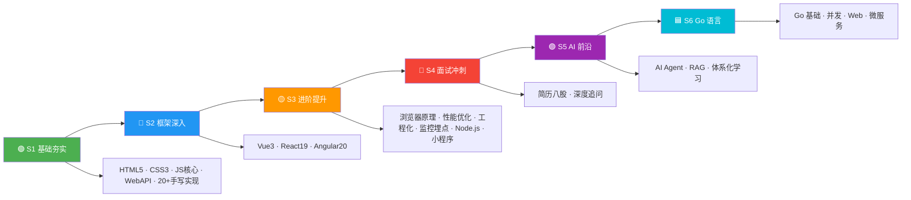

---
# https://vitepress.dev/reference/default-theme-home-page
layout: home

hero:
  name: "前端知识体系"
  text: "2026前端技术全景学习路径"
  tagline: HTML· CSS · JavaScript · Vue3 · React19 · Angular20 · 性能优化 · 工程化 · 监控埋点 · AI 前沿 · Go 语言
  image:
    src: /logo.svg
    alt: Frontend Interview Notes
  actions:
    - theme: brand
      text: 开始学习
      link: /S1-基础夯实/
    - theme: alt
      text: 在 GitHub 查看
      link: https://github.com/KMaybe01/common

features:
  - icon: 🟢
    title: S1 基础夯实
    details: HTML5 · CSS3 · JavaScript 核心 · Web API · 20+ 手写实现
    link: /S1-基础夯实/
  - icon: 🔵
    title: S2 框架深入
    details: Vue3 · React19 · Angular20 · 框架对比与选型
    link: /S2-框架深入/
  - icon: 🟡
    title: S3 进阶提升
    details: 浏览器原理 · 性能优化 · 工程化 · 监控埋点 · Node.js
    link: /S3-进阶提升/
  - icon: 🔴
    title: S4 面试冲刺
    details: 简历优化 · 项目复盘 · 反向面试 · 真实项目深度分析
    link: /S4-面试冲刺/
  - icon: 🟣
    title: S5 AI 前沿
    details: AI Agent · RAG · 端侧推理 · MCP/A2A 协议 · 大模型基础
    link: /S5-AI/
  - icon: 🟦
    title: S6 Go 语言
    details: Go 基础 · 并发编程 · Web 开发 · 微服务架构
    link: /S6-Go/
---

## 🗺️ 五阶段学习路径图



---

## 📈 前端技术发展脉络（2010—2026）

> 了解技术从哪里来、到哪里去，是面试中展现"技术视野"的关键。

### 阶段一：刀耕火种（2010—2014）
```
HTML4 + CSS2 + jQuery         ← 原生 DOM 操作，贫血架构
├─ 2010: AngularJS（MVC 理念引入前端）
├─ 2011: React 诞生（虚拟 DOM 新范式）
├─ 2013: React 开源 + Node.js 生态萌芽
└─ 2014: HTML5 定稿，ES6 草案推进
```

### 阶段二：框架三国（2014—2019）
```
├─ 2014: Vue 1.0 发布（轻量级选手入场）
├─ 2015: React Native（跨平台）、ES6 正式发布
├─ 2016: Angular 2.0 重写（TypeScript 原生）、Vue 2.0
├─ 2017: React Fiber 架构重写开始
├─ 2018: Vue 3.0 提案（Proxy 响应式）
├─ 2019: React Hooks 发布（函数式革命）、Deno 1.0
```

### 阶段三：深度进化（2019—2024）
```
├─ 2020: Vue 3.0 正式版、Vite 诞生（ESM 开发服务器）
├─ 2021: React 18 Concurrent Mode、Angular Ivy 全面
├─ 2022: Next.js 13 App Router、Turbopack
├─ 2023: React 19 预览（Actions/use()）、Angular Signals
├─ 2024: React Compiler（自动记忆化）、Vue 3.5、Angular 18 Zoneless
```

### 阶段四：AI 融合（2024—2026）
```
├─ 2024: AI 编程助手（Cursor/Copilot）、LLM 前端集成
├─ 2025: Agent 互操作（MCP/A2A）、端侧推理（WebGPU）
├─ 2026: React 19 稳定、Vue 3.6 Alien Signals、Angular 21
│         AI Agent 标准化、Server Components 普及化
```

---

## 🔄 核心框架版本迭代速览

| 框架 | 第一代 | 重大重写 | 现代起点 | 最新版本 | 关键转折 |
|------|--------|---------|---------|---------|---------|
| **Vue** | Vue 1.0 (2014) | Vue 2.0 (2016) | Vue 3.0 (2020) | 3.6 (2026) | Options → Composition API |
| **React** | React 0.3 (2013) | React 16 Fiber (2017) | React 18 (2022) | 19 (2025) | Class → Hooks → Compiler |
| **Angular** | AngularJS (2010) | Angular 2 (2016) | Angular 15 (2022) | 21 (2026) | MVC → Component + Ivy |
| **构建工具** | Grunt → Gulp | Webpack 1-4 | Vite (2021) | Vite 8 (2026) | Bundle → ESM native |
| **Node.js** | 0.10 (2013) | 4.x LTS (2015) | 18 LTS (2022) | 22 LTS (2025) | CommonJS → ESM dual |

> 💡 **面试价值**：了解版本迭代的关键节点（如 AngularJS→Angular 2 的断裂式升级、React 16 Fiber 架构重写），能让面试官感受到你的"技术纵深"。

---

## 💼 职场心法

> **最佳跳槽时机 = 你不需要跳槽的时候**

- 永远保持"可被雇佣"状态（每季度更新一次简历）
- 用"离职者心态"打工（我现在做的哪件事，能写进下一份简历？）
- 入职第一天，就思考 3-5 年后（积累"年谈资"，还是积累"资本"？）
- 最可怕的不是跳槽，大家都在怕：打工人的精神状态，"我好像该走了，但不知道能去哪"。
