# 前端面试题库（详细图解版）🚀

> 基于已有高频前端面试题扩展整理。
>
> 特点：
> - 不只是“标准答案”，而是“面试官真正想听什么”
> - 增加底层原理 + 高频追问 + 场景案例
> - 图解化理解（Mermaid 时序图 / 结构图）
> - 适合中高级前端系统复习

---

# 一、JavaScript 基础

---

## 1. 0.1 + 0.2 为什么不等于 0.3？

### 标准答案

JavaScript 使用 IEEE754 双精度浮点数。

0.1 和 0.2 转换为二进制时是无限循环小数：

```txt
0.1 => 0.0001100110011...
0.2 => 0.001100110011...
```

计算机存储时会进行截断，导致精度丢失。

所以：

```js
0.1 + 0.2 === 0.30000000000000004
```

---

## 图解：浮点数精度问题

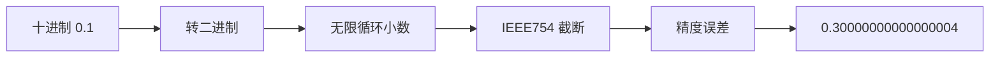

---

## 为什么整数计算没问题？

因为整数在二进制里可以被精确表示。

例如：

```txt
10 => 1010
8 => 1000
```

不会出现无限循环。

---

## 面试官追问 🔥

### 如何解决？

方案：

```js
Math.abs(0.1 + 0.2 - 0.3) < Number.EPSILON
```

或者：

```js
(0.1 * 10 + 0.2 * 10) / 10
```

生产环境通常：

- 金额计算：使用整数分
- 金融系统：Big.js / Decimal.js

---

# 2. == 和 === 的区别

## 核心区别

| 运算符 | 是否类型转换 | 推荐度 |
|---|---|---|
| == | 会 | ❌ |
| === | 不会 | ✅ |

---

## 图解：== 隐式转换流程

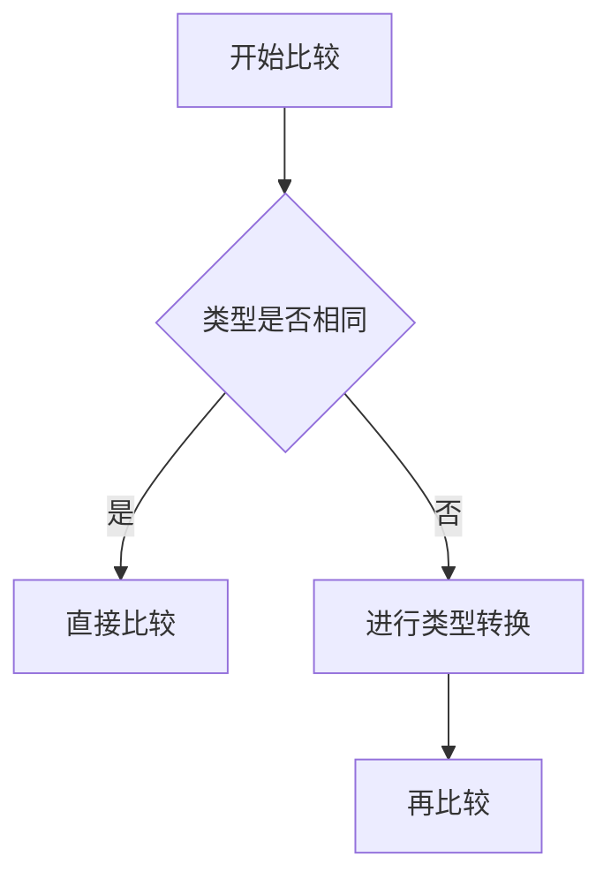

---

## 高频坑点

### [] == ![]

```js
[] == ![]
```

执行过程：

```js
![] => false
[] == false
[] => ''
false => 0
'' => 0
0 == 0
```

结果：

```js
true
```

这是经典面试题。

---

# 3. 闭包是什么？

## 定义

函数能够访问并记住其词法作用域，即使函数在当前作用域之外执行。

---

## 经典示例

```js
function outer() {
  let count = 0

  return function inner() {
    count++
    console.log(count)
  }
}

const fn = outer()
fn()
fn()
```

输出：

```txt
1
2
```

---

## 图解：闭包内存结构

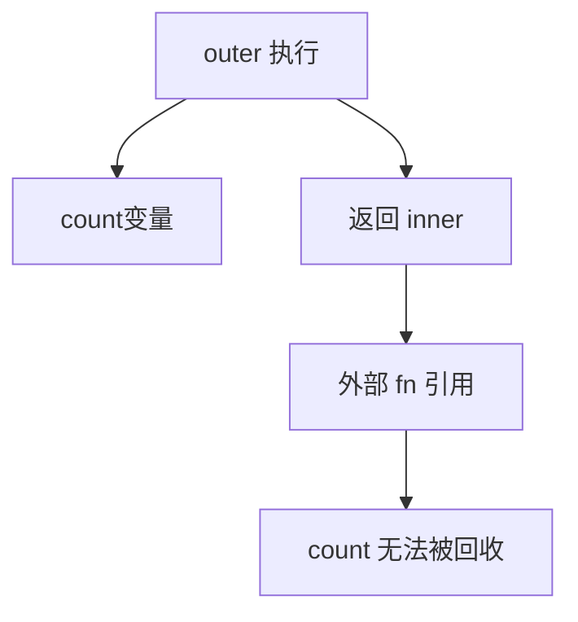

---

## 为什么闭包不会被销毁？

因为：

```txt
存在引用链
Root -> fn -> inner -> count
```

GC（垃圾回收）认为它仍然可达。

---

## 闭包的应用场景

### 1. 数据私有化

```js
function createUser() {
  let token = 'abc'

  return {
    getToken() {
      return token
    }
  }
}
```

---

### 2. 防抖节流

本质：利用闭包保存 timer。

---

### 3. 柯里化

```js
add(1)(2)(3)
```

---

## 闭包的缺点

### 内存泄漏

错误示例：

```js
function test() {
  const hugeData = new Array(1000000)

  return function() {
    console.log(hugeData)
  }
}
```

如果返回函数长期不释放：

```txt
hugeData 永远不会被 GC
```

---

# 4. 原型与原型链

## 核心概念

JavaScript 通过原型链实现继承。

---

## 图解：原型链结构

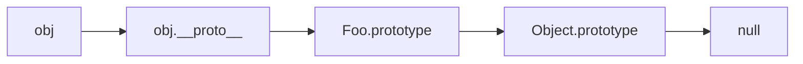

---

## 面试必须会的关系

```js
obj.__proto__ === Foo.prototype
Foo.prototype.constructor === Foo
```

---

## instanceof 原理

本质：

```txt
检查构造函数 prototype 是否在对象原型链上
```

实现思路：

```js
function myInstanceOf(obj, Con) {
  let proto = Object.getPrototypeOf(obj)

  while (proto) {
    if (proto === Con.prototype) {
      return true
    }

    proto = Object.getPrototypeOf(proto)
  }

  return false
}
```

---

# 5. this 指向问题

## 五大绑定规则

| 规则 | 示例 | this |
|---|---|---|
| 默认绑定 | fn() | window / undefined |
| 隐式绑定 | obj.fn() | obj |
| 显式绑定 | call/apply/bind | 指定对象 |
| new绑定 | new Fn() | 新实例 |
| 箭头函数 | ()=>{} | 外层this |

---

## 图解：this 优先级

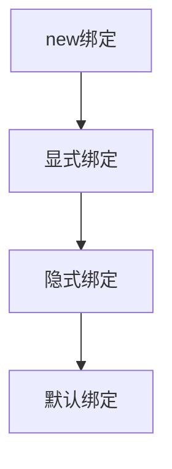

优先级：

```txt
new > bind/call/apply > obj.fn > fn
```

---

## 高频面试题

```js
var name = 'window'

const obj = {
  name: 'obj',
  say() {
    console.log(this.name)
  }
}

const fn = obj.say
fn()
```

输出：

```txt
window
```

因为：

```txt
fn() 属于默认绑定
```

---

# 二、异步编程

---

# 6. Event Loop（事件循环）

## 为什么 JS 是单线程？

因为 JS 需要操作 DOM。

如果多线程同时修改 DOM：

```txt
浏览器无法确定最终结果
```

所以 JS 设计成单线程。

---

## Event Loop 流程图

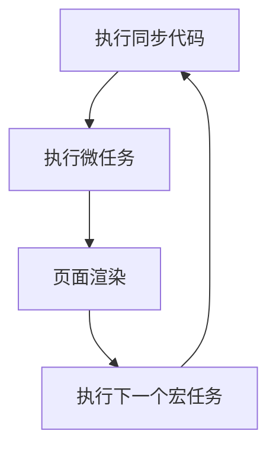

---

## 宏任务 vs 微任务

### 宏任务

- script
- setTimeout
- setInterval
- I/O
- UI render

### 微任务

- Promise.then
- MutationObserver
- queueMicrotask
- process.nextTick(Node)

---

## 高频面试题 🔥

```js
console.log(1)

setTimeout(() => {
  console.log(2)
})

Promise.resolve().then(() => {
  console.log(3)
})

console.log(4)
```

执行顺序：

```txt
1
4
3
2
```

---

## 执行过程图

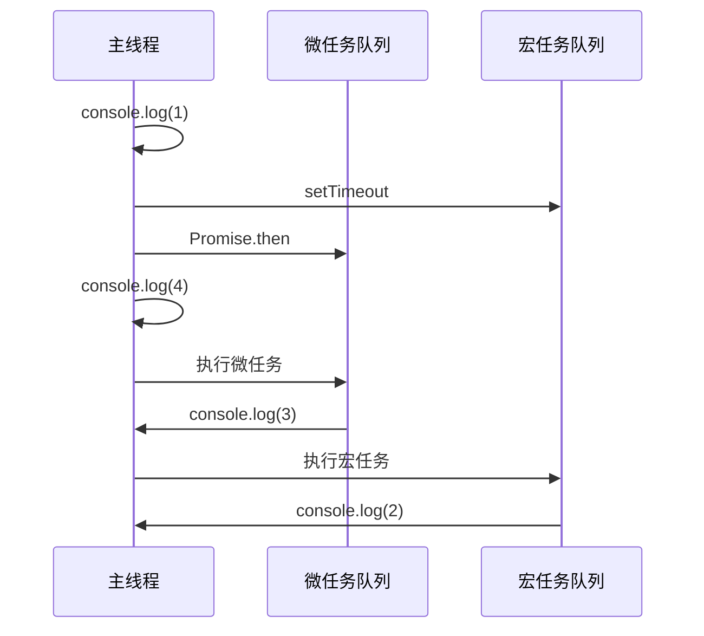

---

# 7. Promise 原理

## Promise 三种状态

```txt
pending
fulfilled
rejected
```

状态一旦改变：

```txt
不可逆
```

---

## Promise 链式调用

```js
Promise.resolve(1)
  .then(res => res + 1)
  .then(res => res + 1)
```

核心：

```txt
then 返回新的 Promise
```

---

## Promise.all 图解

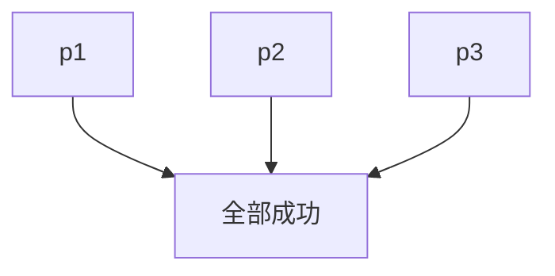

只要有一个失败：

```txt
整体失败
```

---

## Promise.race

谁先完成：

```txt
就返回谁
```

常用于：

```txt
请求超时控制
```

---

# 三、浏览器原理

---

# 8. 从输入 URL 到页面渲染发生了什么？

这是超级高频题 🔥🔥🔥

---

## 完整流程图

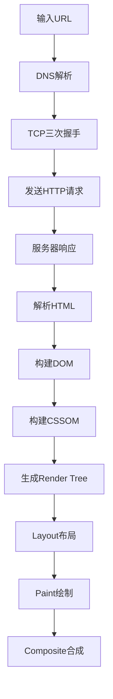

---

## 第一阶段：DNS解析

```txt
域名 -> IP地址
```

查找顺序：

```txt
浏览器缓存
-> hosts
-> 本地DNS
-> 根DNS
-> 顶级域名DNS
-> 权威DNS
```

---

# 9. TCP 三次握手

## 图解

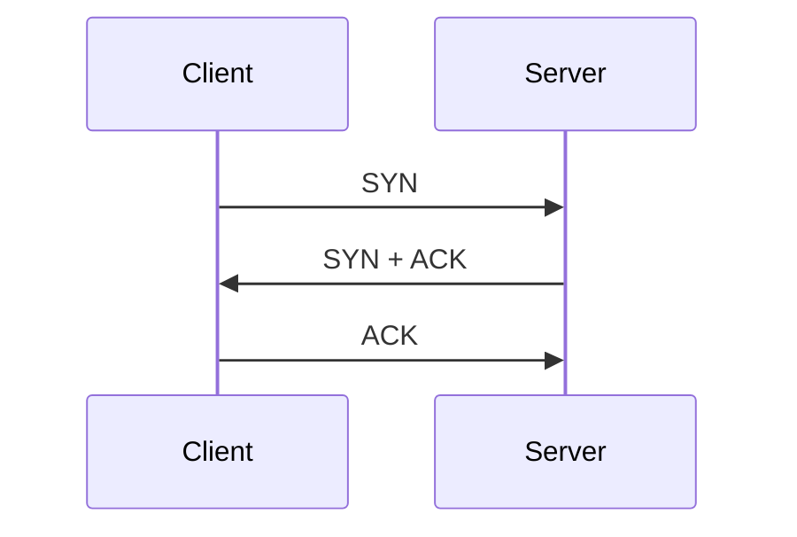

---

## 为什么不是两次？

因为需要确认：

```txt
双方收发能力都正常
```

防止：

```txt
失效连接请求重新到达服务器
```

---

# 10. 浏览器渲染流程

## DOM 树 + CSSOM 树

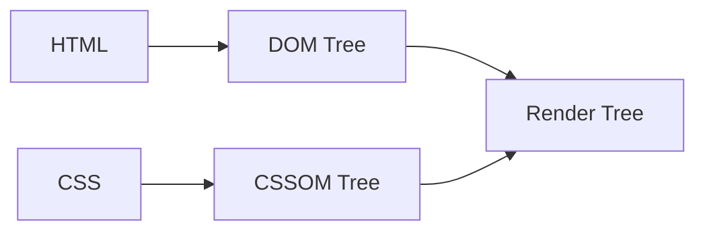

---

## Reflow 与 Repaint

### Reflow（重排）

涉及：

```txt
位置
尺寸
布局
```

代价极高。

---

### Repaint（重绘）

仅改变：

```txt
颜色
背景
```

不影响布局。

---

## 高频优化方案

### 使用 transform 替代 top/left

因为：

```txt
transform 不触发重排
```

只触发：

```txt
composite（合成）
```

GPU 直接处理。

---

# 四、网络协议

---

# 11. HTTP 与 HTTPS 区别

| 对比项 | HTTP | HTTPS |
|---|---|---|
| 安全性 | 明文 | 加密 |
| 端口 | 80 | 443 |
| 性能 | 更快 | 略慢 |
| 证书 | 不需要 | 需要CA证书 |

---

## HTTPS 握手流程

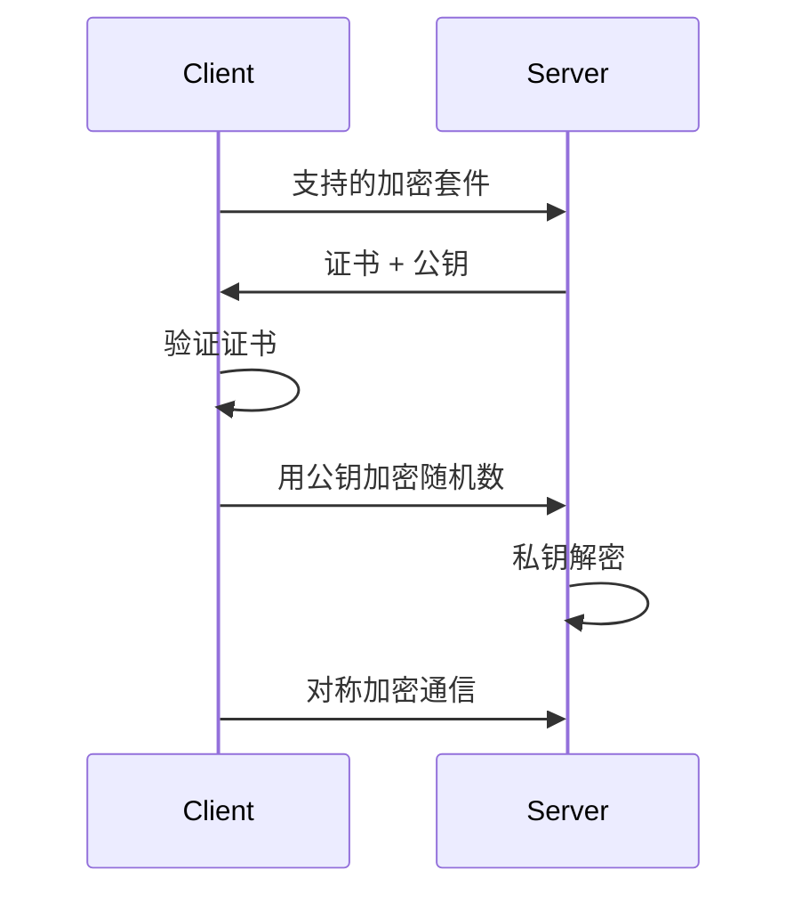

---

## 为什么 HTTPS 更安全？

因为：

```txt
非对称加密 + 对称加密 + 数字证书
```

共同完成。

---

# 12. HTTP 缓存机制

## 强缓存 vs 协商缓存

---

## 强缓存

浏览器直接读取本地缓存。

不会发送请求。

关键字段：

```txt
Cache-Control
Expires
```

---

## 协商缓存

浏览器询问服务器：

```txt
资源有没有更新？
```

关键字段：

```txt
ETag
If-None-Match
Last-Modified
If-Modified-Since
```

---

## 图解：缓存流程

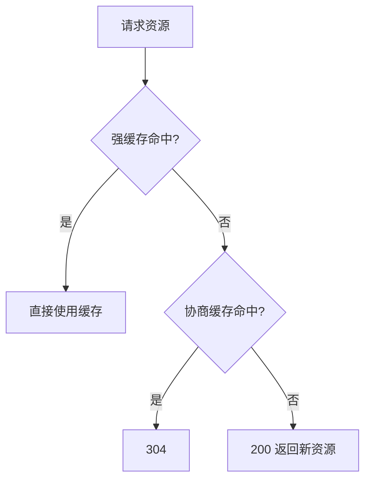

---

# 五、Vue 核心原理

---

# 13. Vue2 响应式原理

## 核心：Object.defineProperty

Vue2 会递归遍历 data：

```js
Object.defineProperty(obj, key, {
  get() {},
  set() {}
})
```

---

## 图解：Vue2 响应式

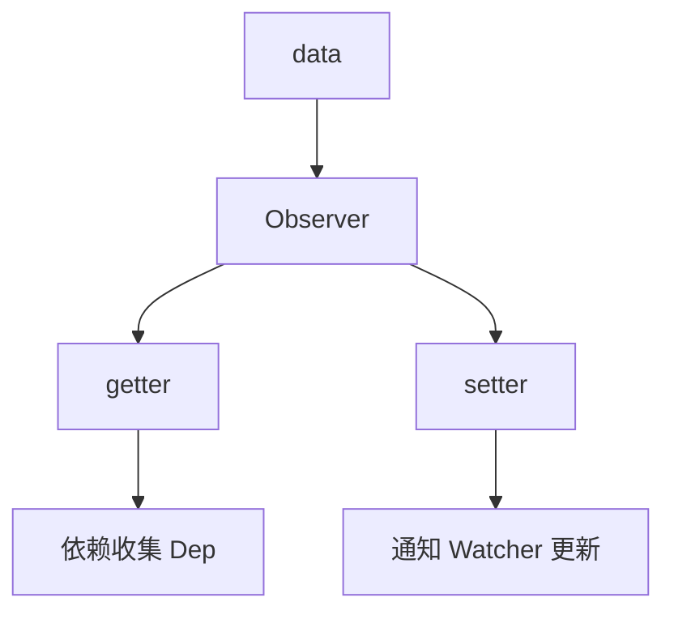

---

## Vue2 的缺陷

### 无法监听：

```txt
对象新增属性
数组下标修改
数组 length 修改
```

所以需要：

```js
Vue.set()
```

---

# 14. Vue3 为什么使用 Proxy？

## Proxy 优势

| 能力 | defineProperty | Proxy |
|---|---|---|
| 监听新增属性 | ❌ | ✅ |
| 监听删除属性 | ❌ | ✅ |
| 监听数组 | ❌ | ✅ |
| 深层递归 | 必须 | 不需要 |

---

## 图解：Vue3 Proxy

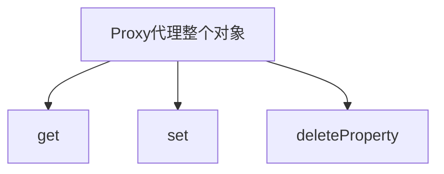

---

# 15. Vue Diff 算法

## 核心思想

```txt
同层比较
```

不会跨层比较。

因为：

```txt
跨层比较复杂度太高
```

---

## key 为什么重要？

key 用于唯一标识 vnode。

---

## 错误示例

```html
<li v-for="item in list" :key="index">
```

问题：

```txt
列表插入时DOM复用错误
```

---

## 正确写法

```html
:key="item.id"
```

---

# 六、React 核心原理

---

# 16. React Fiber 架构

## 为什么 React16 重写 Fiber？

旧版 React：

```txt
递归 diff 无法中断
```

大型应用：

```txt
容易卡顿
```

---

## Fiber 核心思想

```txt
把任务拆成小任务
```

浏览器空闲时执行。

---

## 图解：Fiber

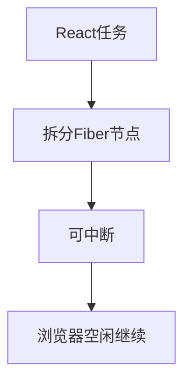

---

# 17. React Hooks 原理

## useState 本质

React 内部：

```txt
链表 + 闭包
```

保存状态。

---

## 为什么 Hooks 不能写在 if 中？

因为：

```txt
Hooks 依赖调用顺序
```

错误示例：

```js
if (flag) {
  useEffect(() => {})
}
```

会导致：

```txt
Hooks 索引错乱
```

---

# 七、工程化

---

# 18. Webpack 构建流程

## 图解：Webpack 打包流程

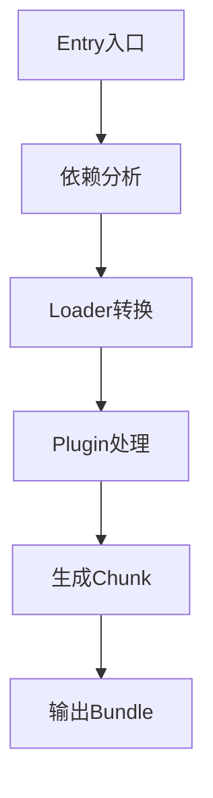

---

## Loader 与 Plugin 区别

| Loader | Plugin |
|---|---|
| 转换文件 | 扩展功能 |
| 文件级别 | 构建生命周期 |
| babel-loader | HtmlWebpackPlugin |

---

# 19. Tree Shaking 原理

## 本质

```txt
删除未使用代码
```

依赖：

```txt
ES Module 静态结构
```

---

## 为什么 CommonJS 不行？

因为：

```js
require(path)
```

是动态的。

无法静态分析。

---

# 八、性能优化

---

# 20. 前端性能优化体系

## 整体思维导图

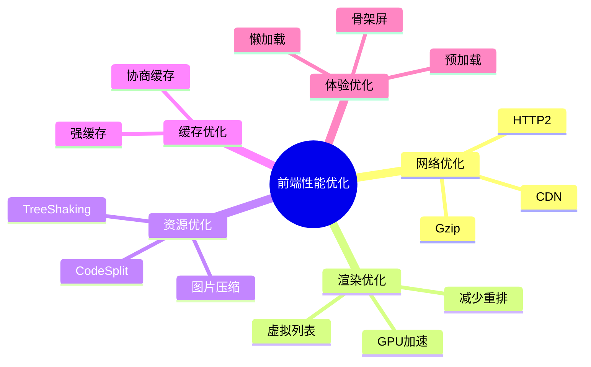

---

# 21. 防抖与节流

## 防抖（Debounce）

### 场景

```txt
搜索框输入
```

用户停止输入后再请求。

---

## 图解

```txt
输入:  ---- ---- ----
执行:              *
```

---

## 节流（Throttle）

### 场景

```txt
scroll
resize
拖拽
```

固定时间执行一次。

---

## 图解

```txt
输入: -------------
执行: *   *   *   *
```

---

# 九、安全

---

# 22. XSS 攻击

## 本质

```txt
向页面注入恶意脚本
```

---

## 经典攻击

```html
<script>
  stealCookie()
</script>
```

---

## 图解：XSS

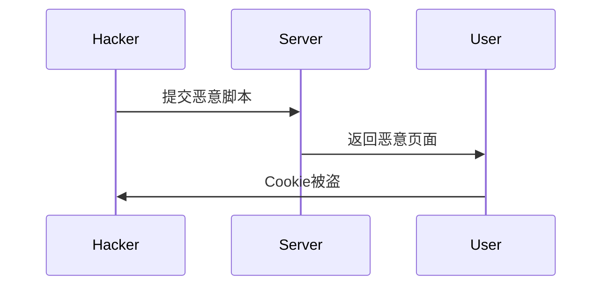

---

## 防御方案

### 1. 转义

```js
< => &lt;
```

---

### 2. CSP

```txt
限制脚本来源
```

---

### 3. HttpOnly

JS 无法读取 Cookie。

---

# 23. CSRF 攻击

## 原理

利用用户登录态。

诱导用户访问恶意网站。

---

## 图解：CSRF

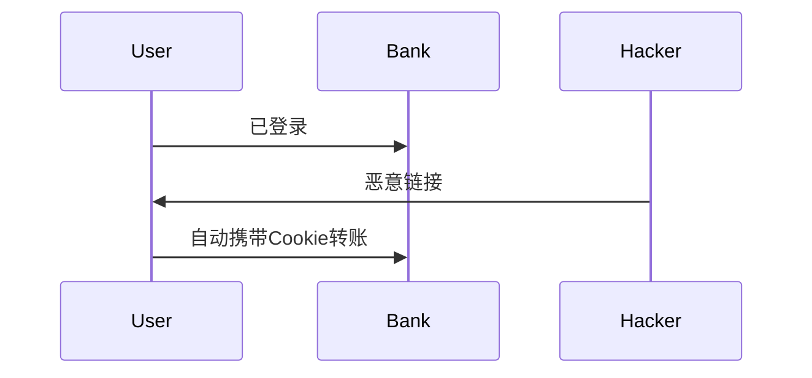

---

## 防御方案

| 方案 | 原理 |
|---|---|
| SameSite | 限制跨站Cookie |
| CSRF Token | 服务端校验 |
| Referer校验 | 来源检查 |

---

# 十、手写代码高频题

---

# 24. 手写 Promise.all

## 面试官考察点

- Promise 状态管理
- 异步并发控制
- 顺序保证
- 错误处理

---

## 实现

```js
Promise.myAll = function(promises) {
  return new Promise((resolve, reject) => {
    const result = []
    let count = 0

    for (let i = 0; i < promises.length; i++) {
      Promise.resolve(promises[i]).then(
        res => {
          result[i] = res
          count++

          if (count === promises.length) {
            resolve(result)
          }
        },
        reject
      )
    }
  })
}
```

---

# 25. 手写深拷贝

## 面试官真正想考什么？

不仅仅是递归。

而是：

```txt
循环引用
Symbol
数组
对象
Map
Set
```

处理能力。

---

## 图解：循环引用

```mermaid
graph TD
A[obj] --> B[self]
B --> A
```

如果没有 WeakMap：

```txt
会无限递归
```

---

## 完整实现

```js
function deepClone(obj, map = new WeakMap()) {
  if (obj === null || typeof obj !== 'object') {
    return obj
  }

  if (map.has(obj)) {
    return map.get(obj)
  }

  const clone = Array.isArray(obj) ? [] : {}

  map.set(obj, clone)

  Reflect.ownKeys(obj).forEach(key => {
    clone[key] = deepClone(obj[key], map)
  })

  return clone
}
```

---

# 十一、大厂高频追问

---

# 26. 为什么 Vue 比 React 更容易上手？

## Vue

特点：

```txt
模板语法
双向绑定
渐进式
```

更接近传统 HTML。

---

## React

特点：

```txt
函数式
JSX
函数式编程思想更强
```

学习曲线更陡。

---

# 27. Vue 和 React 的本质区别

| Vue | React |
|---|---|
| 响应式 | 函数式UI |
| 模板驱动 | JSX驱动 |
| 双向绑定 | 单向数据流 |
| API更多 | 更灵活 |

---

# 28. 为什么 React 要使用不可变数据？

因为 React：

```txt
依赖引用变化判断更新
```

例如：

```js
setState({...state})
```

本质：

```txt
创建新引用
```

方便 diff。

---

# 十二、面试表达技巧

---

# 29. 面试官最喜欢的回答方式

## 错误回答 ❌

```txt
Vue 使用 Object.defineProperty。
```

太浅。

---

## 正确回答 ✅

```txt
Vue2 会递归遍历 data。

通过 Object.defineProperty 劫持 getter/setter。

getter 阶段完成依赖收集。
setter 阶段通知 watcher 更新。

但它无法监听对象新增属性和数组索引变化。

所以 Vue3 改用 Proxy。
```

这类回答：

```txt
原理 + 缺陷 + 演进
```

非常加分。

---

# 30. 中高级前端必须具备的能力

## 初级

```txt
API 使用
```

---

## 中级

```txt
理解原理
```

---

## 高级

```txt
性能
架构
工程化
稳定性
安全
```

---

# 最后建议 📚

## 高频必背模块

优先级：

```txt
JS -> 浏览器 -> 网络 -> Vue/React -> 工程化
```

---

## 高频必会手写题

```txt
防抖
节流
Promise.all
深拷贝
call/apply/bind
new
instanceof
EventEmitter
```

---

## 大厂真正关注的重点

不仅是：

```txt
你会不会写代码
```

而是：

```txt
你是否理解底层原理
你是否具备工程思维
你是否能定位复杂问题
```

---

# 复习建议路线 🚀

```mermaid
flowchart LR
A[JavaScript] --> B[浏览器]
B --> C[网络]
C --> D[Vue/React]
D --> E[工程化]
E --> F[性能优化]
F --> G[安全]
```

---

> 这份详细版更适合作为：
>
> - 面试前冲刺
> - 八股文体系化整理
> - 中高级前端知识地图
> - 面试表达模板
>
> 建议结合手写代码与项目经历一起复习。

