# 一、高频八股题答案版（中高级前端）

---

# 1. React Fiber 是什么？

## 标准答案

React Fiber 是 React 16 后引入的新协调架构，本质上是一种 **可中断 · 可恢复 · 可优先级调度** 的增量渲染机制。

### 为什么需要 Fiber？

传统 React 的协调（reconciliation）是 **递归调用栈**：

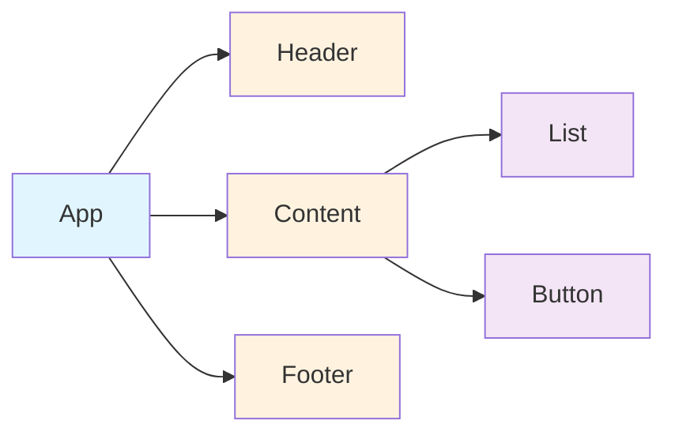
```mermaid
flowchart LR
  A[App] --> B[Header]
  A --> C[Content]
  A --> D[Footer]
  C --> E[List]
  C --> F[Button]
  style A fill:#e1f5fe
  style B fill:#fff3e0
  style C fill:#fff3e0
  style D fill:#fff3e0
  style E fill:#f3e5f5
  style F fill:#f3e5f5
```

**问题**：递归一旦开始无法中断，大组件树会长时间阻塞主线程（>16ms 导致掉帧）。

### Fiber 的核心设计

Fiber 将组件树转换为 **单向链表**，每个节点包含三个指针：

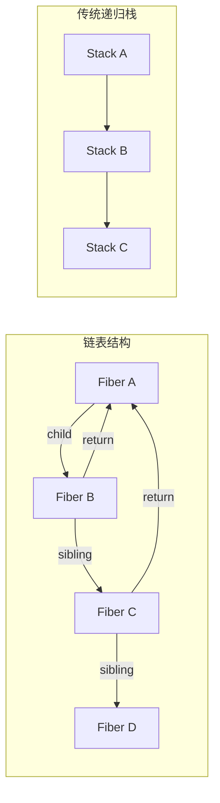
```mermaid
flowchart LR
  subgraph "链表结构"
    F1[Fiber A] -- child --> F2[Fiber B]
    F2 -- sibling --> F3[Fiber C]
    F2 -- return --> F1
    F3 -- sibling --> F4[Fiber D]
    F3 -- return --> F1
  end
  subgraph "传统递归栈"
    S1[Stack A] --> S2[Stack B]
    S2 --> S3[Stack C]
  end
```

| 对比 | 递归栈 | Fiber 链表 |
|------|--------|------------|
| 中断能力 | ❌ 不可中断 | ✅ 可暂停/恢复 |
| 优先级 | ❌ 无 | ✅ 可调度 |
| 复用状态 | ❌ 销毁重建 | ✅ 可复用 |
| 内存 | 栈帧自动管理 | 手动维护链表 |

### 核心机制：时间切片（Time Slicing）

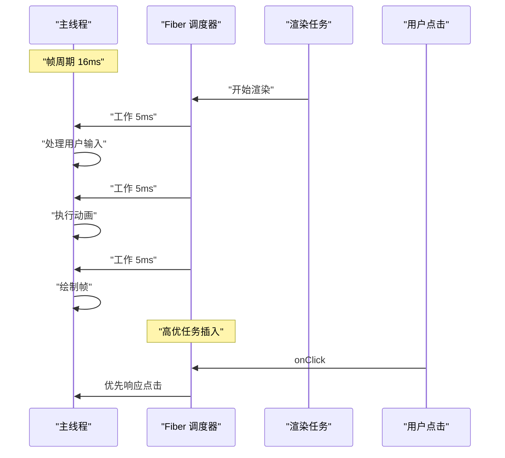
```mermaid
sequenceDiagram
  participant Main as "主线程"
  participant Fiber as "Fiber 调度器"
  participant Task as "渲染任务"
  participant Click as "用户点击"
  
  Note over Main: "帧周期 16ms"
  Task ->> Fiber: "开始渲染"
  Fiber ->> Main: "工作 5ms"
  Main ->> Main: "处理用户输入"
  Fiber ->> Main: "工作 5ms"
  Main ->> Main: "执行动画"
  Fiber ->> Main: "工作 5ms"
  Main ->> Main: "绘制帧"
  Note over Fiber: "高优任务插入"
  Click ->> Fiber: onClick
  Fiber ->> Main: 优先响应点击
```

### 工作流程

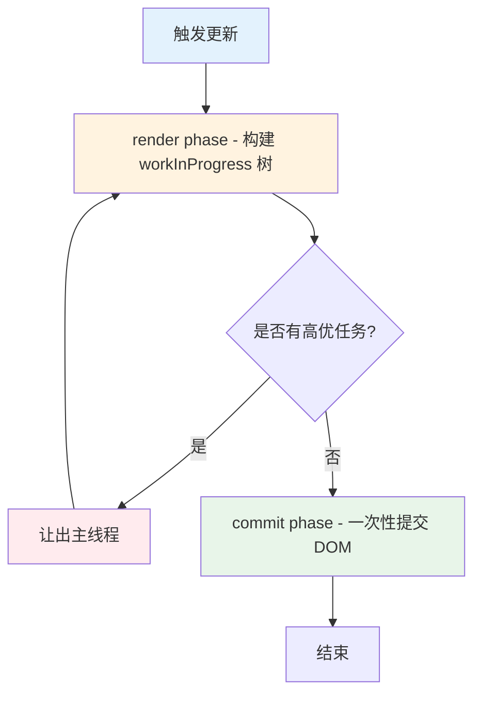
```mermaid
flowchart TD
  Start["触发更新"] --> R["render phase - 构建 workInProgress 树"]
  R --> P{"是否有高优任务?"}
  P -->|"是"| Yield["让出主线程"]
  Yield --> R
  P -->|"否"| Commit["commit phase - 一次性提交 DOM"]
  Commit --> End["结束"]
  style Start fill:#e3f2fd
  style R fill:#fff3e0
  style Commit fill:#e8f5e9
  style Yield fill:#ffebee
```

---

## 面试加分点

React Fiber 的核心目标：

> **将"不可中断的同步渲染"变成"可调度的异步渲染"。**

与 Vue 的区别：
- Vue 使用 **模板编译 + 静态标记** 在编译时优化，不需要 Fiber
- React 使用 **JSX 运行时 + Fiber 调度**，运行时动态优化
- Vue 3 的 `render` 函数 + Block Tree 也是一种类似思路，但粒度不同

---

## 高频追问

### 1. Fiber 为什么用链表？

因为 **链表可以保存执行状态**：

```ts
// 递归无法中断
function render(vnode) {
  // 必须一次执行完
  render(vnode.child)
  render(vnode.sibling)
}

// Fiber 链表可以中断
function workLoop(fiber) {
  while (fiber && !shouldYield()) {
    fiber = performUnitOfWork(fiber)
  }
  // 下次调度从这里继续
}
```

### 2. workInProgress 和 current 两棵树？

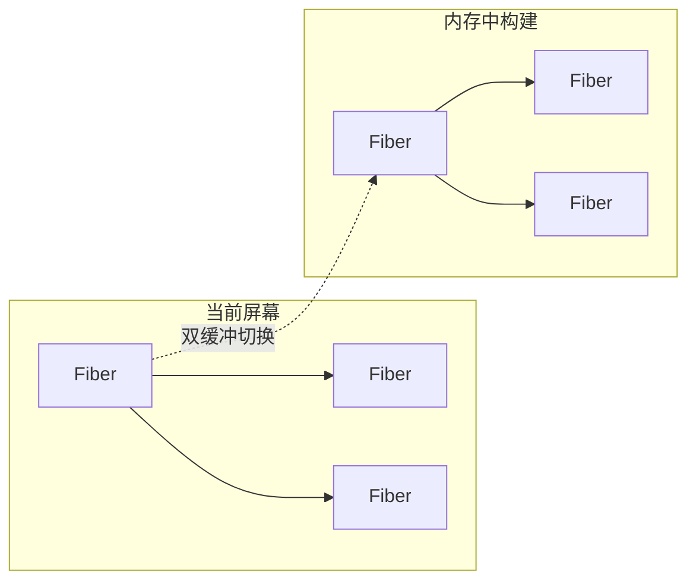
```mermaid
flowchart LR
  subgraph "当前屏幕"
    C1["Fiber"] --> C2["Fiber"]
    C1 --> C3["Fiber"]
  end
  subgraph "内存中构建"
    W1["Fiber"] --> W2["Fiber"]
    W1 --> W3["Fiber"]
  end
  C1 -.->|"双缓冲切换"| W1
```

- **current 树**：当前屏幕上显示的 Fiber 树
- **workInProgress 树**：内存中构建的下一棵树
- **commit 阶段**：直接切换指针，完成双缓冲

### 3. 优先级如何实现？

React 维护 **5 种优先级**：

```txt
Immediate  >  UserBlocking  >  Normal  >  Low  >  Idle
  点击事件       输入框          默认        预加载      Analytics
```

- 优先级高的任务可以 **打断** 低优先级任务
- 低优先级任务被 **丢弃或延后**

### 4. useEffect 和 useLayoutEffect 在 Fiber 中的区别？

- `useLayoutEffect`：在 **commit 阶段同步执行**（阻塞 paint）
- `useEffect`：在 **commit 后异步调度**（不阻塞 paint）

---

# 2. SSE 和 WebSocket 区别？

## 标准答案

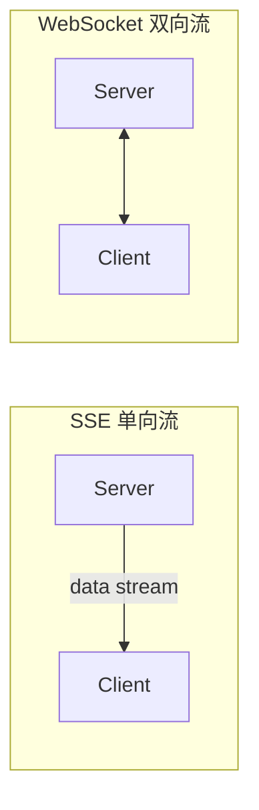
```mermaid
flowchart LR
  subgraph "SSE 单向流"
    S1[Server] -- "data stream" --> C1[Client]
  end
  subgraph "WebSocket 双向流"
    S2[Server] <--> C2[Client]
  end
```

| 对比维度 | SSE | WebSocket |
|----------|-----|-----------|
| **通信方向** | 服务端 → 客户端（单向） | 双向 |
| **底层协议** | HTTP（标准 HTTP 流） | ws/wss（独立协议） |
| **自动重连** | ✅ 浏览器原生支持 `EventSource` | ❌ 需手动实现 |
| **数据格式** | 文本（UTF-8） | 文本 + 二进制 |
| **最大连接数** | 浏览器限制 6 个/域名 | 无限制 |
| **实现复杂度** | 低 | 高 |
| **自定义 Header** | ❌ EventSource 不支持 | ✅ 支持 |
| **跨域** | 需 CORS 配置 | 协议本身不限 |

### SSE 本质

```http
GET /api/logs HTTP/1.1
Accept: text/event-stream

HTTP/1.1 200 OK
Content-Type: text/event-stream

data: {"message": "log line 1"}

data: {"message": "log line 2"}
```

SSE 就是 **HTTP 长连接 + 流式响应**，浏览器解析 `text/event-stream` 格式。

---

## 项目结合回答

### 日志流 → 选 SSE

```
日志流的特征：
  ├─ 单向：服务端产生 → 客户端消费
  ├─ 高频：每秒可能数百条
  ├─ 无需客户端回传
  └─ 需要自动重连（网络抖动频繁）
                  
                 ↓
            选 SSE ✅
        EventSource 自带重连
        浏览器自动解析数据
        资源消耗更低
```

### 告警系统 → 选 WebSocket

```
告警系统的特征：
  ├─ 双向：需要 ACK 确认
  ├─ 需要心跳保活（检测设备离线）
  ├─ 需要双向交互（抑制/确认/升级）
  └─ 可能包含二进制数据
                  
                 ↓
           选 WebSocket ✅
        自定义心跳机制
        双向消息推送
        支持二进制帧
```

---

## 追问：SSE 怎么断线重连？

`EventSource` 默认自动重连，但可以加上**指数退避**：

```ts
// 浏览器默认行为 - 连接断开后自动重连
const es = new EventSource('/api/logs')

// 重连事件
es.addEventListener('error', () => {
  console.log('连接断开，浏览器会自动重连')
  // EventSource 默认 3 秒后重试
})

// 服务端可以控制重连延迟
// 发送: retry: 5000\n\n
```

服务端控制重连间隔：

```go
// Go 服务端控制重连时间
fmt.Fprintf(w, "retry: %d\n\n", 5000) // 5 秒后重试
```

---

# 3. RxJS switchMap 和 mergeMap 区别？

## 核心区别

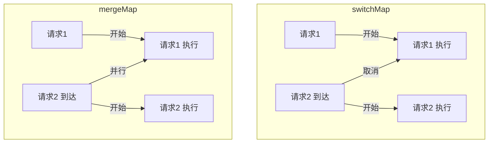
```mermaid
flowchart TD
  subgraph "switchMap"
    S1["请求1"] -->|"开始"| S2["请求1 执行"]
    S3["请求2 到达"] -->|"取消"| S2
    S3 -->|"开始"| S4["请求2 执行"]
  end
  
  subgraph "mergeMap"
    M1["请求1"] -->|"开始"| M2["请求1 执行"]
    M3["请求2 到达"] -->|"并行"| M2
    M3 -->|"开始"| M4["请求2 执行"]
  end
```

| 操作符 | 行为 | 适合场景 |
|--------|------|----------|
| `switchMap` | 新请求 **取消** 旧请求 | 搜索框、Token 刷新 |
| `mergeMap` | 新请求 **并行** 旧请求 | 批量请求、并发任务 |
| `concatMap` | 新请求 **排队** 旧请求 | 顺序写入、文件上传 |
| `exhaustMap` | 新请求 **忽略**（旧完成前） | 登录/提交按钮防抖 |

### switchMap（取消旧请求）

```ts
// 搜索框：每次输入取消上一次请求
searchInput.valueChanges.pipe(
  debounceTime(300),
  switchMap(keyword => this.api.search(keyword))
  // 如果 keyword 变了，上一次请求自动取消
).subscribe()
```

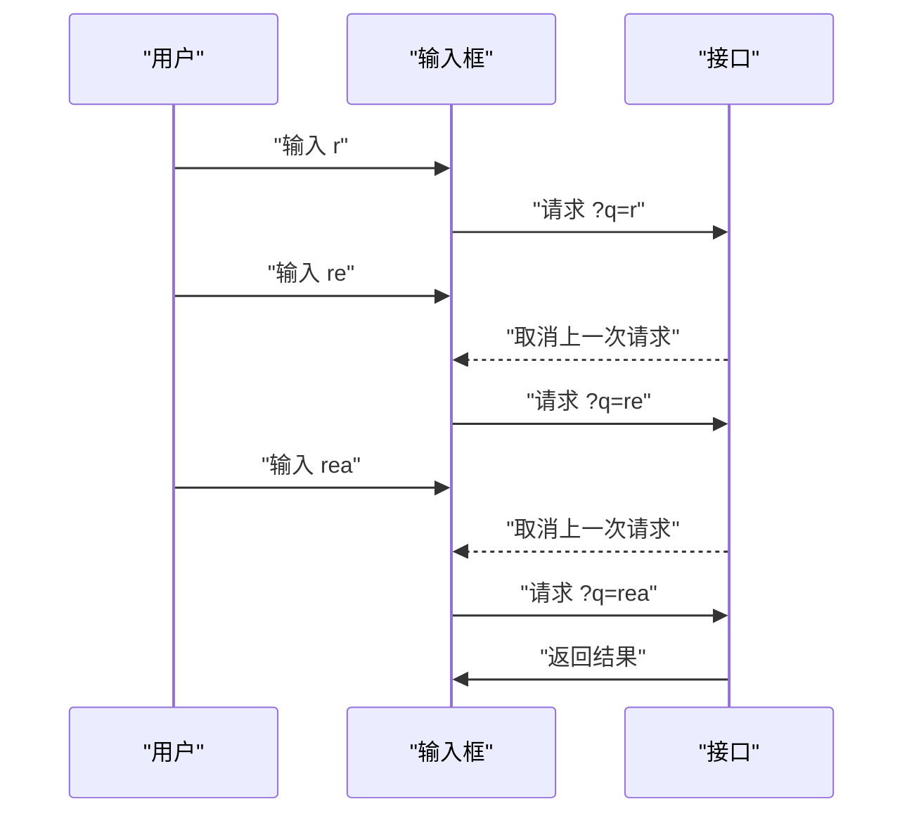
```mermaid
sequenceDiagram
  participant User as "用户"
  participant Input as "输入框"
  participant API as "接口"

  User->>Input: "输入 r"
  Input->>API: "请求 ?q=r"
  User->>Input: "输入 re"
  API-->>Input: "取消上一次请求"
  Input->>API: "请求 ?q=re"
  User->>Input: "输入 rea"
  API-->>Input: "取消上一次请求"
  Input->>API: "请求 ?q=rea"
  API->>Input: "返回结果"
```

### mergeMap（并行执行）

```ts
// 批量请求：同时获取多个详情
ids$.pipe(
  mergeMap(ids => forkJoin(
    ids.map(id => this.api.getDetail(id))
  )),
  // 控制并发数
  // mergeMap(fn, concurrent: 3)
).subscribe()
```

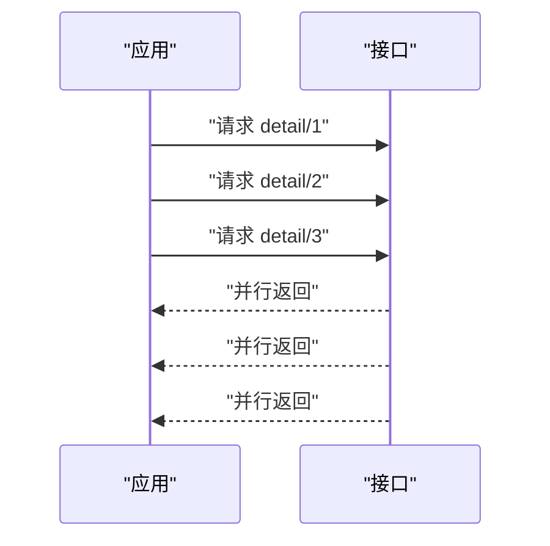
```mermaid
sequenceDiagram
  participant App as "应用"
  participant API as "接口"

  App->>API: "请求 detail/1"
  App->>API: "请求 detail/2"
  App->>API: "请求 detail/3"
  API-->>App: "并行返回"
  API-->>App: "并行返回"
  API-->>App: "并行返回"
```

---

## 面试加分回答

### 双 Token 刷新为什么必须用 switchMap？

```ts
// ❌ 错误：用 mergeMap
intercept(req, next) {
  return next.handle(req).pipe(
    catchError(err => {
      if (err.status === 401) {
        return this.refreshToken().pipe(
          mergeMap(newToken => { // 并发刷新！
            // 3 个请求同时 401 → 并发刷新 3 次
            // 最后一次覆盖前面的 token
            // 前两次的请求携带了过期 token
            return next.handle(addToken(req))
          })
        )
      }
    })
  )
}
```

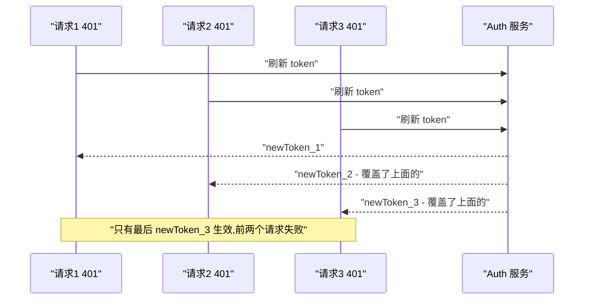
```mermaid
sequenceDiagram
  participant Req1 as "请求1 401"
  participant Req2 as "请求2 401"
  participant Req3 as "请求3 401"
  participant Auth as "Auth 服务"
  
  Req1->>Auth: "刷新 token"
  Req2->>Auth: "刷新 token"
  Req3->>Auth: "刷新 token"
  Auth-->>Req1: "newToken_1"
  Auth-->>Req2: "newToken_2 - 覆盖了上面的"
  Auth-->>Req3: "newToken_3 - 覆盖了上面的"
  Note over Req1,Req3: "只有最后 newToken_3 生效,前两个请求失败"
```

```ts
// ✅ 正确：用 switchMap
intercept(req, next) {
  return next.handle(req).pipe(
    catchError(err => {
      if (err.status === 401) {
        return this.refreshToken().pipe(
          switchMap(newToken => { // 只有一个刷新请求
            return next.handle(addToken(req))
          })
        )
      }
    })
  )
}
```

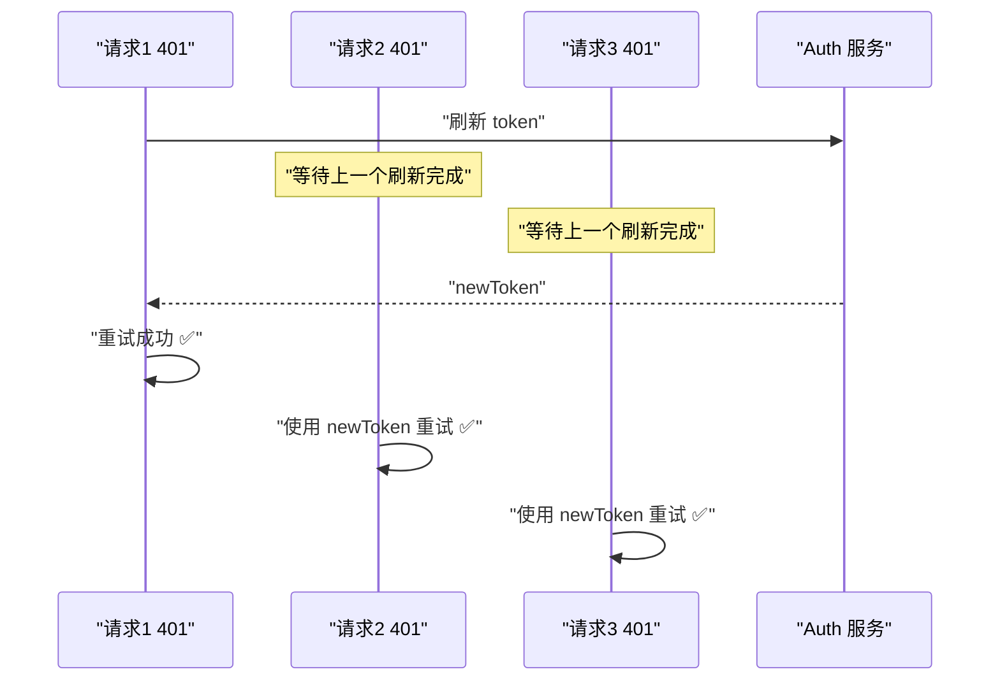
```mermaid
sequenceDiagram
  participant Req1 as "请求1 401"
  participant Req2 as "请求2 401"
  participant Req3 as "请求3 401"
  participant Auth as "Auth 服务"
  
  Req1->>Auth: "刷新 token"
  Note over Req2: "等待上一个刷新完成"
  Note over Req3: "等待上一个刷新完成"
  Auth-->>Req1: "newToken"
  Req1->>Req1: "重试成功 ✅"
  Req2->>Req2: "使用 newToken 重试 ✅"
  Req3->>Req3: "使用 newToken 重试 ✅"
```

---

# 4. 为什么虚拟列表能优化性能？

## 核心认知

> **虚拟列表不是优化"数据"，而是减少"DOM 数量"。**

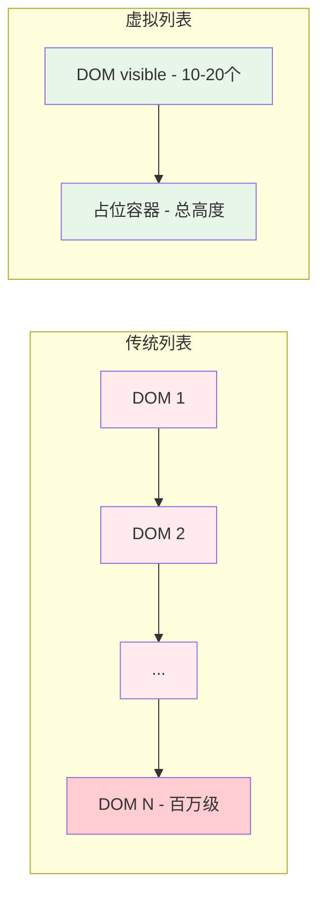
```mermaid
flowchart LR
  subgraph "传统列表"
    D1["DOM 1"] --> D2["DOM 2"] --> D3["..."]
    D3 --> DN["DOM N - 百万级"]
  end
  subgraph "虚拟列表"
    V1["DOM visible - 10-20个"] --> V2["占位容器 - 总高度"]
  end
  style D1 fill:#ffebee
  style D2 fill:#ffebee
  style D3 fill:#ffebee
  style DN fill:#ffcdd2
  style V1 fill:#e8f5e9
  style V2 fill:#e8f5e9
```

### 为什么多 DOM 会卡？

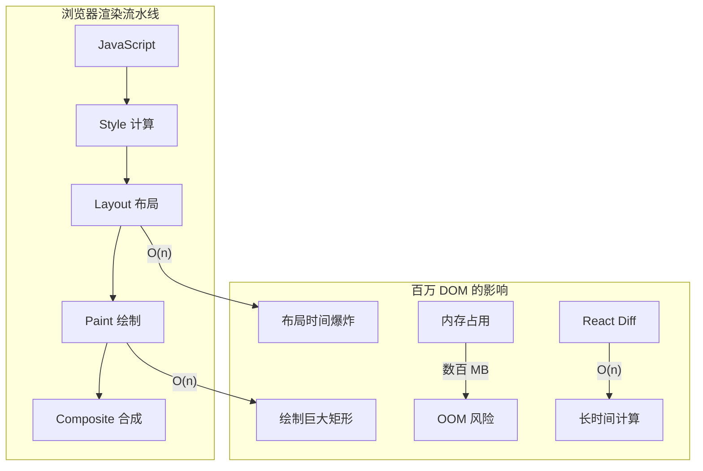
```mermaid
flowchart TD
  subgraph "浏览器渲染流水线"
    JS["JavaScript"] --> Style["Style 计算"]
    Style --> Layout["Layout 布局"]
    Layout --> Paint["Paint 绘制"]
    Paint --> Composite["Composite 合成"]
  end
  
  subgraph "百万 DOM 的影响"
    Layout -->|"O(n)"| L1["布局时间爆炸"]
    Paint -->|"O(n)"| P1["绘制巨大矩形"]
    Memory["内存占用"] -->|"数百 MB"| OOM["OOM 风险"]
    Diff["React Diff"] -->|"O(n)"| Long["长时间计算"]
  end
```

具体瓶颈分析：

| 瓶颈 | 原因 | 影响 |
|------|------|------|
| **Layout（回流）** | 每个 DOM 位置需要计算 | 万级 => 几十 ms，百万 => 几秒 |
| **Paint（绘制）** | 将 DOM 绘成位图 | GPU 内存暴涨 |
| **Memory（内存）** | DOM 对象本身占用 | 每个 DOM ~4KB，百万 => 4GB |
| **Diff（协调）** | React 需要遍历所有节点 | 1000 个节点约 1ms，10 万 => 100ms |

### 虚拟列表原理

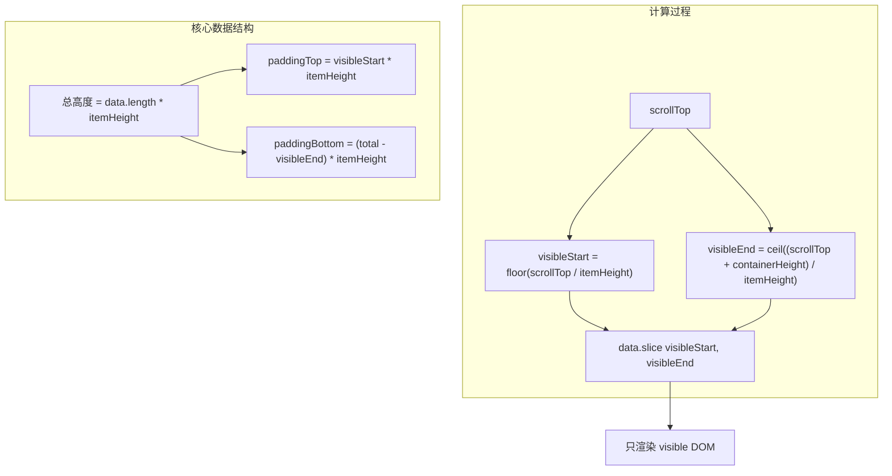
```mermaid
flowchart TD
  subgraph "计算过程"
    ST["scrollTop"] --> VI["visibleStart = floor(scrollTop / itemHeight)"]
    ST --> VE["visibleEnd = ceil((scrollTop + containerHeight) / itemHeight)"]
    VI --> Render["data.slice visibleStart, visibleEnd"]
    VE --> Render
  end
  
  subgraph "核心数据结构"
    Total["总高度 = data.length * itemHeight"] --> PadTop["paddingTop = visibleStart * itemHeight"]
    Total --> PadBottom["paddingBottom = (total - visibleEnd) * itemHeight"]
  end
  
  Render --> DOM["只渲染 visible DOM"]
```

```ts
// 核心计算
function getVisibleRange(scrollTop: number, containerHeight: number, itemHeight: number, total: number) {
  const visibleStart = Math.floor(scrollTop / itemHeight)
  const visibleEnd = Math.ceil((scrollTop + containerHeight) / itemHeight)
  
  return {
    start: Math.max(0, visibleStart - overscan),   // overscan 额外渲染几项
    end: Math.min(total, visibleEnd + overscan),    // 防止白屏
    totalHeight: total * itemHeight,                // 容器总高度
    offset: visibleStart * itemHeight               // 偏移量
  }
}
```

### 为什么叫"虚拟"列表？

- **"虚拟"** = 在内存中维护完整列表
- **"真实"** = 只渲染可视区域
- 用户 **感知** 到的是完整列表（滚动条高度正确）
- 浏览器 **实际** 只处理少量 DOM

---

## 进阶：虚拟列表 + 变高元素

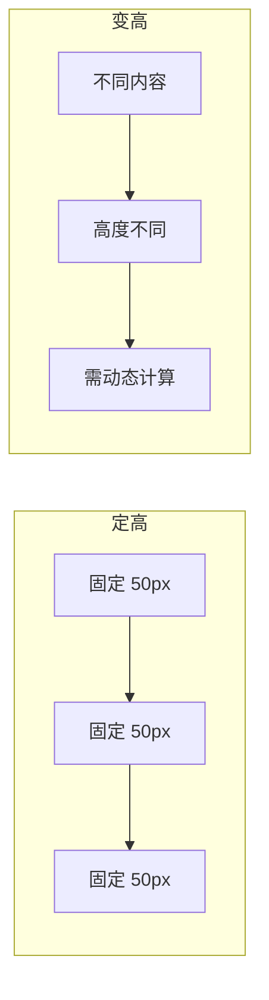
```mermaid
flowchart LR
  subgraph "定高"
    F1["固定 50px"] --> F2["固定 50px"]
    F2 --> F3["固定 50px"]
  end
  subgraph "变高"
    V1["不同内容"] --> V2["高度不同"]
    V2 --> V3["需动态计算"]
  end
```

解决方案：
1. **预估高度 + 二次校正**：先给预估高度，渲染后更新真实高度
2. **二分查找位置**：维护已渲染元素的真实位置数组

---

# 5. Angular OnPush 原理？

## 标准答案

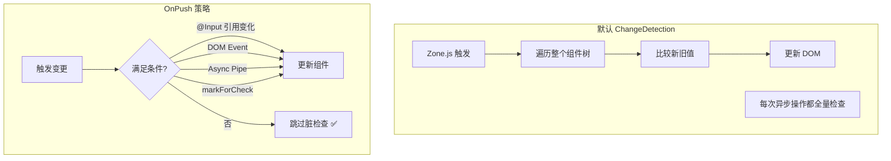
```mermaid
flowchart TD
  subgraph "默认 ChangeDetection"
    Z["Zone.js 触发"] --> CheckAll["遍历整个组件树"]
    CheckAll --> Compare["比较新旧值"]
    Compare --> Update["更新 DOM"]
    Note["每次异步操作都全量检查"]
  end
  
  subgraph "OnPush 策略"
    O["触发变更"] --> Condition{"满足条件?"}
    Condition -->|"@Input 引用变化"| Update2["更新组件"]
    Condition -->|"DOM Event"| Update2
    Condition -->|"Async Pipe"| Update2
    Condition -->|"markForCheck"| Update2
    Condition -->|"否"| Skip["跳过脏检查 ✅"]
  end
```

| 触发条件 | Default | OnPush |
|----------|---------|--------|
| `@Input` 值变化（引用） | ✅ 检查 | ✅ 检查 |
| `@Input` 值变化（内部改变） | ✅ 检查 | ❌ 跳过 |
| DOM 事件（click/input） | ✅ 检查 | ✅ 检查 |
| `async` pipe 新值 | ✅ 检查 | ✅ 检查 |
| `markForCheck()` | ✅ 检查 | ✅ 检查 |
| setTimeout/setInterval | ✅ 检查 | ❌ 跳过 |
| HTTP 请求完成 | ✅ 检查 | ❌ 跳过 |
| Observable 不通过 async pipe | ✅ 检查 | ❌ 跳过 |

### 为什么 OnPush 能优化？

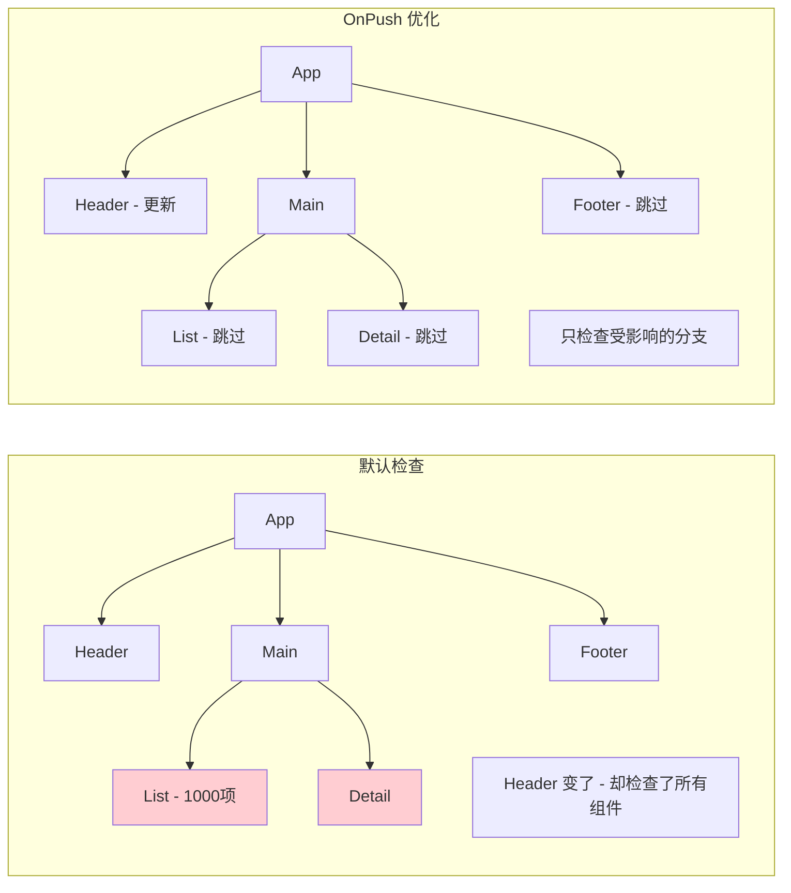
```mermaid
flowchart LR
  subgraph "默认检查"
    A["App"] --> B["Header"]
    A --> C["Main"]
    A --> D["Footer"]
    C --> E["List - 1000项"]
    C --> F["Detail"]
    Note["Header 变了 - 却检查了所有组件"]
  end
  
  subgraph "OnPush 优化"
    A2["App"] --> B2["Header - 更新"]
    A2 --> C2["Main"]
    A2 --> D2["Footer - 跳过"]
    C2 --> E2["List - 跳过"]
    C2 --> F2["Detail - 跳过"]
    Note2["只检查受影响的分支"]
  end
  
  style E fill:#ffcdd2
  style F fill:#ffcdd2
  
  style E fill:#ffcdd2
  style F fill:#ffcdd2
```

---

## 面试加分点

### OnPush + 不可变数据

```ts
// ❌ 错误：改变数组内部
@Component({ changeDetection: ChangeDetectionStrategy.OnPush })
class ListComponent {
  @Input() items: string[]

  addItem(item: string) {
    this.items.push(item) // 引用没变，OnPush 不检测！
  }
}

// ✅ 正确：创建新引用
@Component({ changeDetection: ChangeDetectionStrategy.OnPush })
class ListComponent {
  @Input() items: string[]

  addItem(item: string) {
    this.items = [...this.items, item] // 新数组，新引用
  }
}
```

### OnPush 类似 React.memo

| 对比 | React.memo | Angular OnPush |
|------|------------|----------------|
| 触发机制 | Props 浅比较 | @Input 引用变化 |
| 跳过渲染 | ✅ | ✅ |
| 强制更新 | `forceUpdate()` | `markForCheck()` |
| 默认行为 | 不是默认 | 需手动配置 |

---

# 6. JWT 为什么不安全？

## 核心问题

> **JWT 本身不是不安全，不安全的是存储方式。**

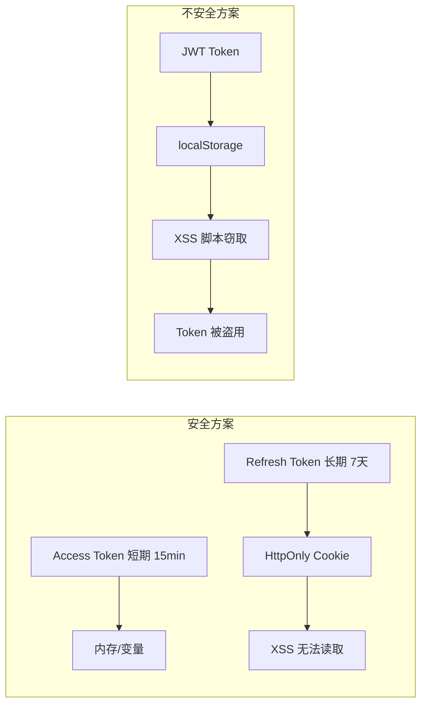
```mermaid
flowchart LR
  subgraph "安全方案"
    Access["Access Token 短期 15min"] --> Memory["内存/变量"]
    Refresh["Refresh Token 长期 7天"] --> Cookie["HttpOnly Cookie"]
    Cookie --> Safe["XSS 无法读取"]
  end
  
  subgraph "不安全方案"
    JWT["JWT Token"] --> Local["localStorage"]
    Local --> XSS["XSS 脚本窃取"]
    XSS --> Steal["Token 被盗用"]
  end
```

### 攻击链路

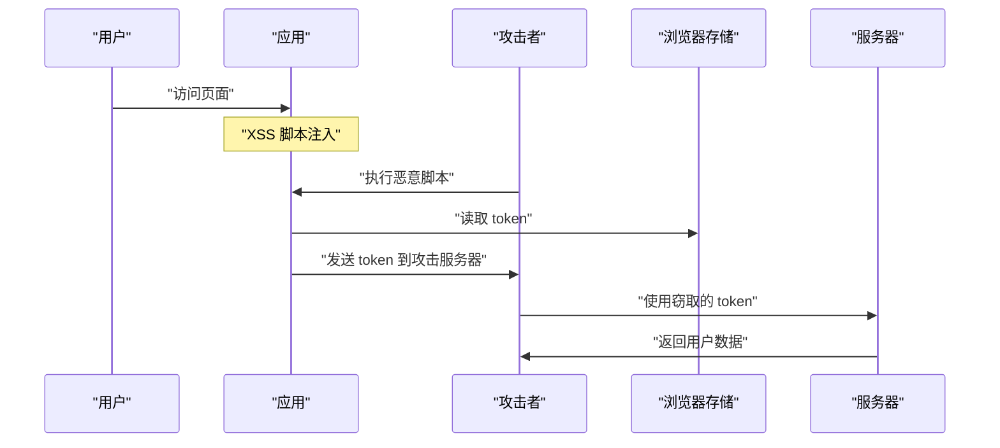
```mermaid
sequenceDiagram
  participant User as "用户"
  participant App as "应用"
  participant Attacker as "攻击者"
  participant Browser as "浏览器存储"
  participant ApiServer as "服务器"
  
  User->>App: "访问页面"
  Note over App: "XSS 脚本注入"
  Attacker->>App: "执行恶意脚本"
  App->>Browser: "读取 token"
  App->>Attacker: "发送 token 到攻击服务器"
  Attacker->>ApiServer: "使用窃取的 token"
  ApiServer->>Attacker: "返回用户数据"
```

---

## 正确安全方案

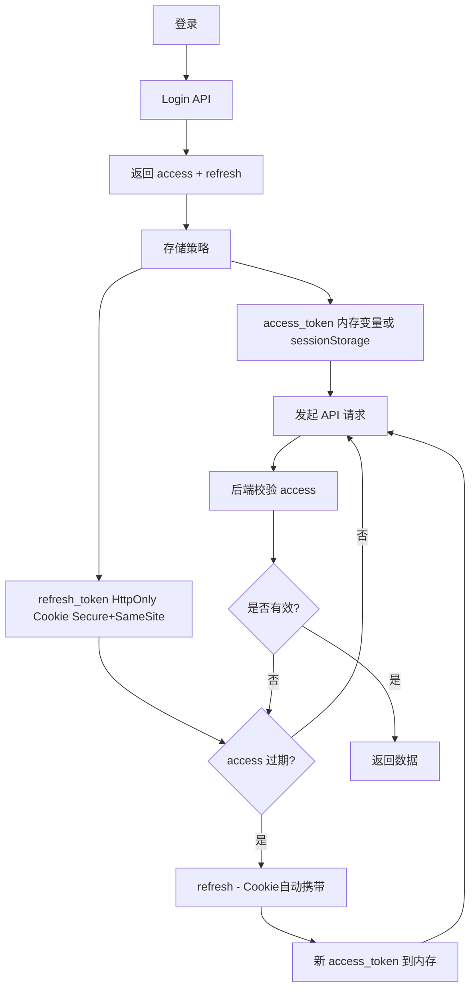
```mermaid
flowchart TD
  Login["登录"] --> LoginAPI["Login API"]
  LoginAPI --> Return["返回 access + refresh"]
  Return --> Store["存储策略"]
  
  Store --> AccessMem["access_token 内存变量或 sessionStorage"]
  Store --> RefreshCookie["refresh_token HttpOnly Cookie Secure+SameSite"]
  
  AccessMem --> Request["发起 API 请求"]
  RefreshCookie --> Expired{"access 过期?"}
  Expired -->|"是"| Refresh["refresh - Cookie自动携带"]
  Refresh --> NewAccess["新 access_token 到内存"]
  NewAccess --> Request
  Expired -->|"否"| Request
  
  Request --> API["后端校验 access"]
  API --> Valid{"是否有效?"}
  Valid -->|"是"| Data["返回数据"]
  Valid -->|"否"| Expired
```

### 多层防御

```
第一层：XSS 防御
├─ CSP（Content Security Policy）
├─ 输入过滤 / 输出转义
└─ 避免 dangerouslySetInnerHTML / innerHTML

第二层：Token 安全
├─ access_token：短期（15min）+ 内存存储
├─ refresh_token：HttpOnly + Secure + SameSite
└─ 刷新接口限流防刷

第三层：传输安全
├─ HTTPS 全站
└─ 前端不能操作 refresh_token
```

---

# 7. 为什么 WebSocket 会卡？

## 根本原因

> **不是 WebSocket 卡，是 UI 渲染跟不上消息速度。**

```mermaid
flowchart LR
  subgraph "消息洪峰"
    M1["msg 1"] --> M2["msg 2"] --> M3["msg 3"]
    M3 --> M4["msg ..."]
    M4 --> MN["msg N - 每秒数百条"]
  end
  
  subgraph "浏览器帧"
    F1["帧1 - 16ms"] --> F2["帧2 - 16ms"]
    F2 --> F3["掉帧"]
    F3 --> F4["卡顿"]
  end
  
  subgraph "结果"
    R1["消息堆积"] --> R2["DOM 频繁更新"]
    R2 --> R3["Layout 抖动"]
    R3 --> R4["页面卡死"]
  end
```

### 消息处理 vs 渲染帧

```txt
WebSocket 事件队列：
  msg1 → msg2 → msg3 → ... → msg100 (10ms 内到达)
                                  ↓
                        每个 msg 触发 setState
                                  ↓
                        100 次 setState → 100 次脏检查
                                  ↓
                        同步执行 → 阻塞主线程 500ms
                                  ↓
                        用户操作被阻塞 ❌
```

---

## 优化方案

```mermaid
flowchart TD
  WS["WebSocket 消息"] --> Queue["消息队列 - 缓冲"]
  Queue --> Batch["批量处理 - 合并更新"]
  Batch --> RAF["requestAnimationFrame - 同步帧"]
  
  RAF --> Worker{"是否繁重计算?"}
  Worker -->|"是"| W["Web Worker - 后台线程"]
  Worker -->|"否"| Main["主线程更新"]
  W --> Main
  Main --> DOM["DOM 更新 - 一帧一次"]
  
  style WS fill:#e3f2fd
  style Queue fill:#fff3e0
  style RAF fill:#e8f5e9
  style W fill:#f3e5f5
```

### 代码实现

```ts
// 1. 消息队列 + 节流
class MessageQueue {
  private buffer: Message[] = []
  private isScheduled = false

  push(msg: Message) {
    this.buffer.push(msg)
    if (!this.isScheduled) {
      this.isScheduled = true
      requestAnimationFrame(() => this.flush())
    }
  }

  private flush() {
    const batch = this.buffer.splice(0, this.buffer.length)
    // 一次 RAF 处理所有累积消息
    this.processBatch(batch)
    this.isScheduled = false
  }
}

// 2. Web Worker 处理数据
const worker = new Worker('log-worker.js')
worker.postMessage(rawLogs)
worker.onmessage = ({ data }) => {
  // 只在格式化后更新一次
  this.display(data)
}

// 3. 虚拟列表 + 增量追加
// 只维护可视区域的 DOM
```

### 效果对比

```txt
优化前：  msg → setState → msg → setState → ... → 卡顿
优化后：  msg → msg → ... → RAF → 批量 setState → 流畅
                      ↓
              16ms 窗口内合并
```

---

# 二、项目深挖模拟面试（真实场景）

---

# 项目一：5GC 自动化测试平台

---

## 面试官：

你这个平台最大的技术难点是什么？

---

## 你的回答（推荐）

最大的难点是：**实时日志流 + 大规模自动化任务并发。**

```mermaid
flowchart TD
  subgraph "挑战"
    C1["200+ 测试任务 - 同时运行"] --> C2["每个任务 - 实时产生日志"]
    C2 --> C3["前端需要 - 秒级展示"]
    C3 --> C4["传统轮询 - QPS 太高"]
  end
  
  subgraph "解决方案"
    S1["SSE 日志流 - EventSource"] --> S2["Go 协程推流 - channel 管道"]
    S2 --> S3["前端缓冲队列 - requestAnimationFrame"]
    S3 --> S4["虚拟滚动 - 增量渲染"]
  end
```

---

## 继续说（核心）

为什么选 SSE：

```txt
日志是天然的单向数据流：
  Pod A 输出日志 → 服务端采集 → 推送到前端
                                                      
  选型对比：                  
  ├─ 轮询：HTTP 请求太频繁，K8s API 扛不住           
  ├─ WebSocket：双向能力浪费，复杂度高            
  └─ SSE：✅ 最合适
       ├─ 浏览器原生 EventSource，自动重连
       ├─ 基于 HTTP，兼容性最好（穿透防火墙）
       └─ 服务端实现简单（Content-Type: text/event-stream）
```

---

## 技术方案

```mermaid
sequenceDiagram
  participant Pod as "K8s Pod"
  participant Go as "Go 服务端"
  participant Client as "前端"
  
  Note over Go: "协程池管理 200+ 连接"
  Pod->>Go: "日志输出 stdout"
  Go->>Go: "channel 缓冲"
  Go->>Client: "SSE 推流"
  Client->>Client: "EventSource 接收"
  
  Note over Client: "消息队列缓冲"
  Client->>Client: "RAF 节流批量更新"
  Client->>Client: "虚拟列表渲染"
    
  Note over Client: "断线场景"
  Client-->>Go: "连接断开"
  Go->>Client: "EventSource 自动重连 ✅"
  Go->>Client: "从断点续推"
```

### 核心代码片段

```go
// Go 服务端：K8s 日志订阅 + SSE 推流
func (s *LogServer) StreamLogs(w http.ResponseWriter, r *http.Request) {
    w.Header().Set("Content-Type", "text/event-stream")
    w.Header().Set("Cache-Control", "no-cache")
    w.Header().Set("Connection", "keep-alive")
    
    podName := r.URL.Query().Get("pod")
    logChan := make(chan string, 100)
    
    // 启动协程订阅 K8s 日志
    go s.watchPodLogs(podName, logChan)
    
    for {
        select {
        case log := <-logChan:
            fmt.Fprintf(w, "data: %s\n\n", log)
            w.(http.Flusher).Flush()
        case <-r.Context().Done():
            return
        }
    }
}
```

```ts
// 前端：EventSource + 缓冲队列
class LogStream {
  private es: EventSource
  private buffer: string[] = []
  private isScheduled = false

  connect(url: string) {
    this.es = new EventSource(url)
    
    this.es.onmessage = (event) => {
      this.buffer.push(event.data)
      this.scheduleFlush()
    }
    
    this.es.onerror = () => {
      // EventSource 自动重连
      console.log('断开重连中...')
    }
  }

  private scheduleFlush() {
    if (this.isScheduled) return
    this.isScheduled = true
    
    requestAnimationFrame(() => {
      const batch = this.buffer.splice(0)
      this.virtualList.append(batch)
      this.isScheduled = false
    })
  }
}
```

---

## 最终效果

```
排障效率：    提升 50%  ← 实时日志秒级高亮
错误率：      下降 65%  ← 异常自动检测标注
自动化任务：  支撑 200+  ← Go 协程池管理
发布周期：    缩短 60%  ← CI/CD + K8s
```

---

# 面试官追问链路（非常真实）

---

## Q1：为什么不用 WebSocket？

### 回答重点：

```txt
因为日志是：
服务端 → 客户端 的单向数据流。

WebSocket 的"双向能力"在这个场景是浪费的：
├─ 客户端并不需要向服务端发送日志指令
├─ 日志内容不需要 ACK 确认（丢了就丢了）
└─ 唯一的控制（暂停/继续）可以用单独的 REST API

SSE 更轻：
├─ 基于 HTTP，无需额外协议握手
├─ 浏览器原生中断重连
└─ 资源开销更小（没有帧掩码、心跳等）
```

---

## Q2：SSE 有什么缺点？

```
缺点：
├─ 单向通信：只能服务端→客户端
├─ 只支持文本：无法传输二进制
├─ 浏览器连接数限制：同域名最多 6 个
├─ EventSource 不支持自定义 Header（无法带 token）
└─ IE 不支持（Polyfill 方案：用 fetch + ReadableStream 模拟）
                
                    ↓

  解决方案：
  ├─ 连接数限制 → 域名分发（log1.example.com / log2.example.com）
  ├─ 自定义 Header → 使用 fetch API 手动解析 text/event-stream
  └─ IE 兼容 → 降级为轮询（或告知客户升级浏览器）
```

### 如何用 fetch 替代 EventSource（解决 Header 问题）

```ts
async function createSSE(url: string, token: string) {
  const response = await fetch(url, {
    headers: { Authorization: `Bearer ${token}` }
  })
  
  const reader = response.body!.getReader()
  const decoder = new TextDecoder()
  let buffer = ''
  
  while (true) {
    const { done, value } = await reader.read()
    if (done) break
    
    buffer += decoder.decode(value, { stream: true })
    const lines = buffer.split('\n')
    buffer = lines.pop() || ''
    
    for (const line of lines) {
      if (line.startsWith('data: ')) {
        this.onMessage(line.slice(6))
      }
    }
  }
}
```

---

## Q3：日志很多为什么不卡？

```
核心防线三层层：
                
第一层：消息缓冲
├─ 所有日志先进入 buffer
└─ 不直接触发更新
                
第二层：RAF 节流
├─ requestAnimationFrame 同步浏览器帧率
├─ 每帧只处理一次批量更新
└─ 避免 setState → 重渲染的连锁反应

第三层：虚拟列表
├─ 只渲染可视区域 20-30 个 DOM
├─ 超出视图的日志直接丢弃内存引用
└─ 无论后端推多少条，DOM 数量恒定
                
        ↓
                
结论：不是"不卡"，是"用架构把卡死的可能性降到了最低"
```

---

# 三、项目深挖（NMS 网管系统）

---

# 面试官：

万级 OpenLayers 点位怎么优化？

---

## 推荐回答

核心问题：

> **不是地图渲染慢，而是海量 feature 导致 Canvas 重绘压力过大。**

```mermaid
flowchart LR
  subgraph "性能瓶颈分析"
    P1["万级 Feature"] --> P2["每个 Feature - 独立样式计算"]
    P2 --> P3["Canvas - 全量重绘"]
    P3 --> P4["帧率 低于 10fps"]
  end
  
  subgraph "优化目标"
    O1["减少 Feature 数量"] --> O2["减少重绘频率"]
    O2 --> O3["帧率 > 30fps"]
  end
```

---

## 优化方案

### 1. Cluster 聚合（核心优化）

```mermaid
flowchart TD
  subgraph "低 Zoom 级别"
    Z1["Zoom=5"] --> C1["聚合为 50 个 Cluster"]
    C1 --> D1["显示聚合数量 - 23个基站"]
  end
  
  subgraph "高 Zoom 级别"
    Z2["Zoom=14"] --> C2["展开为 5000 个点"]
    C2 --> D2["显示具体设备"]
  end
  
  Z1 --> Z2 -->|"用户缩放"| Z1
```

```ts
// OpenLayers Cluster 实现
const source = new ol.source.Vector({ features })
const clusterSource = new ol.source.Cluster({
  source,
  distance: 40,          // 聚合像素距离
  minDistance: 20,       // 最小间距
  geometryFunction: (feature) => {
    return feature.getGeometry()
  }
})

const clusterLayer = new ol.layer.Vector({
  source: clusterSource,
  style: (feature) => {
    const size = feature.get('features').length
    // 根据聚合数量动态调整样式
    return [
      new ol.style.Style({
        image: new ol.style.Circle({
          radius: Math.min(10 + size / 10, 30),
          fill: new ol.style.Fill({
            color: size > 100 ? '#ff4444' : size > 50 ? '#ffaa00' : '#44aa44'
          })
        }),
        text: new ol.style.Text({
          text: size.toString(),
          font: 'bold 12px sans-serif'
        })
      })
    ]
  }
})
```

### 2. 分层渲染

```mermaid
flowchart LR
  subgraph "渲染层"
    L1["告警层 - 少量高频更新"] --> L2["基站层 - 大量低频更新"]
    L2 --> L3["动态层 - 轨迹/连线"]
    L3 --> L4["底图层 - 瓦片"]
  end
  
  subgraph "更新策略"
    L1 --> U1["增量更新"]
    L2 --> U2["按需更新"]
    L3 --> U3["动画帧更新"]
    L4 --> U4["几乎不变"]
  end
```

```ts
// 分层管理
const alarmLayer = new ol.layer.Vector({  // 告警层 - 高频
  source: alarmSource,
  updateWhileAnimating: true,
  updateWhileInteracting: true,
})

const baseLayer = new ol.layer.Vector({   // 基站层 - 低频
  source: baseSource,
  updateWhileAnimating: false,  // 动画时跳过更新
  updateWhileInteracting: false, // 交互时跳过更新
})
```

### 3. 视口过滤（只渲染可视区域）

```ts
map.on('moveend', () => {
  const extent = map.getView().calculateExtent(map.getSize())
  
  // 只加载可视区域内的 feature
  const visibleFeatures = allFeatures.filter(f => {
    const coord = f.getGeometry().getCoordinates()
    return ol.extent.containsXY(extent, coord[0], coord[1])
  })
  
  source.clear()
  source.addFeatures(visibleFeatures)
})
```

### 4. 状态更新优化

```ts
// ❌ 错误：全量替换
function updateAlarm(featureId: string, status: string) {
  source.clear()                     // 清空所有
  const updated = features.map(f => {
    if (f.getId() === featureId) {
      f.set('status', status)
    }
    return f
  })
  source.addFeatures(updated)       // 全部重新添加 → 全量重绘
}

// ✅ 正确：增量更新
function updateAlarm(featureId: string, status: string) {
  const feature = source.getFeatureById(featureId)
  if (feature) {
    feature.set('status', status)          // 只更新属性
    feature.setStyle(getAlarmStyle(status)) // 只更新样式
    // 不需要 clear + add，OpenLayers 自动局部重绘
  }
}
```

### 优化效果对比

| 指标 | 优化前 | 优化后 |
|------|--------|--------|
| Feature 数量 | 10000 个独立渲染 | ~50 个 Cluster |
| 帧率 | < 10 fps | 60 fps |
| 内存占用 | ~200 MB | ~30 MB |
| 交互响应 | 卡顿 2s+ | 流畅 |
| 缩放体验 | 白屏等待 | 即时聚合/展开 |

---

# 面试官继续追问

---

## 为什么不用 Leaflet？

```txt
对比维度          OpenLayers                    Leaflet
──────────      ──────────                    ──────────
坐标系支持       EPSG:4326/3857/自定义           EPSG:4326/3857（有限）
数据格式         GeoJSON/WFS/WMS/WMTS/KML        GeoJSON/矢量瓦片
空间分析         内置 Buffer/Intersect           需插件
大数据渲染        内置 Cluster + WebGL            需 Leaflet.markercluster 插件
热力图           内置 Heatmap Layer              需 leaflet.heat
坐标系转换        完整 Proj4js 支持                有限

结论：
├─ Leaflet：轻量简单，适合地图展示
├─ OpenLayers：GIS 能力完整，适合专业网管系统
└─ 我们的场景需要复杂 GIS 分析 → OpenLayers ✅
```

---

## Canvas 和 SVG 区别？

```mermaid
flowchart LR
  subgraph SVG 模式
    S1[每个元素 = DOM 节点] --> S2[属性变化 → DOM 更新]
    S2 --> S3[适合 < 1000 个元素]
    S3 --> E1[优点:交互方便 / 缺点:DOM太多卡]
  end
  
  subgraph Canvas 模式
    C1[像素位图绘制] --> C2[整体重绘]
    C2 --> C3[适合大于 1000 个元素]
    C3 --> E2[优点:海量元素性能好 / 缺点:交互需自己实现]
  end
```

| 对比 | SVG | Canvas |
|------|-----|--------|
| 本质 | DOM 节点 | 位图（像素） |
| DOM 数量 | 元素数 = DOM 数 | 1 个 Canvas DOM |
| 交互 | 自带事件（点哪个哪个触发） | 需自行计算坐标命中 |
| 样式 | CSS 控制 | 代码绘制 |
| 缩放 | 矢量不失真 | 可能模糊 |
| 性能拐点 | ~1000 元素 | 10000+ 元素 |

**OpenLayers 的选择**：默认使用 Canvas，SVG 作为降级方案。

---

# 四、React 手写题

---

# 1. 手写 useDebounce

```ts
function useDebounce<T>(value: T, delay: number): T {
  const [debouncedValue, setDebouncedValue] = useState<T>(value)

  useEffect(() => {
    const timer = setTimeout(() => {
      setDebouncedValue(value)
    }, delay)

    return () => clearTimeout(timer) // 依赖变化时清除上一次
  }, [value, delay])

  return debouncedValue
}
```

```mermaid
sequenceDiagram
  participant User as 用户
  participant Input as 输入框
  participant Timer as 定时器
  participant State as 状态
  
  User->>Input: 输入 "r"
  Input->>Timer: 启动 300ms 定时器
  User->>Input: 输入 "re" (300ms 内)
  Timer-->>Timer: ❌ 清除上一次
  Input->>Timer: 新启动 300ms
  User->>Input: 输入 "rea" (300ms 内)
  Timer-->>Timer: ❌ 清除上一次
  Input->>Timer: 新启动 300ms
  Note over Timer: 等待 300ms...
  Timer->>State: ✅ 更新状态 "rea"
```

---

# 2. 手写 useThrottle

```ts
function useThrottle<T extends (...args: any[]) => void>(
  fn: T,
  delay: number
): (...args: Parameters<T>) => void {
  const timer = useRef<ReturnType<typeof setTimeout> | null>(null)

  return useCallback((...args: Parameters<T>) => {
    if (timer.current) return // 节流时间内，忽略

    timer.current = setTimeout(() => {
      fn(...args)
      timer.current = null // 执行完后释放
    }, delay)
  }, [fn, delay])
}
```

```mermaid
sequenceDiagram
  participant E as 事件
  participant T as 节流器
  participant F as 函数
  
  E->>T: 触发
  T->>F: ✅ 立即执行
  E->>T: 触发（100ms 后）
  T-->>F: ❌ 忽略
  E->>T: 触发（200ms 后）
  T-->>F: ❌ 忽略
  Note over T: 300ms 窗口结束
  E->>T: 触发
  T->>F: ✅ 执行
```

---

# 3. 手写虚拟列表核心思路

```ts
function VirtualList({ data, itemHeight, containerHeight }: Props) {
  const [scrollTop, setScrollTop] = useState(0)

  const visibleStart = Math.floor(scrollTop / itemHeight)
  const visibleEnd = Math.ceil(
    (scrollTop + containerHeight) / itemHeight
  )

  const visibleData = data.slice(
    Math.max(0, visibleStart - 2),  // overscan
    Math.min(data.length, visibleEnd + 2)
  )

  const offset = visibleStart * itemHeight  // paddingTop

  return (
    <div
      style={{ height: containerHeight, overflow: 'auto' }}
      onScroll={e => setScrollTop(e.target.scrollTop)}
    >
      <div style={{ height: data.length * itemHeight }}>
        <div style={{ transform: `translateY(${offset}px)` }}>
          {visibleData.map((item, i) => (
            <div key={i} style={{ height: itemHeight }}>
              {item}
            </div>
          ))}
        </div>
      </div>
    </div>
  )
}
```

```mermaid
flowchart TD
  Scroll[滚动事件] --> Calc[计算 visibleStart / visibleEnd]
  Calc --> Slice[data.slice 截取]
  Slice --> Render[渲染 10-20 个 DOM]
  Render --> Pad[paddingTop + paddingBottom 模拟滚动]
  Pad --> Scroll
```

---

# 五、Angular 手写题

---

# 1. Token 刷新拦截器

```ts
@Injectable()
export class AuthInterceptor implements HttpInterceptor {
  private isRefreshing = false
  private pendingRequests: {
    req: HttpRequest<any>
    next: HttpHandler
  }[] = []

  intercept(req: HttpRequest<any>, next: HttpHandler) {
    // 跳过登录/刷新接口
    if (req.url.includes('/auth/')) {
      return next.handle(req)
    }

    return next.handle(this.addToken(req)).pipe(
      catchError((err: HttpErrorResponse) => {
        if (err.status === 401 && !this.isRefreshing) {
          this.isRefreshing = true
          
          return this.authService.refreshToken().pipe(
            switchMap((newToken) => {
              this.isRefreshing = false
              // 重试所有等待的请求
              this.pendingRequests.forEach(({ req, next }) => {
                next.handle(this.addToken(req, newToken)).subscribe()
              })
              this.pendingRequests = []
              
              return next.handle(this.addToken(req, newToken))
            }),
            catchError((refreshError) => {
              this.isRefreshing = false
              this.authService.logout() // 刷新失败，强制登录
              return throwError(() => refreshError)
            })
          )
        }
        
        // 刷新中，缓存请求
        if (err.status === 401 && this.isRefreshing) {
          return new Observable(observer => {
            this.pendingRequests.push({
              req,
              next: {
                handle: (r) => {
                  observer.next(r)
                  observer.complete()
                  return EMPTY
                }
              } as any
            })
          })
        }

        return throwError(() => err)
      })
    )
  }

  private addToken(req: HttpRequest<any>, token?: string) {
    return req.clone({
      setHeaders: {
        Authorization: `Bearer ${token || this.authService.getAccessToken()}`
      }
    })
  }
}
```

```mermaid
sequenceDiagram
  participant Req1 as 请求 A
  participant Req2 as 请求 B
  participant Req3 as 请求 C
  participant Interceptor as 拦截器
  participant Auth as Auth API
  
  Req1->>Interceptor: 401
  Interceptor->>Auth: 刷新 token
  Req2->>Interceptor: 401
  Note over Req2: 等待刷新中...
  Req3->>Interceptor: 401
  Note over Req3: 等待刷新中...
  Auth-->>Interceptor: 新 token
  Interceptor->>Req1: 重试 ✅
  Interceptor->>Req2: 使用新 token ✅
  Interceptor->>Req3: 使用新 token ✅
```

---

# 2. takeUntilDestroyed 防止内存泄漏（Angular 20+）

Angular 20+ 推荐使用 `takeUntilDestroyed`，基于 `DestroyRef`，无需手动管理 `Subject` 和 `ngOnDestroy`。

```ts
import { takeUntilDestroyed } from '@angular/core/rxjs-interop'
import { DestroyRef, inject } from '@angular/core'

@Component({
  template: `<div>{{ data$ | async }}</div>`
})
export class MonitorComponent implements OnInit {
  private readonly destroyRef = inject(DestroyRef)

  ngOnInit() {
    // 多个订阅，统一管理，无需 ngOnDestroy
    this.webSocketService.messages$
      .pipe(takeUntilDestroyed(this.destroyRef))
      .subscribe(msg => this.handleMessage(msg))

    this.alarmService.alarms$
      .pipe(takeUntilDestroyed(this.destroyRef))
      .subscribe(alarm => this.handleAlarm(alarm))

    // 定时轮询
    interval(30000)
      .pipe(takeUntilDestroyed(this.destroyRef))
      .subscribe(() => this.refresh())
  }
}
```

> 若在 `constructor` 中使用，无需传入 `destroyRef`（自动注入）：
> ```ts
> constructor() {
>   someObservable.pipe(takeUntilDestroyed()).subscribe(...)
> }
> ```

```mermaid
flowchart LR
  subgraph "组件生命周期"
    Init["ngOnInit"] --> Active["活跃"]
    Active --> Destroy["组件销毁"]
  end
  
  subgraph "订阅管理（Angular 20+）"
    WS["WebSocket"] --> |"takeUntilDestroyed"| DR["DestroyRef"]
    Alarm["Alarm"] --> |"takeUntilDestroyed"| DR
    Timer["Interval"] --> |"takeUntilDestroyed"| DR
  end
  
  Destroy --> DR
  DR --> Unsub["所有订阅自动取消 ✅"]
```

---

# 六、适合你的自我介绍（非常关键）

---

# 推荐版本（3 分钟）

> 你好，我叫 XXX，目前有 4 年前端开发经验，主要方向是**企业级 ToB 平台研发**。

过去几年主要负责：
- 5GC 核心网自动化测试平台
- 综合网络管理系统
- 运维与可观测性平台

**技术栈上**，我同时具备 **React 18** 和 **Angular 20** 双栈开发经验。

**项目中**，我最核心的能力集中在四个方面：

```
┌─ 实时通信 ─── SSE / WebSocket 高并发实时日志与告警系统
├─ 性能优化 ─── 虚拟列表 / 大文件流式加载 / 万级 GIS 点位渲染
├─ 架构设计 ─── JSON Schema 动态表单 / RBAC 双 Token 安全体系
└─ 工程化 ───── GitLab CI/CD / K8s 部署 / Grafana 可观测性
```

**举个例子**：
- 我基于 SSE 搭建的实时日志系统，支撑了 200+ 自动化任务并发，排障效率提升 50%
- 用 OpenLayers Cluster 算法，把万级基站点位帧率从 <10fps 优化到 60fps
- 百万行日志文件通过流式分片 + 虚拟列表，从 OOM 崩溃优化到毫秒级加载

**此外**，我也深度参与 GitLab CI/CD 流水线设计、K8s 集群部署、Grafana/Prometheus 可观测性建设等云原生相关工作。

**未来方向**，我希望往以下方向继续深入：
- 中高级前端架构
- 云平台 / DevOps 平台
- AI Infra 方向

---

# 七、4 年前端涨薪版简历优化（关键）

---

# 你现在的问题

```
内容很多。
但 "技术亮点密度不够聚焦"。
```

```mermaid
flowchart LR
  subgraph "现在"
    A1["React"] --> A2["Angular"]
    A2 --> A3["Go"]
    A3 --> A4["K8s"]
    A4 --> A5["Docker"]
    A5 --> A6["CI/CD"]
    A6 --> A7["OpenLayers"]
    A7 --> A8["SSE/WebSocket"]
  end
  
  subgraph "优化后"
    B1["实时通信专家"] --> B2["性能优化能手"]
    B2 --> B3["云原生工程化"]
  end
  
  style A1 fill:#ffebee
  style A2 fill:#ffebee
  style A3 fill:#ffebee
  style A4 fill:#ffebee
  style A5 fill:#ffebee
  style A6 fill:#ffebee
  style A7 fill:#ffebee
  style A8 fill:#ffebee
  style B1 fill:#e8f5e9
  style B2 fill:#e8f5e9
  style B3 fill:#e8f5e9
```

---

# 推荐优化思路

## 1. 技术栈减少堆砌

```
现在：React + Angular + Go + K8s + Docker + CI/CD + OpenLayers + SSE + WebSocket + ...
        ↓
看起来像 "关键词收集器"
```

**正确写法**：突出**核心能力**。

```txt
擅长企业级实时通信、高性能可视化、云原生前端工程化建设
```

## 2. 所有项目都必须量化

```txt
❌ 泛泛而谈：
  优化了系统性能，提升了用户体验

✅ 量化表达：
  响应效能提升 35% | 发布周期缩短 60% | 开发人效提升 80%
  排障效率提升 50% | 支撑日均 200+ 自动化任务
  会话稳定性 99.9% | 帧率从 <10fps 优化到 60fps
```

## 3. 项目描述减少"平台化空话"

```txt
❌ 删掉：
  打造一站式闭环服务
  构建全链路解决方案
  赋能业务数字化升级

✅ 改成：
  支撑 200+ 自动化任务并发执行
  实现万级 GIS 点位 60fps 流畅渲染
  百万行日志毫秒级加载
```

---

# 八、大厂/外企/国企面试风格区别

---

```mermaid
flowchart TD
  subgraph "大厂"
    D1["字节/腾讯/阿里"]
    D2["JS基础 / React原理 / 算法 / 性能优化"]
    D3["追问极深 - 一题到底"]
  end
  
  subgraph "外企"
    F1["SAP / IBM / 微软"]
    F2["英文 / 架构思维 / 沟通 / 设计能力"]
    F3["不太卷八股 - 更看重系统设计"]
  end
  
  subgraph "国企"
    G1["银行 / 电信 / 央企"]
    G2["项目稳定性 / 业务经验 / Vue/Angular / 文档规范"]
    G3["算法较少 - 重视学历和项目合规性"]
  end
```

| 维度 | 大厂 | 外企 | 国企 |
|------|------|------|------|
| **八股深度** | ⭐⭐⭐⭐⭐ | ⭐⭐ | ⭐⭐⭐ |
| **算法要求** | ⭐⭐⭐⭐ | ⭐⭐⭐ | ⭐⭐ |
| **项目深挖** | ⭐⭐⭐⭐ | ⭐⭐⭐⭐ | ⭐⭐⭐ |
| **英文要求** | ⭐⭐ | ⭐⭐⭐⭐⭐ | ⭐ |
| **架构设计** | ⭐⭐⭐⭐ | ⭐⭐⭐⭐⭐ | ⭐⭐ |
| **学历看重** | ⭐⭐⭐ | ⭐⭐⭐ | ⭐⭐⭐⭐⭐ |

---

# 九、真实一小时模拟面试流程

---

```mermaid
flowchart TD
  subgraph "面试流程"
    P1["第一阶段 10min - 自我介绍 + 项目概述"] --> P2["第二阶段 20min - 项目深挖"]
    P2 --> P3["第三阶段 15min - 八股问答"]
    P3 --> P4["第四阶段 10min - 手写题"]
    P4 --> P5["第五阶段 5min - 反问环节"]
  end
  
  subgraph "重点考察"
    P2 --> T1["SSE / WebSocket / OpenLayers / Token"]
    P3 --> T2["Fiber / Event Loop / RxJS / Angular DI"]
    P4 --> T3["防抖 / Promise.all / 虚拟列表"]
  end
```

## 第一阶段（10min）—— 自我介绍 + 项目概述

- 给出清晰的技术定位（3 分钟版本）
- 不展开细节
- 引导面试官到你准备好的方向

## 第二阶段（20min）—— 项目深挖 ⭐ 核心环节

```
面试官关注点：
├─ 你在这个项目里的"不可替代性"是什么？
├─ 遇到最大的技术挑战是什么？
├─ 为什么选这个方案？
└─ 有没有想过更好的方案？
```

## 第三阶段（15min）—— 八股

```
高频考点：
├─ React Fiber 原理（必问）
├─ Event Loop + 微任务宏任务（必问）
├─ RxJS 操作符（switchMap / mergeMap）
├─ Angular DI 原理
└─ 浏览器渲染流程（Layout / Paint / Composite）
```

## 第四阶段（10min）—— 手写题

```
常考：
├─ 防抖 / 节流
├─ Promise.all 实现
├─ 虚拟列表核心
├─ compose / pipe
└─ 深拷贝
```

## 第五阶段（5min）—— 反问环节

```
✅ 建议问：
  "团队目前的技术栈和工程体系是怎样的？"
  "你们在性能优化和可观测性上有什么建设？"
  "团队在 AI 辅助开发上的使用情况如何？"

❌ 避免问：
  "加班多不多？"
  "KPI 严不严？"
  "有没有下午茶？"
```

---

## 最终建议

**你这份简历如果准备充分，已经接近：**

```
├─ 中高级前端
├─ 高级 ToB 前端
└─ 平台型前端
```

**你真正需要提升的不是"会不会"，而是：**

> **"能不能把复杂项目讲成自己的技术体系。"**

```mermaid
flowchart LR
  subgraph "面试本质"
    Know["知道答案"] --> Show["展示思路"]
    Show --> System["成体系表达"]
    System --> Offer["拿 Offer ✅"]
  end
  
  style Offer fill:#e8f5e9
```
